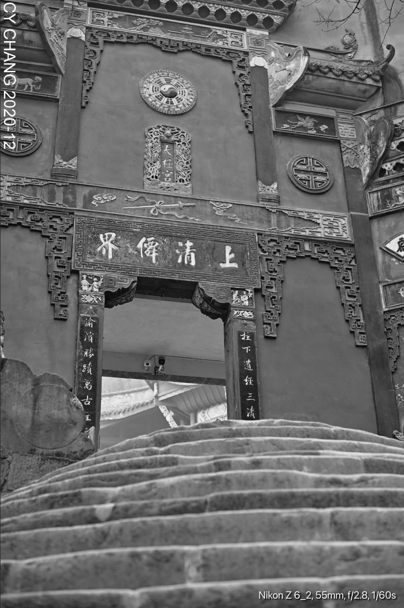
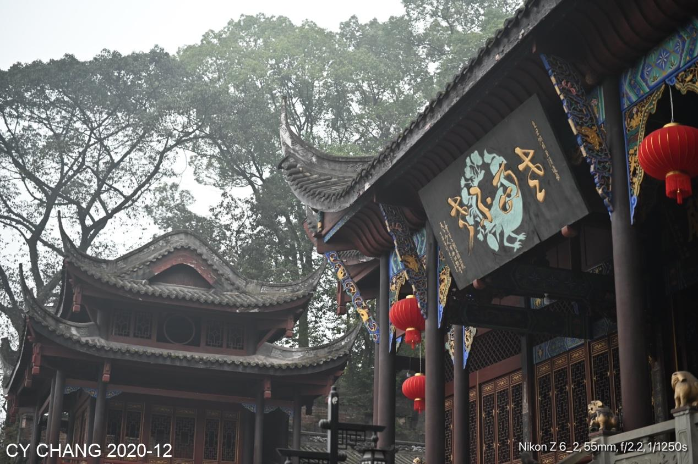
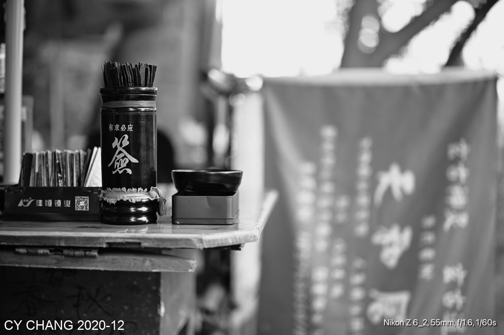
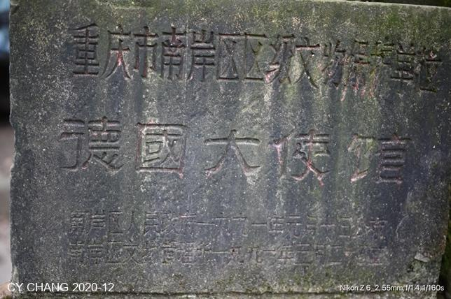

+++
author = "CY Chang"
title = "Laojun Cave Taoist Temple, Chongqing"
date = "2020-12-26"
description = ""
tags = [

    "photography",

    "ChongQing"

]
categories = [

    "photography",

]
category_group = "photography"
series = ["ChongQing"]
image = "image_2.jpeg"
+++
12-26-2020 Laojun Cave，Old German Embassy, ChongQing 

Photo/Writing CY Chang

> Note1: Laojun Cave is located on Laojun Mountain. It was first built in the Tang Dynasty and rebuilt into Taiji Palace in the Ming Dynasty (1480 AD). The Taoist temple was built against the mountain. The statues were carved into the mountain wall. The structure of the temple forms the shape of the Chinese character "玄" which spirals upwards, blending in with the deep and tranquil natural scenery.

## Unfamiliarity

The place I often visited in 2003, doesn't feel familiar anymore. The roads had been changed and the side gates are closed. Only the main gate is accessible. The red candles are still lit, and worshippers come and go. It is a good thing that there is quite. I also lit the incense, and I liked the way the smoke floated through the Zeiss lens, savoring the difference.

 

The temple gate is still there, and the steps paved with old stones always feel good, so just ignore the passengers walking and stopping.

Red window frame, ash incense burner, just take this small scene, use of pleasing myself.

Whether fortune-telling is a consolation or you really believe what others say about, the future depends on the individual. Economic activities have continued for thousands of years. Believe it or not, it's also a sight.

## German Embassy

 

The German doctor's house was converted into a consulate during the Anti-Japanese War, and it was not well preserved.
What's the big deal about it becoming a place to raise chickens? That's a pity for this scene. Still a good spot, has so many stairs to climb that you barely finish walking.

> Note2: Residence of German doctor Paul Assmy.  Assmy became the first foreign doctor to earn local trust to the point of performing surgery on a Sichuanese. 
