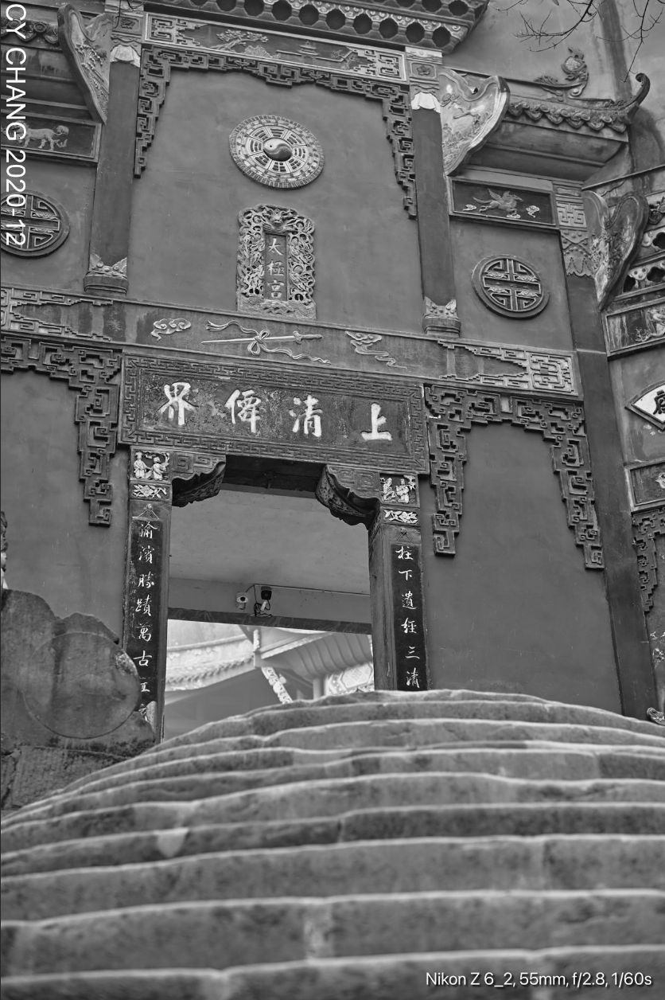
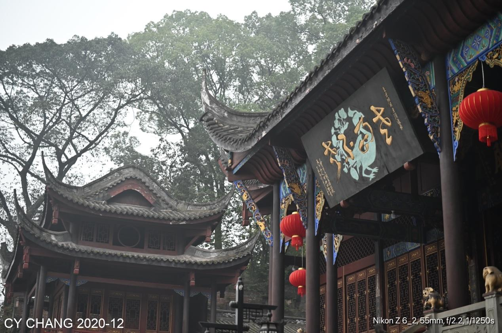
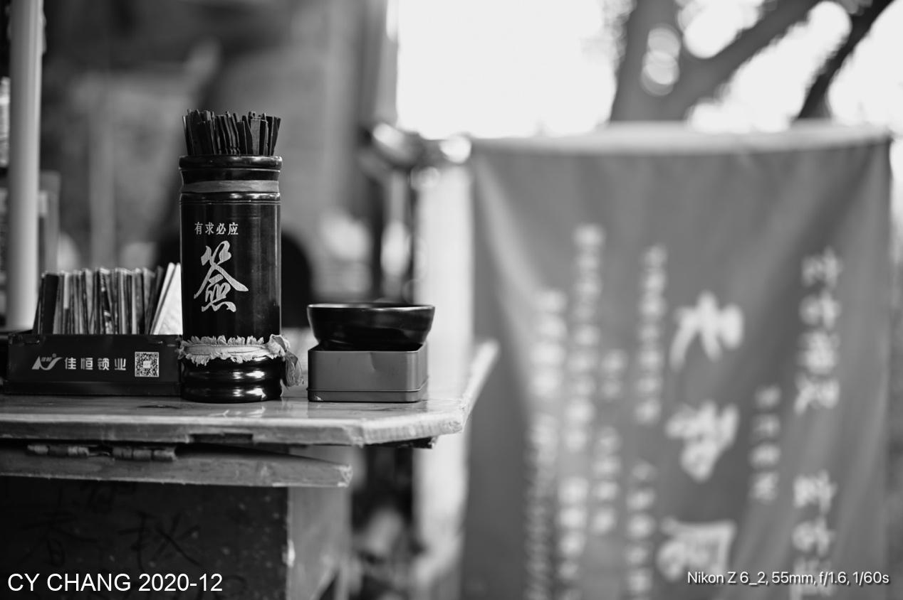

+++
author = "CY Chang"
title = "老君洞，德國領事館, 重慶"
date = "2020-12-26"
description = ""
tags = [

    "photography",

    "重慶"

]
categories = [

    "photography",

]
category_group = "photography"
series = ["重慶"]
image = "image_2.jpeg"
+++
12-26-2020 老君洞，德國領事館, 重慶 

Photo/Writing CY Chang

## 疏遠的 老君洞 太極宮

> 註1：老君洞位於老君山上，始建於唐代，明代(公元1480)重修為太極宮，道觀依山而建，氣勢雄偉。鑿壁成像，殿宇結構成“玄”字盤旋而上，與深幽靜謐的自然景色融為一體。夠了不寫了。

2003年常來的地方怎覺得不熟悉了，全改了路又封了門，只有正門可進，紅蠟燭還點著，參拜的人來來去去，沒有吵鬧聲倒是好事。 香也點著，喜歡那煙在蔡斯鏡頭中的飄，細細的品著那不同。

 

廟門還在，舊石頭鋪的台階總是好感覺的，也就別管路人走走停停。

紅窗框，灰香爐，就取這小小的景，取悅自己又何仿

相命是慰藉還是真相信別人說的未來，就看個人了，經濟活動也持續幾千年了，信就信，不信也好，也是個景。

## 德國領事館

 

德國醫生的家改了變領事館也是抗戰時的事了，沒好好存著，
變個養雞的地方又能說什呢？ 可惜了這好點，走不完的階梯怎落得這景。

> 註2：德國醫生Dr. Paul Assmy故居，曾改建領事館（？）
