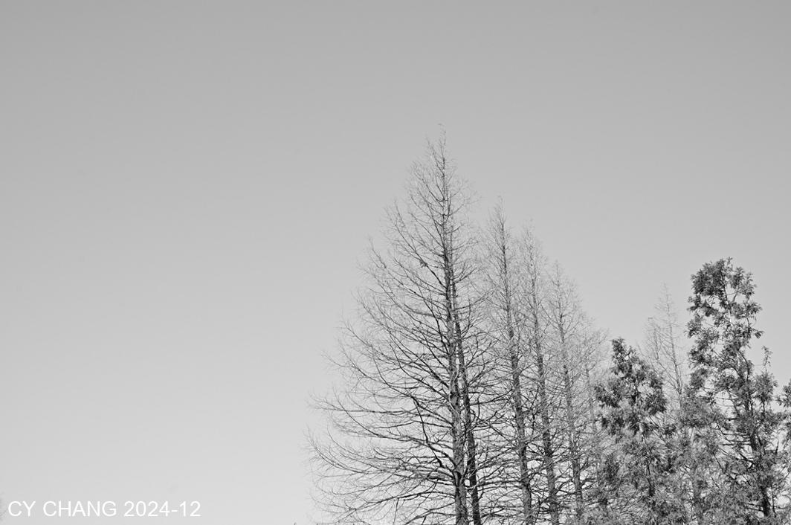
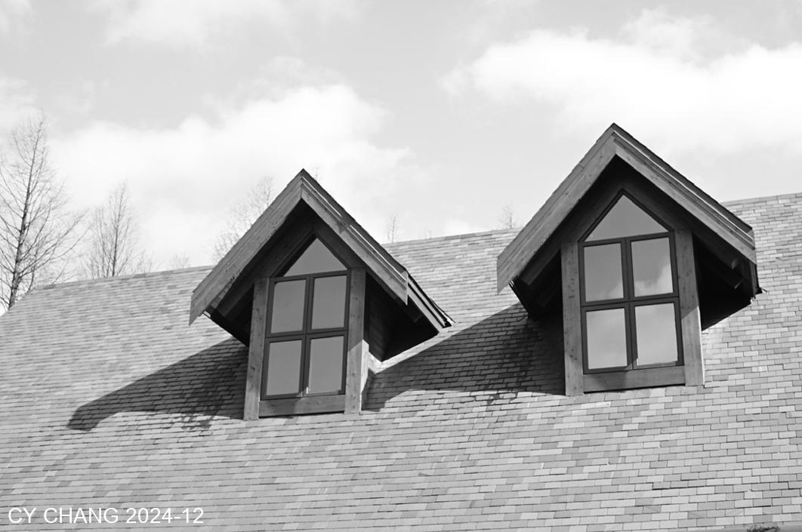

+++
author = "CY Chang"
title = "Winter in Shanwangping, Nanchuan, ChongQing"
date = "2024-12-15"
description = ""
tags = [

    "photography",

    "ChongQing",

    "Snow"

]
categories = [

    "photography",

]
category_group = "photography"
series = ["ChongQing"]
image = "image_2.jpeg"
+++
12-15-2024 Shanwangping, Nanchuan, ChongQing

Photo/Writing CY Chang

## Winter

After two years of renovation, I came to see if it was as beautiful as before. The blue sky and the trees were still there. The snow on the treetops was blown down by the wind, falling like snow, falling on my hat and coat. Walking along the familiar mountain path, carrying heavy cameras, I returned to a corner I hadn't been to for a long time.

 

## Black and White

The Hasselblad is equipped with a Zeiss lens, and I couldn't help but pressing the shutter, a lot.

In a black and white world, there is no other disturbing colors. Just the harmony of black, white and light. Isn't this the attitude that life should have?

 

The ice under the tree, the 45-degree slanting light, turned the water into a crystal-like beauty. The tourists next to me used their mobile phones to imitate me and take photos, but I don’t know how it goes.

 

On the moss on the rock, the protruding grass was frozen. With a tripod and a close-up ring, I saw a different world.
Talking about the surface of things may obscure many details, but behind the details is the beginning of beauty.
With the help of oblique light, I created enough contrast. It turns out that the outstanding beauty requires the silent darkness behind.

 

The light grey in the evening is a bit like the ice and snow world of Mohe, Daxing'anling.
On the way home, I looked back and saw that the blue sky and trees were still there. Next time I come back, the hillside will be covered with green leaves, I wonder.
