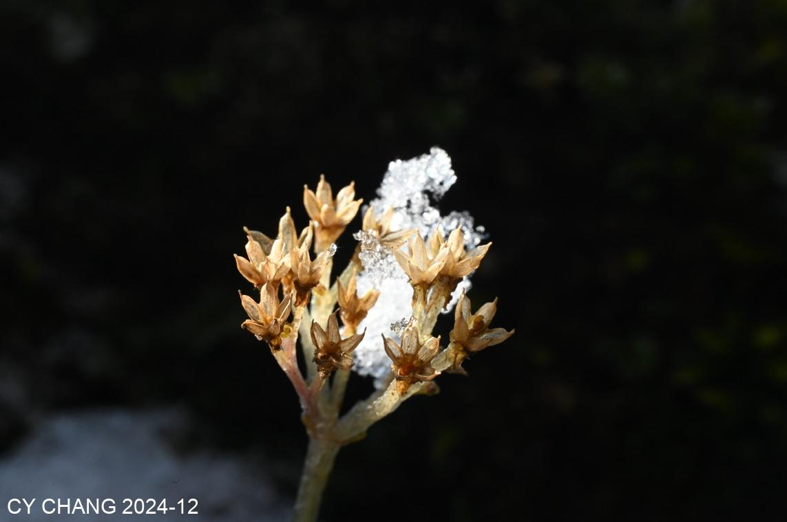
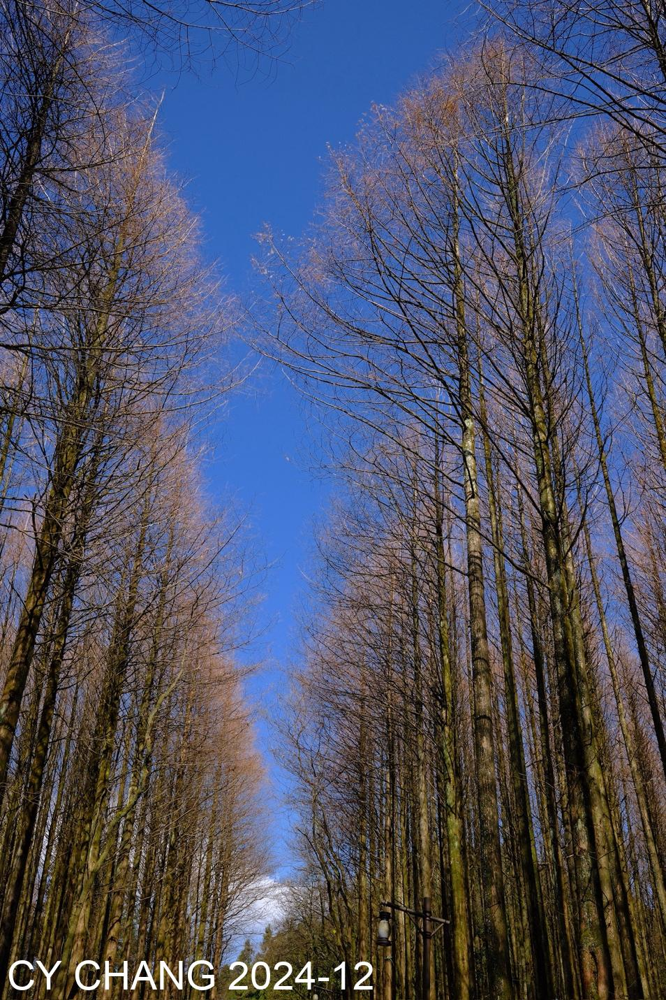

+++
author = "CY Chang"
title = "山王坪的冬天，南川，重慶"
date = "2024-12-15"
description = ""
tags = [

    "photography",

    "重慶",

    "雪景"

]
categories = [

    "photography",

]
category_group = "photography"
series = ["重慶"]
image = "image_2.jpeg"
+++
12-15-2024 山王坪 南川 重慶

攝影/文案 CY Chang

## 冬天

經過兩年的整修, 這天來試試是不是跟以前一樣的美. 藍天陪著, 樹林依舊. 樹梢的雪被風吹落, 像下雪般的飄落, 掉落在帽上衣上, 沿著熟悉的山徑, 背著重重的相機,回到許久沒來的角落. 

  

## 黑白

哈蘇配著蔡司的鏡頭, 不由的多按了好多快門. 

黑白的世界, 不用與其它色調紛擾, 就黑, 白跟光的和諧, 這不就是人生該有的態度. 

  

樹下的冰, 45度斜照的光, 把水變成了晶體般的美、旁邊的遊客用手機學我拍不知道可拍出什樣子.

  

在岩石上的青苔上, 突出的小草被冰凍著, 架了三腳架, 近攝環, 看到了不ㄧ樣的世界. 
說事情表面, 或許蒙蔽了許多細節, 細節的背後, 才是美的開始. 
借了斜光, 做出夠的反差, 原來能突出的美, 需要背後沈默的黑. 

  

傍晚的淡淡的灰, 怎有點像漠河的冰雪世界. 
歸途, 回頭一看, 藍天還在, 樹也還在, 想著下次再來, 綠葉該會滿山坡. 

