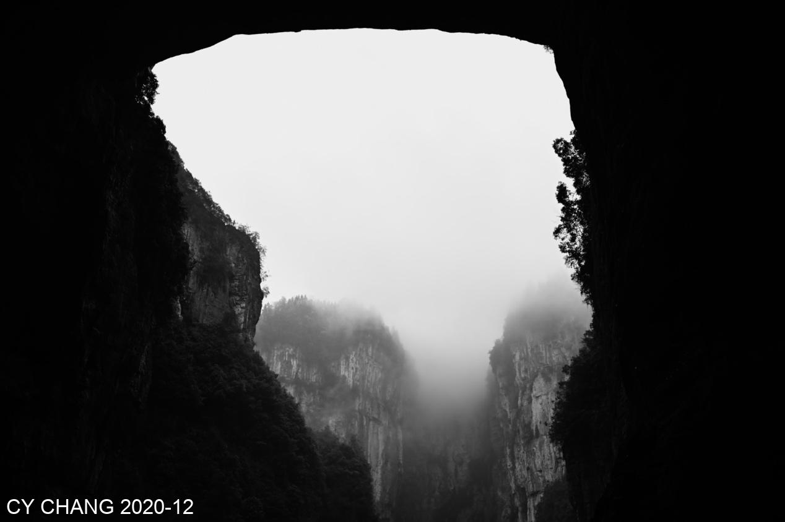
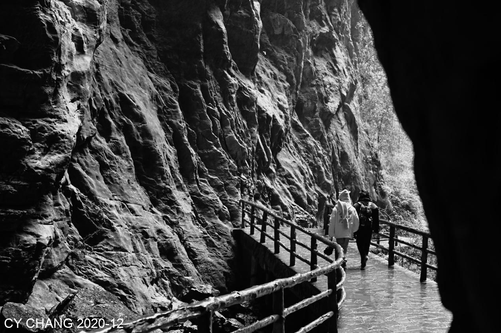
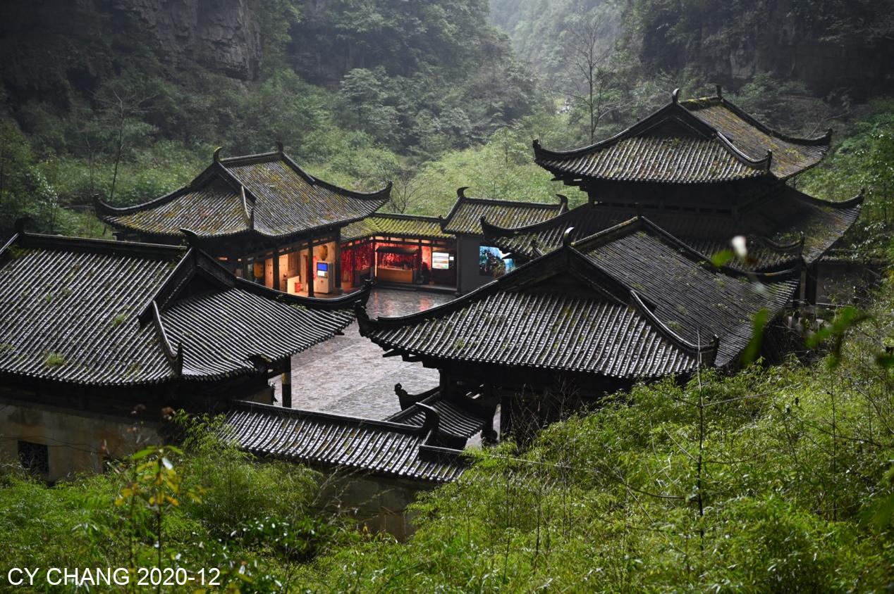
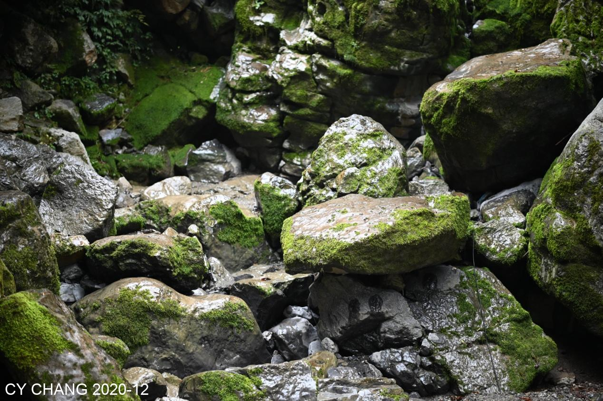

+++
author = "CY Chang"
title = "The Wulong Karst, ChongQing"
date = "2020-12-30"
description = ""
tags = [

    "photography",
    "mountain",
    "ChongQing"

]
categories = [

    "photography",

]
category_group = "photography"
series = ["Sichuan"]
image = "image_3.jpeg"
+++
12-30-2020 Wulong Heavenly Pit Three Bridges Site, ChongQing

Photo/Writing CY Chang

> Notes: A.K.A. The Wulong Karst National Geology Park, where the  epic battle between Autobots were shot.

## Rainy and Snowy

On a rainy and snowy day, Fairy Mountain, walking slowly between the cracks of the ground. Tourists were noisy and it was not easy to enjoy the landscape.

 

## Green Through Zeiss

The gray scene I saw in the eyes, but surprisingly green through the Carl Zeiss's lens. The moss was a little far away, but very familiar. I haven't seen emerald green for a long time.

 

This building in the mountains is a relic of the Transformers filming. It is a must-see, for tourist. Without it, maybe it won't be so crowded. Curse of the Transformers, there will probably be no third movie shot here.

The snow was falling sporadically, and the ice covered the leaves. I took a few photos.