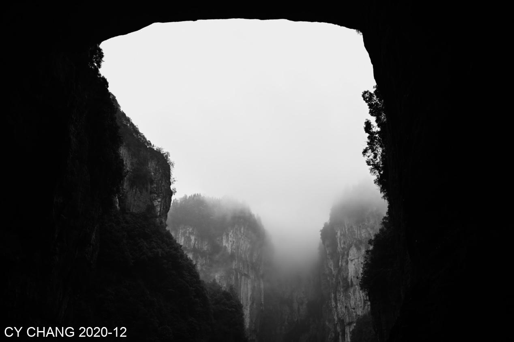

+++
author = "CY Chang"
title = "武隆 天生三橋, 重慶"
date = "2020-12-30"
description = ""
tags = [

    "photography",
    "群山",
    "重慶"

]
categories = [

    "photography",

]
category_group = "photography"
series = ["四川"]
image = "image_3.jpeg"
+++
12-30-2020 武隆 天生三橋, 重慶 

Photo/Writing CY Chang

> 註：變形金剛4拍攝地

## 訪武隆

雨雪的日子，仙女山，地縫中緩行，遊客吵鬧，沒有享受地貌的閒情

到此一遊反而是來這天然景色的目地。真的可惜

 

## 蔡司的綠

眼裡看到灰灰的景，在蔡斯的玻璃中卻是綠意樣然，有那種驚喜的感覺，青苔有點遠，但是很親切。很久沒看到翠綠色了

 

山中蓋這半舊的房，拍片的遺物，又是到此一遊的點，沒這，或許就沒那麽多人來了，黃金甲，變型金剛，以後該沒第三片電影在這拍了

雪下下停停，冰珠蓋在葉上，隨手拍了幾張 
