+++
author = "CY Chang"
title = "Pingtan, Fuzhou"
date = "2021-08-01"
description = ""
tags = [

    "photography",

    "Fuzhou"

]
categories = [

    "photography",

]
category_group = "photography"
series = ["Fuzhou"]
image = "image_33.jpeg"
+++
2021-08-01  Pingtan, Fuzhou

Photo/Writing CY Chang

# Pingtan in August

A place I haven't been to. I heard it is the closest to Taiwan. I came here to see these coincidences.  
The silver grass on the hillside of Fuzhou was dried in the afternoon.

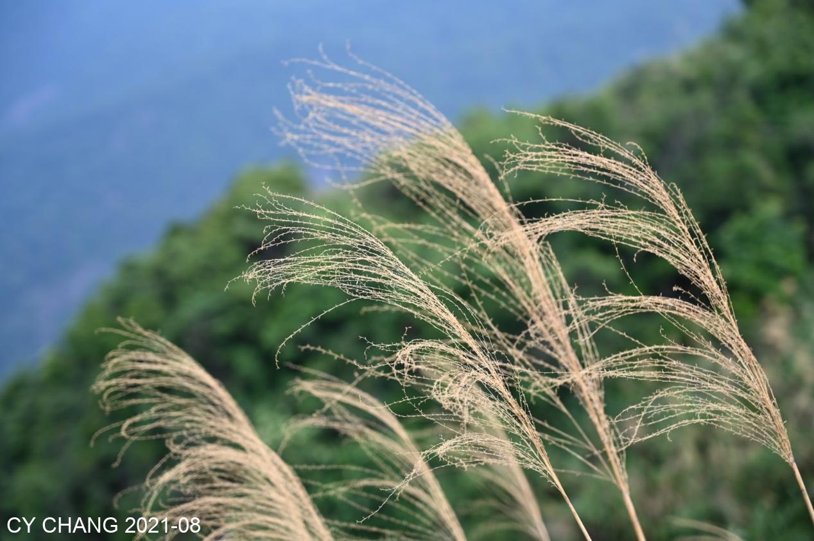 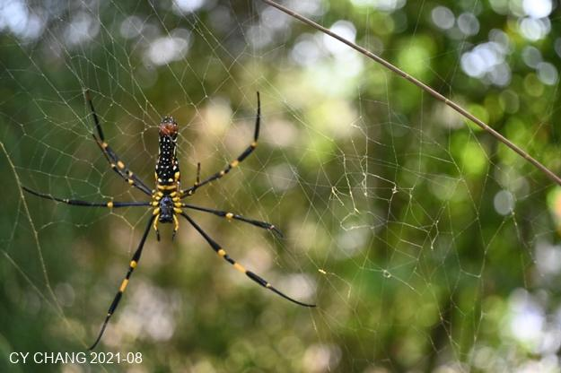

It was a surprise to see Zhushan in the ship museum. The old street has different accents and is very friendly.

Several shops are decorated in old styles. The craftsmen are still working very hard on hot days. They enjoy here.

I like things with different colors. Although I just took some photos, it feels good.

 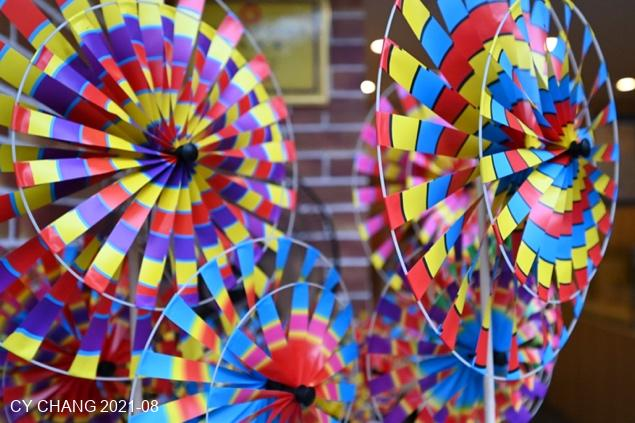

Pingtan is a completely different place. It is just a small island. It can only be said to be simple and has not been carved yet. It's the place I've been looking for for a long time. I haven't smelled the sea for a long time.  
Looking at some rocks and fishing boats in the distance, they said it's very close to my home, about 100 kilometers away. (~65mi)

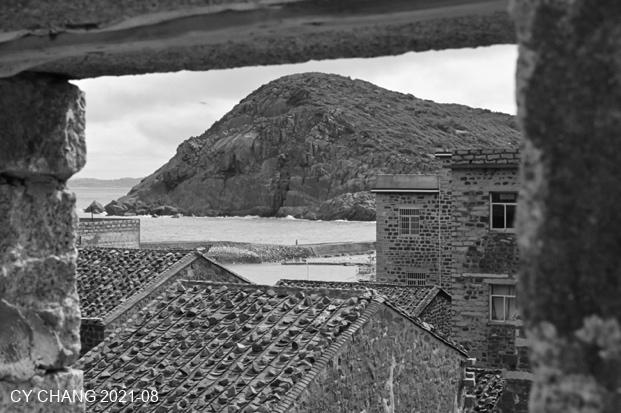 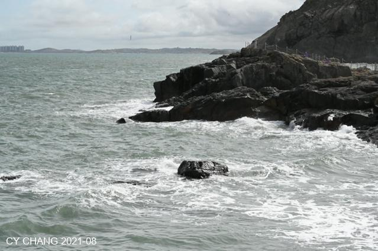

We told the tour guide that we would not go to the scenic spots, but only to places where there were no people. As we walked, we ended up on the road to the sea.  
It can only be said that it's a very simple island. The kind of smile that only people in southern Fujian can see is on everyone's face.
Slapping the rocks, white, I haven't seen it for a long time. I feel like I'm home.

## Fishing the waves

That's the boat we rented. It's much better than I thought. There are a few waves today. I've taken all the seasickness medicine. I hope nothing will happen.  
Two-meter waves are really bumpy. If you like to play, just accept it.

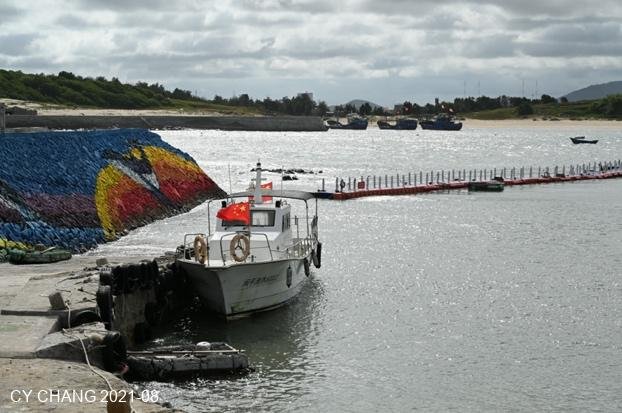 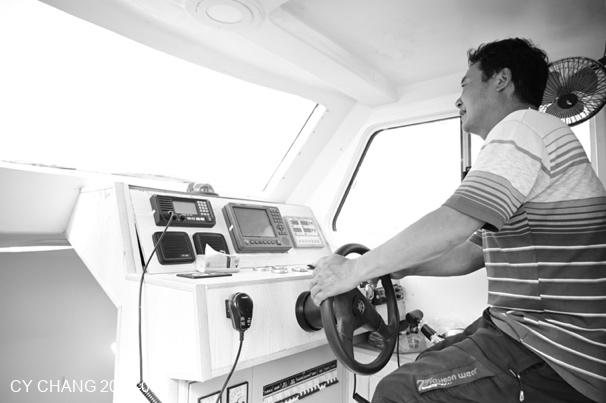

The captain drove very seriously and looked a little serious, but isn't it for safety?

Seagulls followed us along the way, perhaps hoping that we would catch some fish for them to eat.

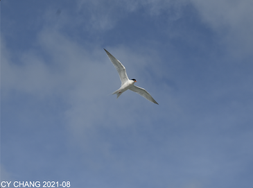 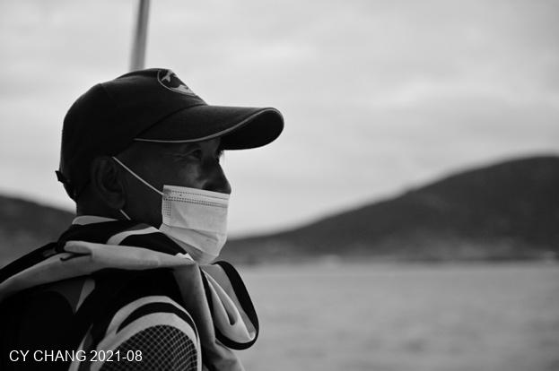

The waves were still very big. The sailor looked anxious and worried that we would not be able to catch any fish after dropping anchor. He might not know that we came here to feel the waves, not to catch fish.

In two hours, we only caught this one fish on the boat. The four of us didn't know how to cook it, so we shared it.

The soup might not even taste like fish.

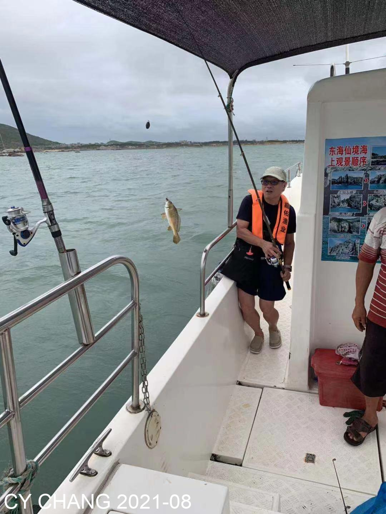

The captain dropped anchor in several places, probably because the fish went home to rest because of the big waves.

With such big waves and approaching dusk, we put away the anchor and headed back.

## Dusk

In the dusk, the lights of the houses were all on, and the faint black and white photos set off well.  
The B&B is right on the shore. They said my home is across the street. The closest distance to Zhuwei Fishing Port is more than 100 kilometers, and I can't even see it.

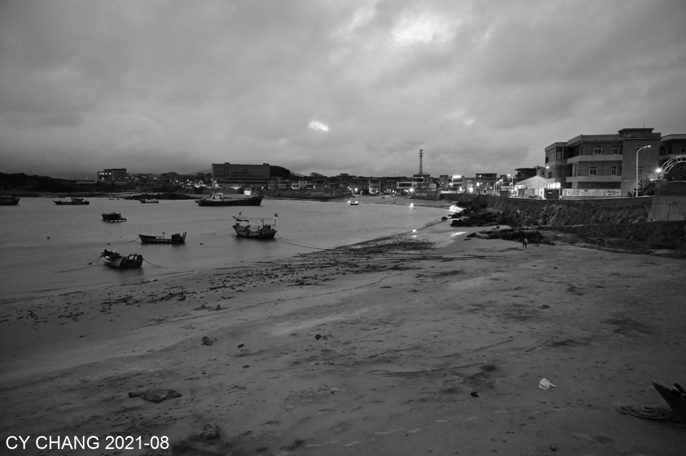

At night, I drank and chatted with the owner of the B&B and the part-time students. I drank a little too much without realizing it. I didn't dare to say that I missed home, so I talked about some things that a hero doesn't mention in the past. I didn't remember anything when I returned to the room.  
Walking on the hard sand early in the morning, there are many small crabs and small wild flowers everywhere.

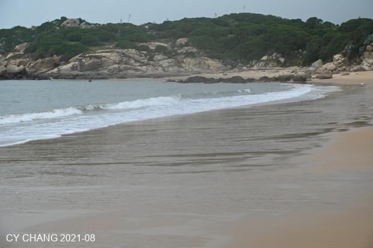 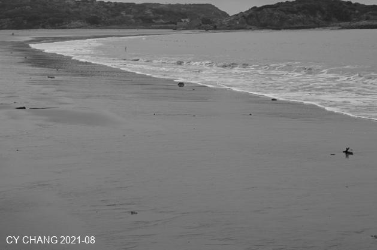

I like to take pictures of things that others can't see. I changed the lens of 1990 and enjoy the microscopic world.

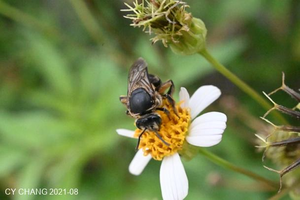 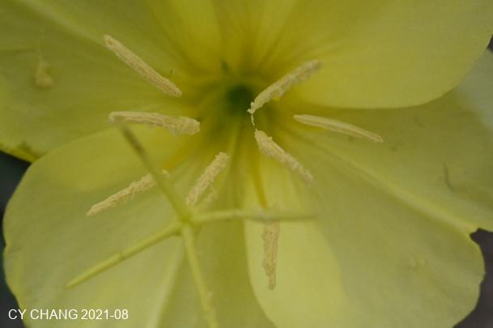

Those little crabs are really having fun.

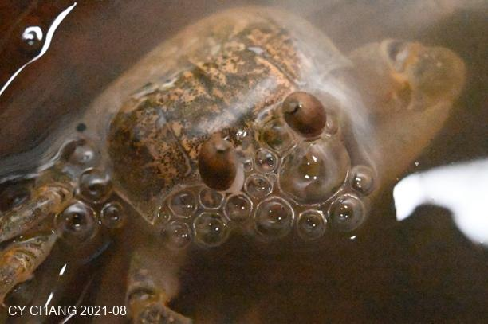 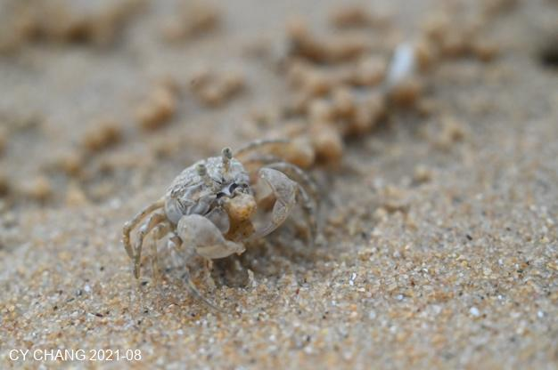

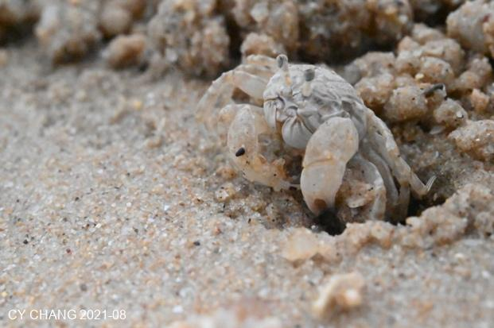 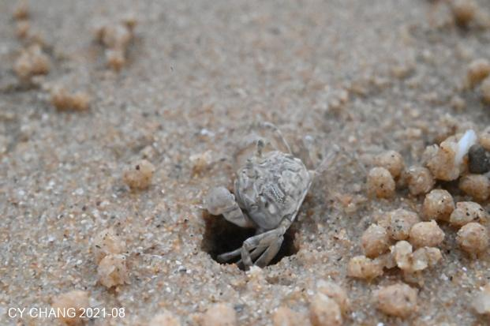

They are painters, using grains of sand to create beautiful lines. I waited for them to finish before taking pictures. I didn’t dare to disturb them too much. After all, the beach is theirs, not ours. We are just passers-by, and they are permanent residents.

## Beigang Village

Beigang Village has a lot of rocks and tourists, which is not what we like. I heard that many Taiwanese people opened shops there, so we just walked there.

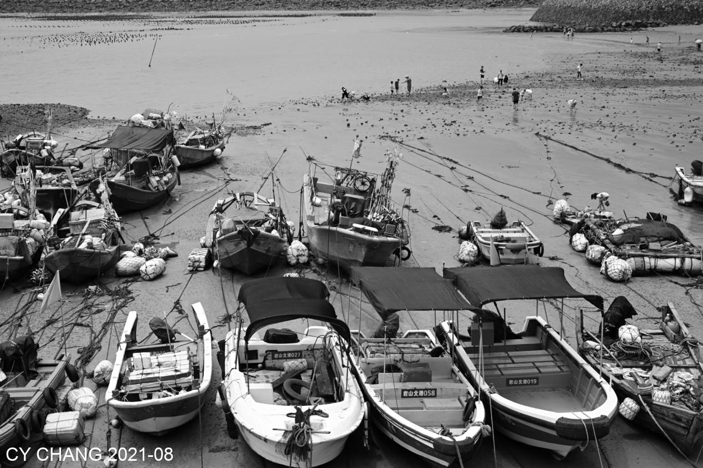

Black and white photos without color adjustment are so natural. I like this three-dimensional sense and contrast. Good sunlight, air and shadows can take such good photos. Clear air and sunlight can sell beautiful flowers.

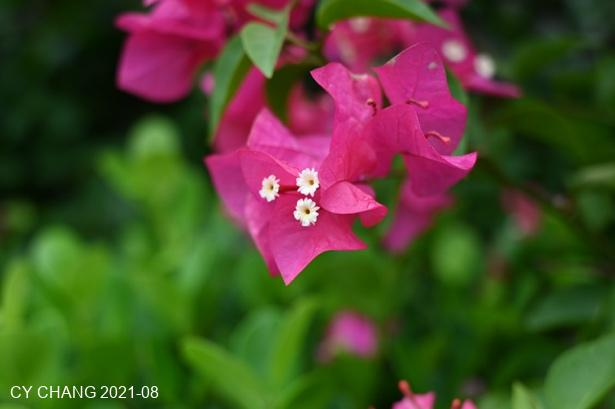 

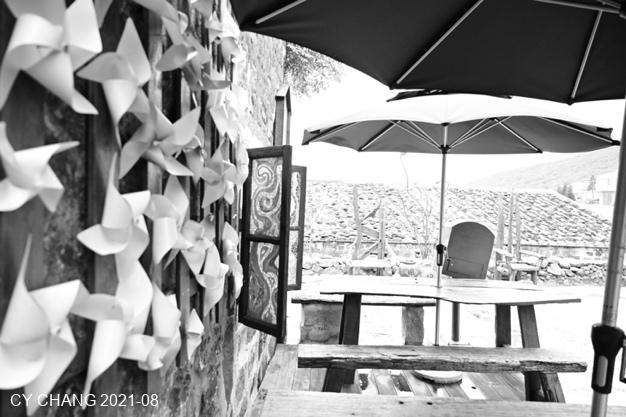 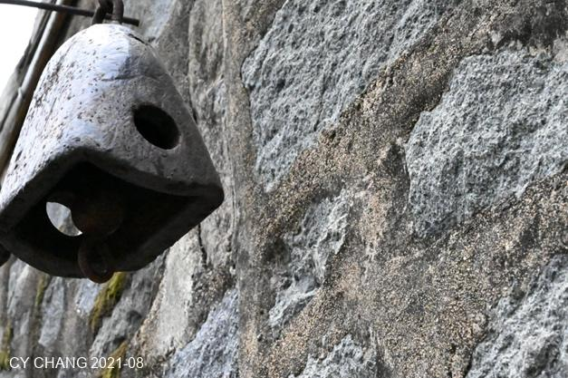

Went to the beach in Daifuku. The clean beach and a bunch of leisurely people made it feel good.

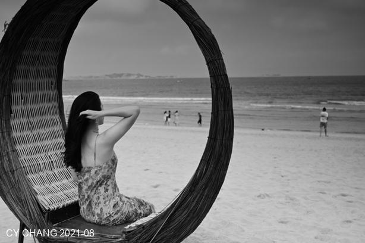

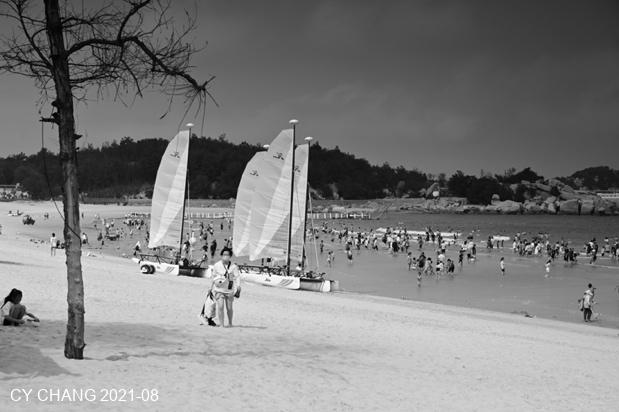

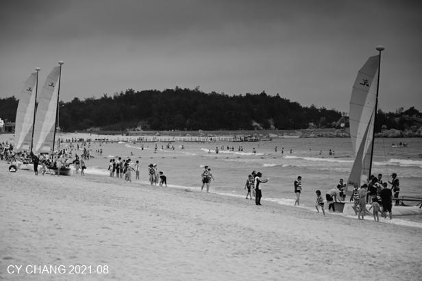

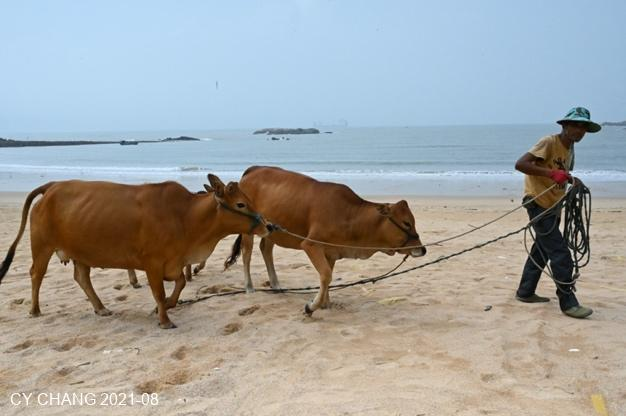

Wuyi Mountain. Saw a glimpse of lotus flowers on the court.

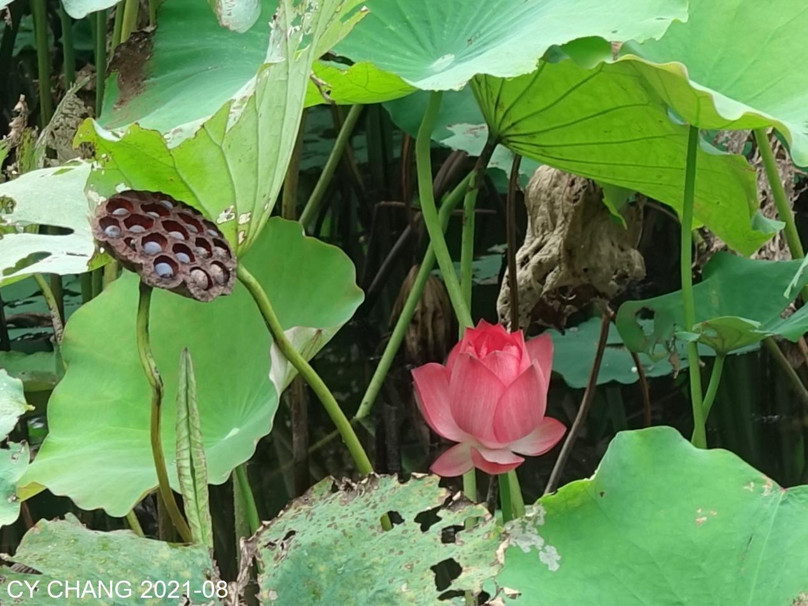