+++
author = "CY Chang"
title = "平潭, 福州"
date = "2021-08-01"
description = ""
tags = [

    "photography",

    "福州"

]
categories = [

    "photography",

]
category_group = "photography"
series = ["福州"]
image = "image_33.jpeg"
+++
2021-08-01  平潭, 福州 

攝影/文案 CY Chang

# 八月的平潭

没来过的一个地方，听说它离台湾最近，这几个巧合来这里看看  
福州半山腰上面的芒草， 午后被晒得干干的

   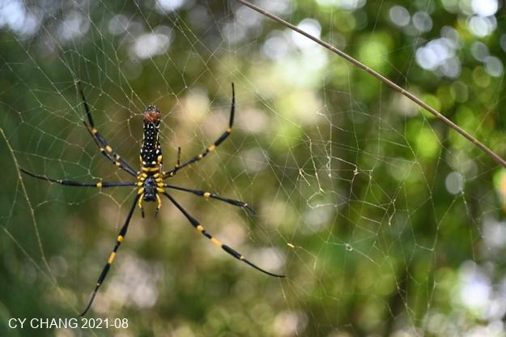

在船博物馆里面看到了竹山，倒也是惊喜，老街上，不一樣的口音，很親切  
幾個店，都是老装潢，大热天里工匠还是很认真的在做， 在这里他们会开玩笑，挺好  
喜欢有不同色彩的东西，虽然随便拍拍，感觉还是不错的 

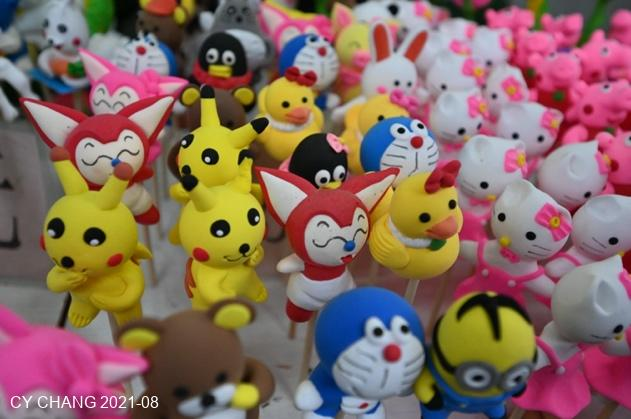   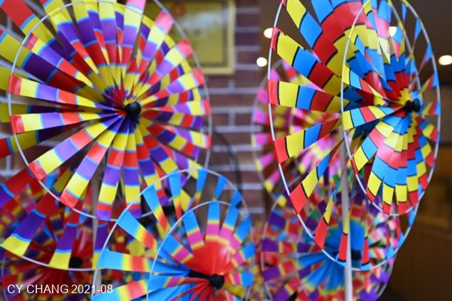

平潭，完全不一样的地方，就是一个小岛， 只能说淳朴，还没有雕琢过， 就是我找了好久的地方， 很久没有闻到海的味道  
看着一些石头，更远处的渔船，他们说离我家很近，100多公里吧  

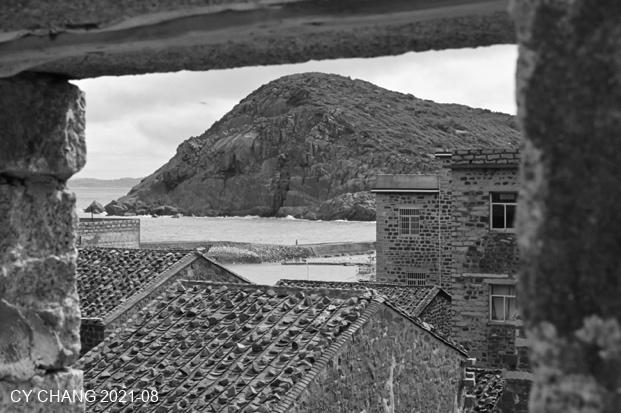 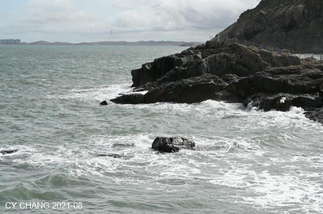

我们跟导游说不去景点，只去没人的地方，，走着走着，却是往海边的路上去了  
只能说很淳朴的小岛， 那种闽南人才看得到的笑容，都掛在每一个人的脸上  
拍打着岩石，白花花的，好久好久没看过了， 觉得有回家的感觉  

## 釣浪

那是我们租的船，比我想象的好太多了，看着今天有一点浪，  晕船药该吃的都吃了， 该不会有事吧  
两米的浪，还真的颠， 爱玩就接受吧

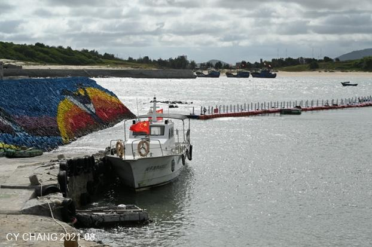 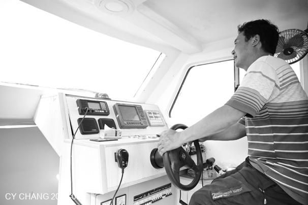

船长很认真的开，看起来有一点严肃，可是为了安全不就是这样吗  
沿路海鸥跟着我们飞，或许希望我们钓到一些鱼给它吃吧 

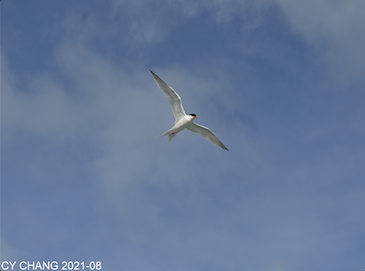 

浪还是很大，水手看他焦虑的样子，怕我们等一下下锚钓不到鱼，他或许不知道我们来是感受那海浪的， 不是要钓到鱼的  
两个小时，船上就钓到这一条了，4个人也不知道怎么煮，这一条来分着吃
煮汤可能都没有魚味了

船长换了几个地方下锚，大概魚浪大，都回家休息了吧  
那么大的浪、又接近傍晚，收起錨，反航去了

## 傍晚

傍晚民家的灯都亮了，淡淡的黑白照，衬托的很好  
民宿正好在岸边的建筑，他们说对面就是我家了，竹围渔港，最近的距离，100多公里，看也看不到  

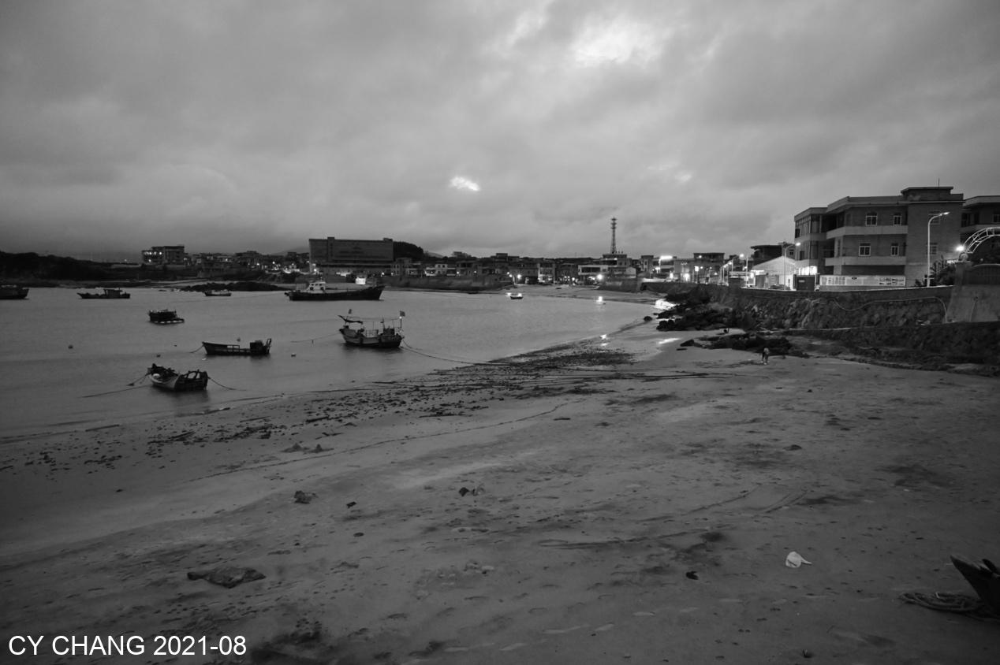

夜里跟民宿的老板，还有工读生，一面喝酒，一面聊天，不知不觉喝多了一点，不敢说想家了，就说了一些好汉不提当年勇的事，回到房间什么也不记得了  
清早走在硬硬的沙上，很多小螃蟹，小野花，到处都有

 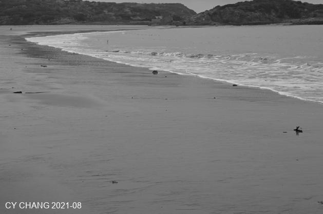

喜欢拍一些人家看不到的东西，换了1990年的鏡头，享受一下顯微的世界 

  

那些小螃蟹玩得还真愉快

  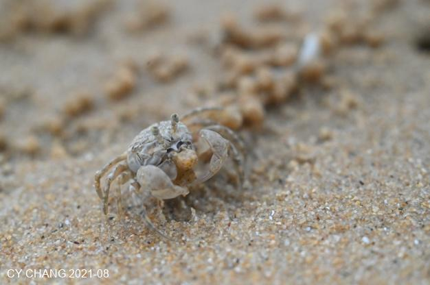

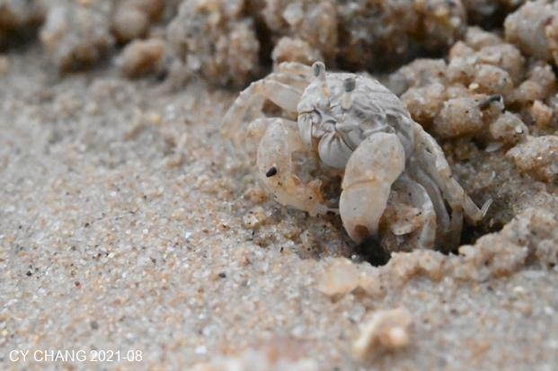  

他们是画家，用一颗颗的沙粒，话说漂亮的线条，等着他那么畫完，我才拍照  
不敢太打扰他们，毕竟沙滩是他们的，不是我们的，我们只是过客，他们是常驻客

## 北港村

北港村很多的石头，很多的游客，不是我们喜欢的那一种，听说很多台湾人在那边开店，那也就走一走

  

没有调过色的黑白照就这天然 喜欢这个立体感跟反差 好的阳光空气跟阴影才能够拍得出这个好照片
清朗的空气跟阳光 卖的出漂亮的花

  

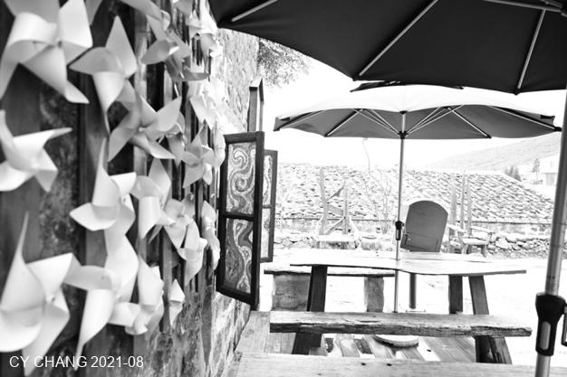  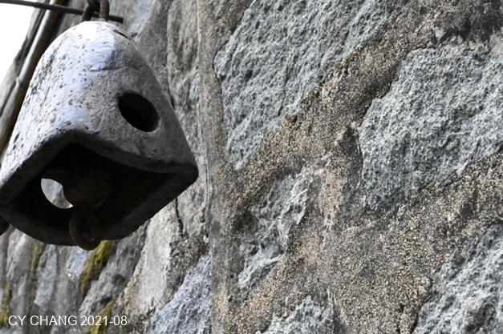

去大福的海水浴場 潔淨的沙滩  还有一堆悠閒的人  感觉挺好

  

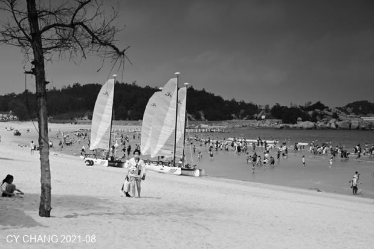 

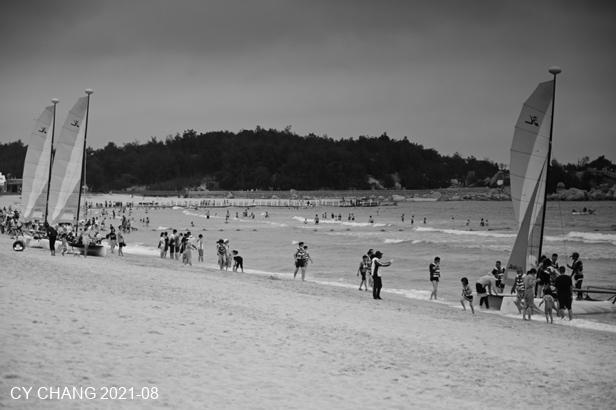  

  

武夷山 在球场上看到惊鸿一瞥的荷花 

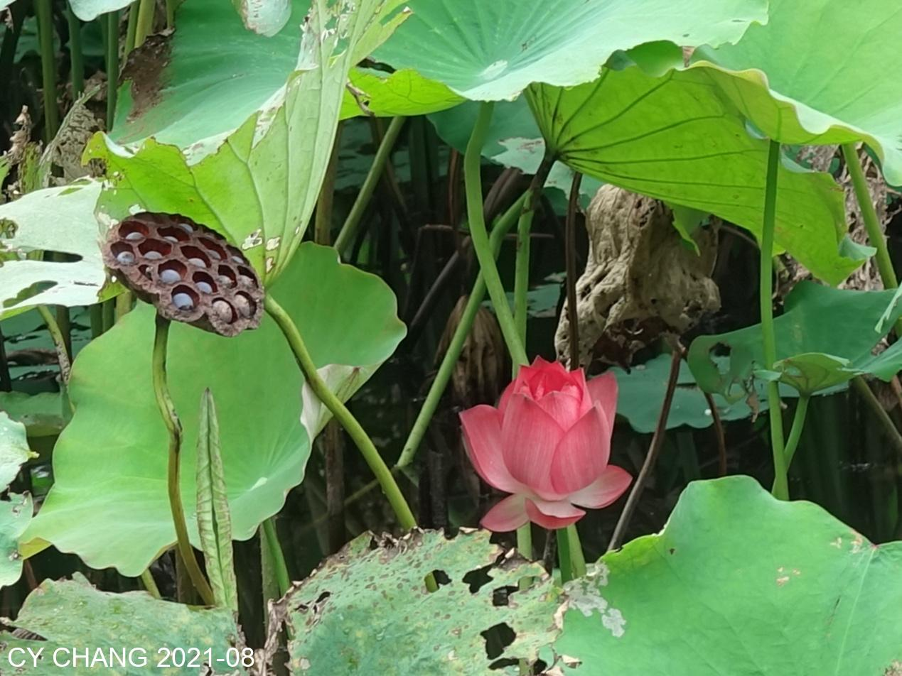  
