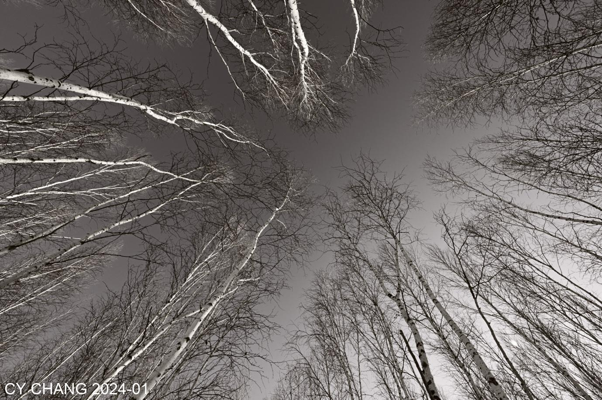
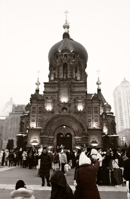
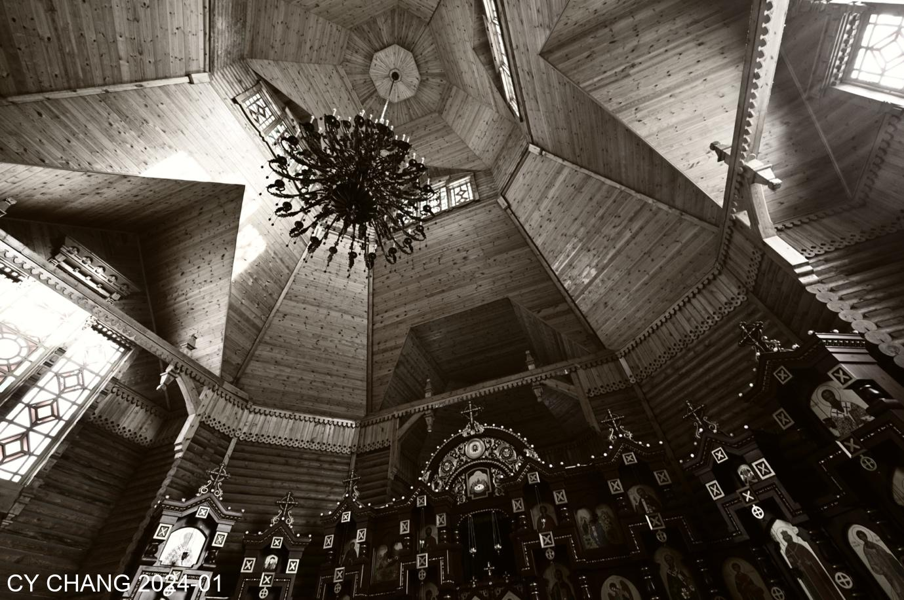
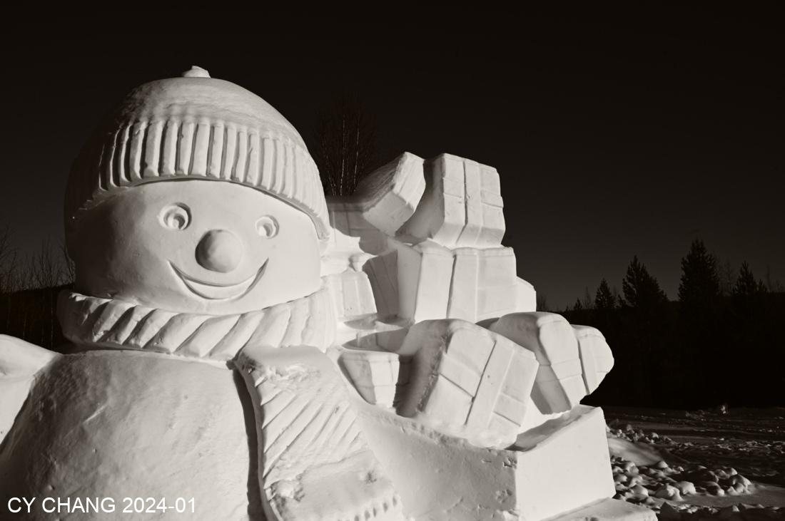
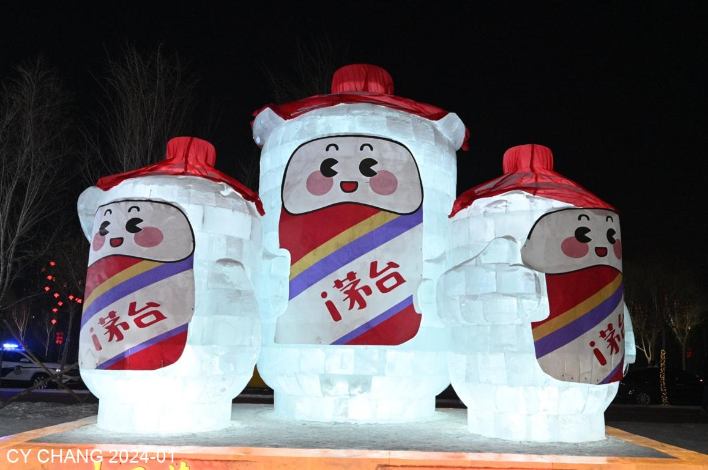

+++
author = "CY Chang"
title = "Mohe, HeiLongJiang"
date = "2024-01-24"
description = "Northernmost border of China"
tags = [

    "photography",

    "HeiLongJiang"

]
categories = [

    "photography",

]
category_group = "photography"
series = ["HeiLongJiang"]
image = "image_21.jpeg"
+++
01-24-2024 Mohe, HeiLongJiang 

Photo/Writing CY Chang

Flew thousands of kilometers in a plane packed with people. Why did everyone go north anyways? The airport was still full of people. The snow piles were really crowded this winter. It was already night when we arrived in Mohe, minus 24 degree C. The ground is covered with snow. Northeastern cuisine, Northeastern wine, it's warmth in the north.

On the second day, we headed north. It was a sunny day, the temperature was still low, there was no snow on the driveway, but there was a lot of snow on both sides.

I stopped after passing a birch forest. The morning sun was just coming in. I switched to a extreme wide-angle 14mm lens and photoed the sky to get the feeling I wanted. The sun is low in the sky in the north all day long, and the color temperature is pleasant, which makes it easy to shoot.

To enter BeiHong Village, you have to pass the checkpoint with your residence permit. He asked for my ID card. I thought the residence permit is the same as my ID card, he let me in after checking it. The village is innocent, with only few households, but there are B&Bs and restaurants. Thinking of the quiet streets, there is only snow and the still present.

The boss lady of a Northeastern restaurant put up this sign. This place really has nothing, and I don't want to stay here.

The border is across the Heilongjiang River to Russia. No one wants to cross the river, but many tourists come to see the barbed wire on the river. 

In the quiet Beihong Village, the sun is low and the sky is blue. Passers-by don’t change anything, but they change their minds. There are few people on the road in the extremely cold weather. I walked up to the stands and looked at the Russian border. There were no people on the other side either. This is a quiet little village.

In the afternoon, on the way back, we stopped by a birch forest. There was a viewing platform where we could see the river in the distance. It was a U-shaped river, and the river water was completely frozen. The snow, the frozen river water, and the leafless forest were all Frozen.

The forest road without tourists allowed me to take good photos. It was completely different from the morning when there were a bunch of influencers here.

The afternoon sun shine is not unusual, because it is slanting all day long. The light and shadows passing through the woods and the shadows printed on the snow are rarely good enough to take good photos.

The moon rose early in the evening, so we took a photo halfway before we went home.

I went to Beiji Village, which is a place where tourists usually go. All the construction is for tourism. BeiHong Village is much better.

Poor elk, working from morning till night. In this extremely cold place, endless work. Looking at their eyes, I don't know how to help them.

> Will's Note: 
>   1) Beiji, means **North Pole** in Mandarin. 
>   2) It's a horse?

Back in Harbin, it's still snowing in this manor, but there are many tourists. I still don't know why tourists like it, the air is polluted and the traffic is inconvenient, so there are so many people here.

The horses are waiting for tourists to feed them, and the park does not need to use flowers to feed the horses. These horses look cute and amiable, and they have no scheming.

The sunlight on the road, shining on the lines of the trees, looks beautiful. I took a few shots hoping to take good photos.

The replica of St. Nicholas Cathedral, accompanied by music, may be able to embody the feeling of 1930.

 

In the city of Harbin, people are still people. All the photo spots are occupied. Internet celebrities who dressed unlike people, were taking photos they like, so all the angles for taking photos of the church are occupied. I don't know where to take the photo. Anyway, I hope everyone is happy.

The performance in the church was very good. The accordion echoed on the curved roof. It was much better than the photos taken by internet celebrities outside.

In the cold theater at night, the ticket scalper was hawking his wares by the garage. Outside, a few arcs of light reflected the moonlight and the snow on the ground.

The famous Ice and Snow World is just a few roadside advertisements for wine merchants. The air is dusty.
PM2.5 is already 350, how can it be a snow festival?

Sunshine, snow, people, and air pollution are nothing compared to the tranquility and the silent village on the border. The return trip is another long journey, thousands of kilometers to the way home. Passing slowly(*).

> Will's Note: 
> Passing, has meaning of **living slowly** in original words.  
> But he then posts a mascot of Moutai wine, so he could really mean **drinking and passing out slowly**.

