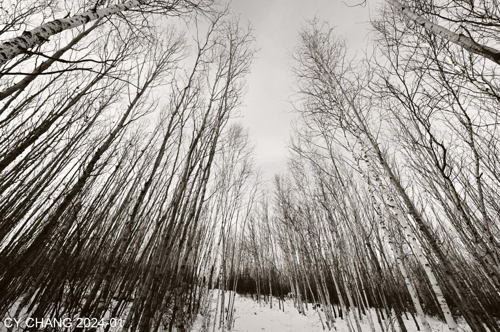

+++
author = "CY Chang"
title = "漠河行腳-北荒雪路, 黑龍江"
date = "2024-01-24"
description = "漠河北極村，中國最北邊境"
tags = [

    "photography",

    "黑龍江"

]
categories = [

    "photography",

]
category_group = "photography"
series = ["黑龍江"]
image = "image_21.jpeg"
+++
01-24-2024 漠河, 黑龍江 

攝影/文案 CY Chang

飛了幾千公里，機上擠滿了人，怎麼大家都往北方跑，轉機，機場裡面還是滿滿的人。今年的冬季雪堆裡真的很火紅，到了漠河已經是晚上了，負24度滿地的雪。 東北菜，東北酒、北地中的溫暖。
第2天，往北方開。 晴天，溫度還是很低，車道沒雪，兩側倒是高高的堆著。 

經過白樺樹林停下腳步，早上的陽光剛剛照進來，換上超廣角的14mm，往天空拍出我要的感覺。 北方太陽整天低低的掛著，都是斜陽，色溫宜人，拍起來都是好光線。 

 

進北紅村要經過檢查哨， 拿著居住證他要我身份證，我想居住證不就是身份證，看看他就放我進去了。 村子純樸， 沒幾戶人家， 倒是開了民宿跟餐廳。 安靜的想街道， 只有雪跟靜止的當下。 

東北餐館的老闆娘， 打著這招牌， 豪放但不是真的。 這個地方真的、啥都沒有， 不會想留在這的。

邊境， 過黑龍江就是俄羅斯， 沒人想過江， 倒是很多遊客來看這江上的鐵絲網， 不可越界。 

安靜的北紅村， 低陽伴著藍藍的天， 過客不會改變啥， 是過客心裡改變了想法。 超低溫的路上沒有什麼人， 走上看臺看著俄羅斯的邊境， 對面也沒有什麼人， 這是一個安靜的小村。 

午後， 回程的路上， 在白樺林邊停留， 說有一個看臺可以看著遠方的河流， 這是一個U型的河道， 河水全結凍了， 雪跟凍的河水， 跟沒有葉子的樹林， 全凍住了。 

沒有遊客的林道， 讓我好好的拍。 跟早上有一堆網紅在這裡， 已經完全不一樣了。 

下午的陽光不叫斜陽， 因為整天都是斜的。 穿過樹林的光影， 雪地上印出來的影子難得可以拍出好照片。 

傍晚的月亮起得早， 我們還沒有回家的半路隨手拍了一張。

去了北極村， 就是一般遊客去的地方， 全部的建設就是為了旅遊， 還是北紅村好多了。 

可憐的麋鹿， 從早工作到晚。 在這極寒的地方， 無盡的工作， 看那眼神我也不曉得怎麼幫忙他們。
> Will's註：牠馬？

回到哈爾濱， 在這莊園雪還是雪， 就是遊客多。 我還是不曉得為什麼大家喜歡， 到這空氣污染交通不方便來人擠人。

馬等著遊客來餵， 園區不用花餵馬。 看這些馬可愛可親的樣子， 沒有什麼心機。

路上陽光， 照著樹林一條條的線條， 看起來就是好看。 拍了幾張膠卷希望能夠照出好照片。

復刻的聖尼古拉大教堂， 伴隨著音樂或許能夠體現1930年的那種感覺。

 

哈爾濱的市區， 人還是人， 還是人。 可以拍的點， 全部被占住了。 網紅穿得不像人的人， 拍了自己很喜歡的照片， 讓可以拍攝教堂的角度全被佔住了。 我也不曉得能夠在哪裡拍。 反正大家高興就好。

教堂裡的演奏感覺非常的好手風琴在圓弧的屋頂回響。 這比外面的網紅拍照感覺好太多了。

晚上寒冷的劇院， 賣著黃牛票的人， 在車庫邊叫賣， 外面冷冷清清的幾個圓弧的線條搭著月色， 跟地上的雪輝映著。

有名的冰雪大世界就看著路邊的幾個酒商的廣告。 空氣全部都是灰， 
ＰＭ2.5 都350 了， 怎是個冰雪節啊。 

陽光， 冰雪， 人， 空氣污染， 比不上邊界的寧靜跟無聲的小村。 回程又是一個漫長的旅程。 幾千公里回家的路上， 慢慢過。

> Will's 註：慢慢喝？

