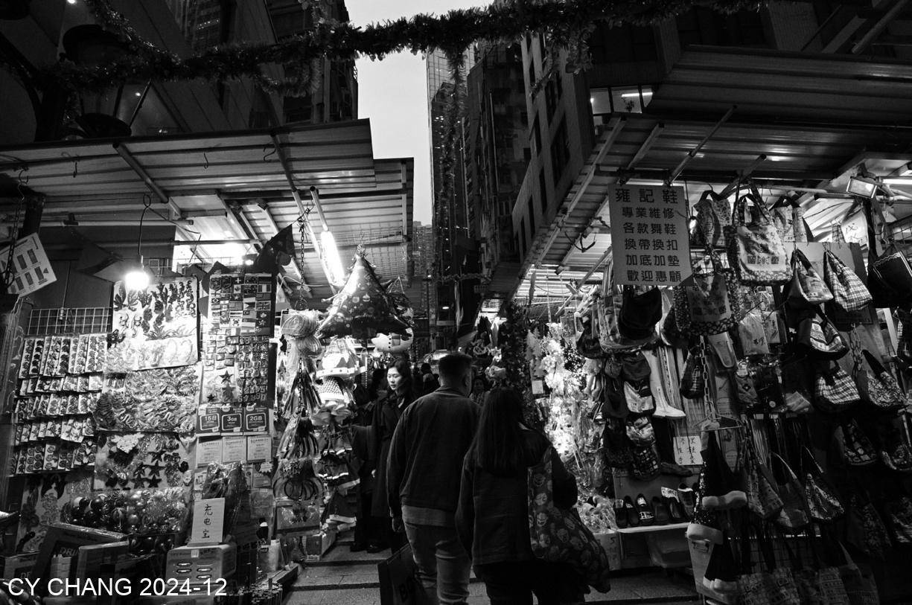
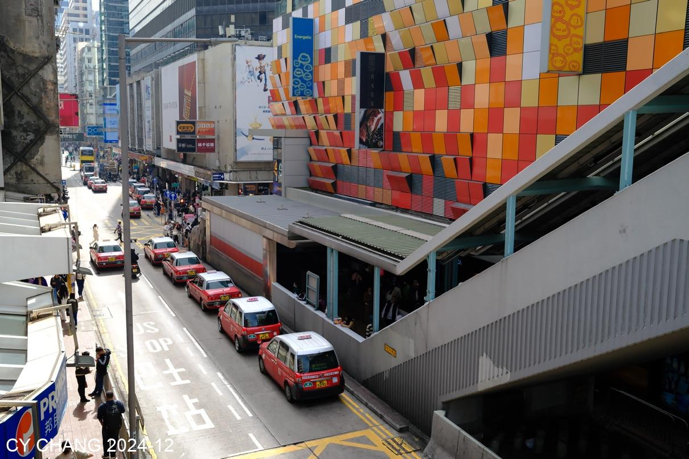
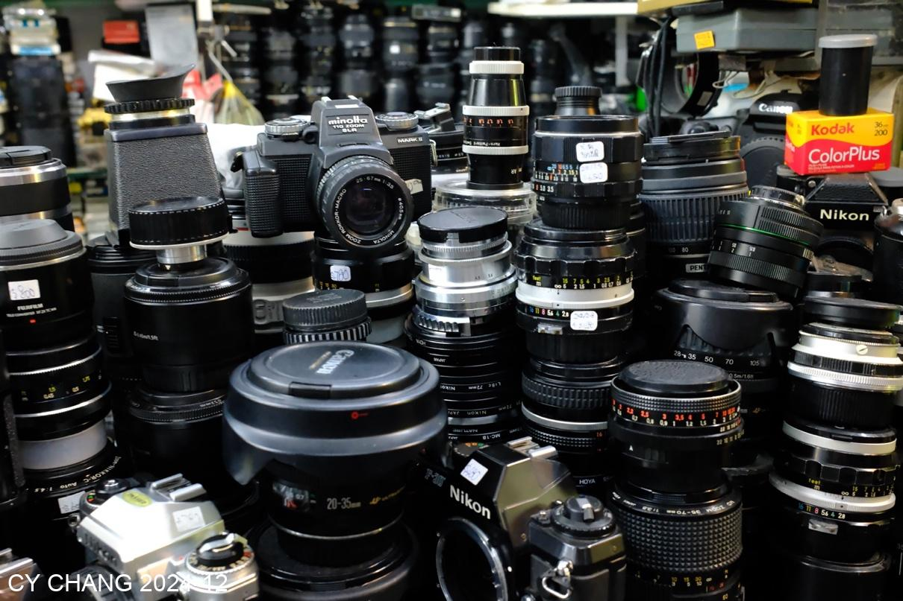
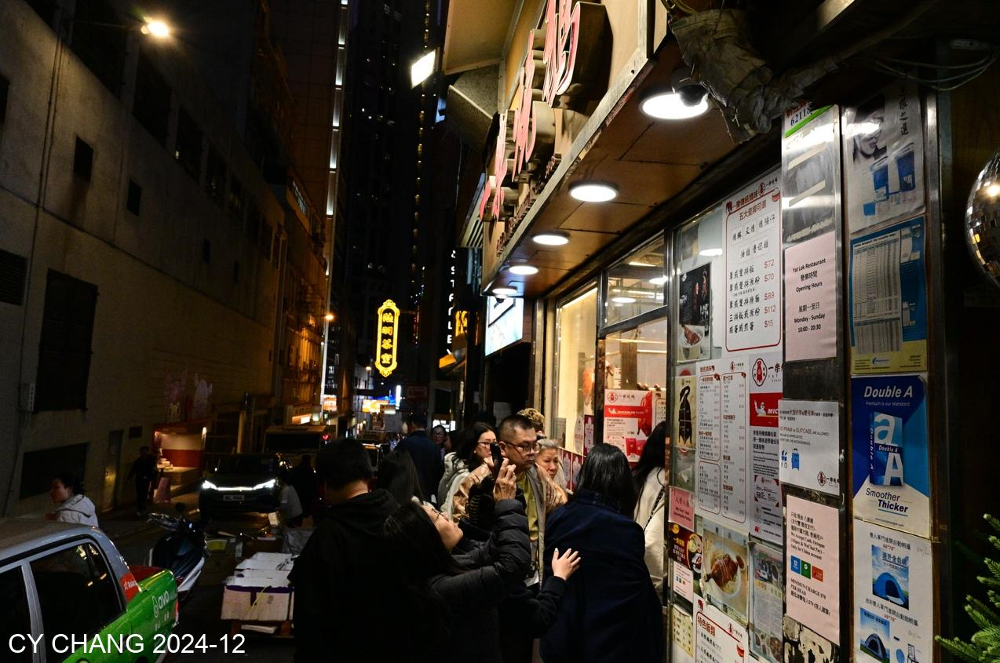

+++
author = "CY Chang"
title = "Wondering in HongKong"
date = "2024-12-25"
description = ""
tags = [

    "photography",

    "HongKong",

    "Night View",

    "Film",

]
categories = [

    "photography",

]
category_group = "photography"
series = ["HongKong"]
image = "image_9.jpeg"
+++
2024-12-25, HongKong 

Photo/Writing CY Chang

# Wondering Hong Kong

I don’t remember how long it has been since I last visited Hong Kong. I learned how to take the subway and transfer to the hotel. I didn’t have any plan. All the tourists came to Hong Kong for Christmas, and the crowds were like ants stretching across the airport.  
Feeling the strong Christmas atmosphere, students at the seaside in Tsim Sha Tsui were all ready for a performance, after all, it is a tradition left by the British.  

Fuji's X100VI is full of film tones, as if taking you back to the days of shooting film in my youth.  
The success of a product depends on careful consideration of the users.

The ferry was packed with people. When I saw the Season’s Greeting, I had to add a dollar sign.   
On the way to Lan Kwai Fong, I no longer had the urge to go into a bar. Taking pictures of the street scenes seemed to be more in line with my current feelings.

A Michelin roast goose restaurant has such a magical and arrogant service attitude. I really doubt if I will ever come here again.  
It’s just that the publicity was so good that people lined up on the street.

## Night view of Taiping Mountain
The roadside flower shop is lit with warm lights. Even though it is at night, it makes my heart colorful just by looking at it.  
The long queue going up Taiping Mountain, looking up and seeing this LED scene, the helplessness is slightly alleviated. Why are so many people crowded here?

The cable car took several minutes to go up the mountain. The crowds kept turning around. One had to find some space to squeeze up the mountain.  
The woman who thought she was an internet beauty was posing in all kinds of ways, but she had forgotten that she was here to see the night view of Victoria Harbour.  
I think she is definitely not a native of Hong Kong.

The Avenue of Stars is full of celebrities, but they float in the sea of ​​stars, and not all of them can leave their names in the world.  
Ruth's Chris's full British service is reasonably expensive. There was only one table of guests at noon, and all the services came to me.

In the afternoon, the wind was blowing and I was walking along the beach. Boats were coming and going, and there were endless streams of tourists, blocking the road.  
Look at Taiping mountain. I think it will be packed tonight.

I thought it was Christmas Eve with fireworks, I watched them by the harbor, and then there was a light show.  
Ending with crowds but orderly in Hong Kong style management. Nathan Road was packed, people walked step by step, it was not the end of a movie, but an escape.

A diverse society, preaching the gospel around the alleys, singing, dancing, a joyful moment.  
It is wonderful to have a fusion.

There's not only roast goose on the street. Seeing this shop full of cameras, with unorganized cameras and lenses on the floor, table, and shelf, reminds me of the feeling of eating roast goose.  
It's unlike the camera shops in Tokyo, where the respect for the cameras makes people feel at ease. This place doesn't have that.

The famous restaurant in Mayoudi, same, poor service, the restaurant is packed with people, smh.

It’s a popular spot, so I still have to check it out. I didn’t find a camera store, but I did see many gatherings of foreign workers.  
I thought, I’m also a worker, but our gathering is in a restaurant this time, not on the overpass.

After part-timing for a long time, isn’t it time to retire and live the life you want and love!