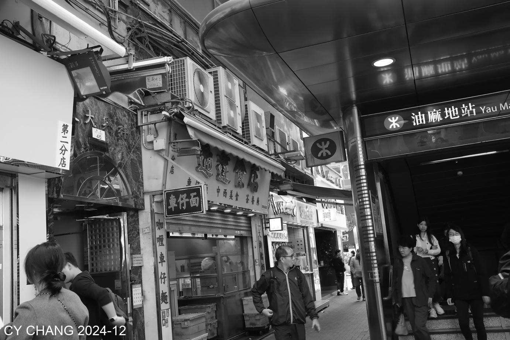
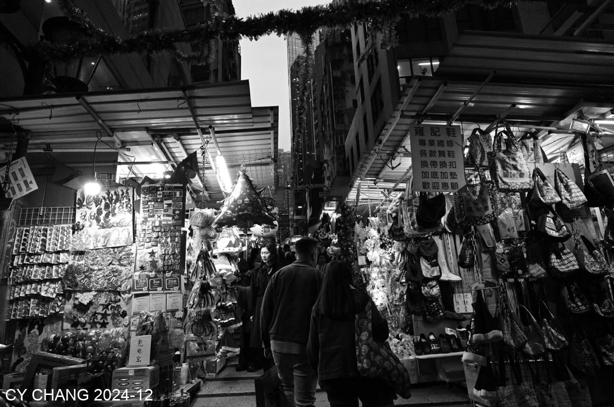
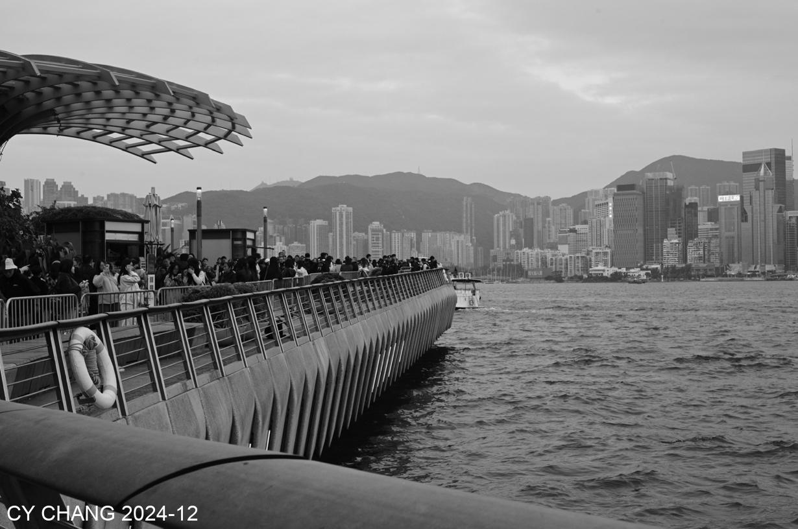
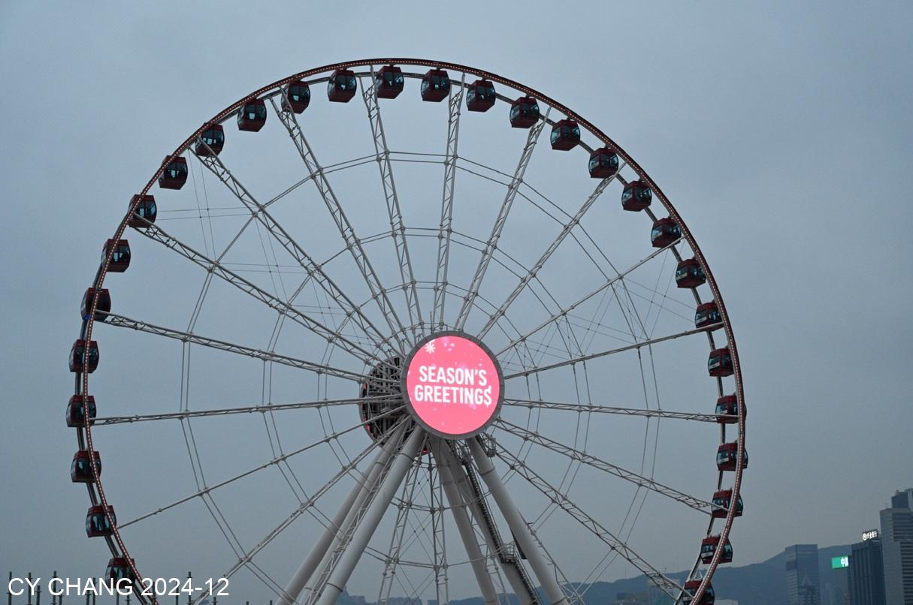
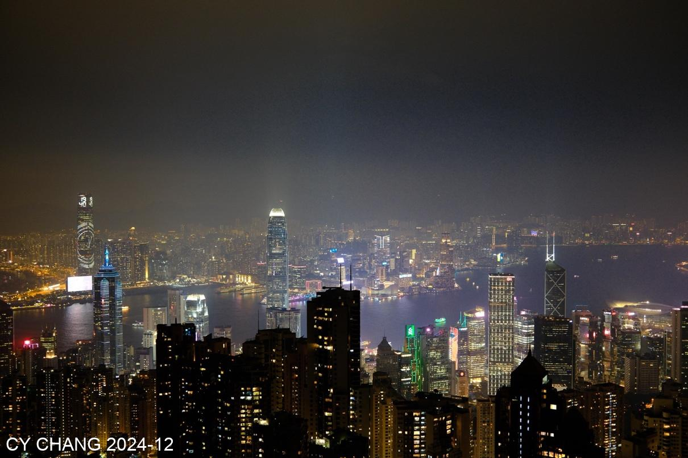
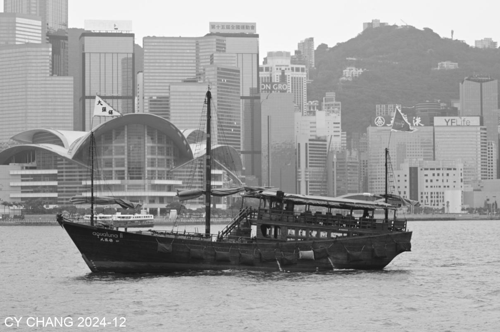
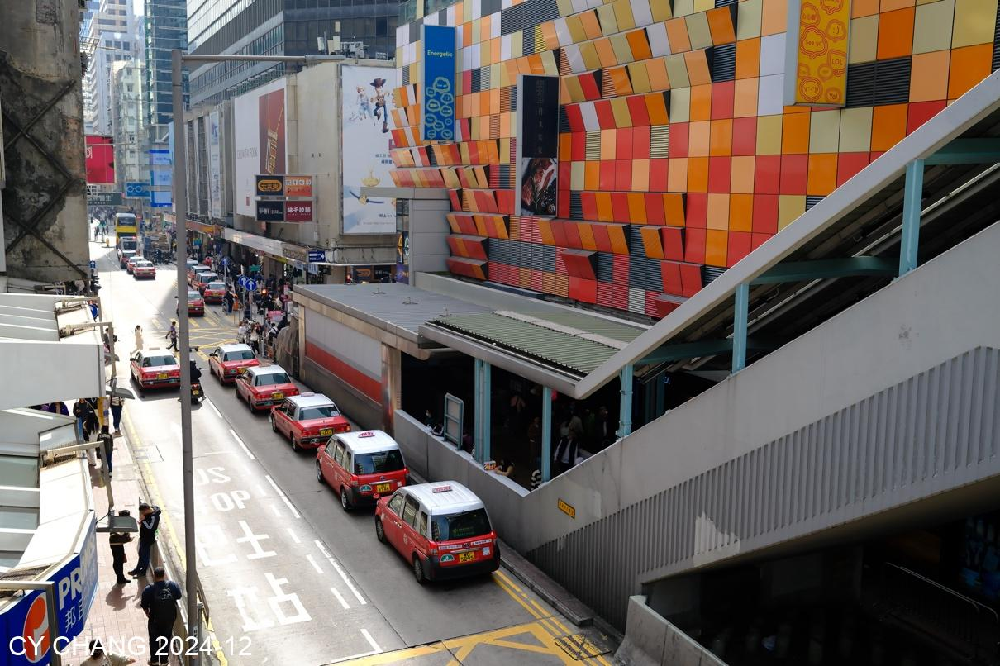
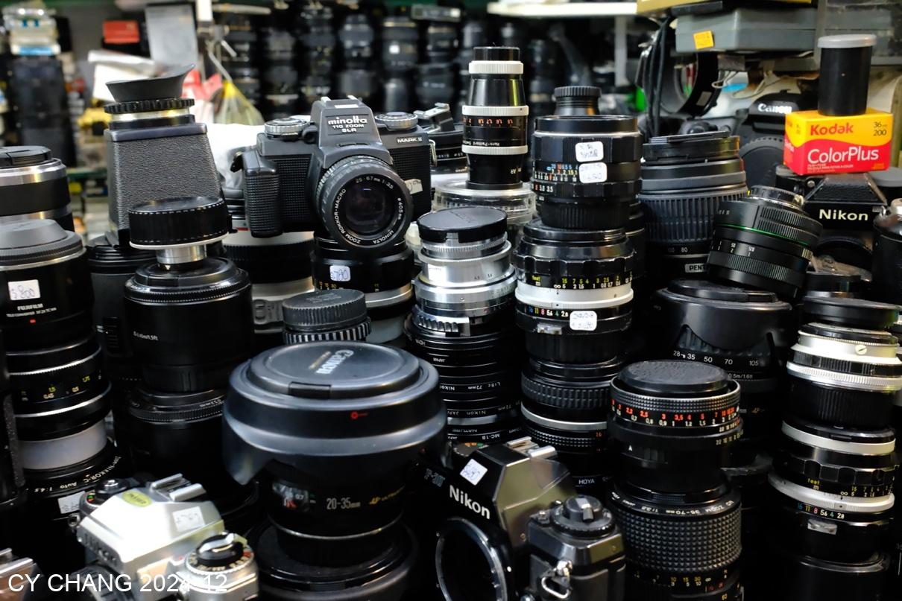
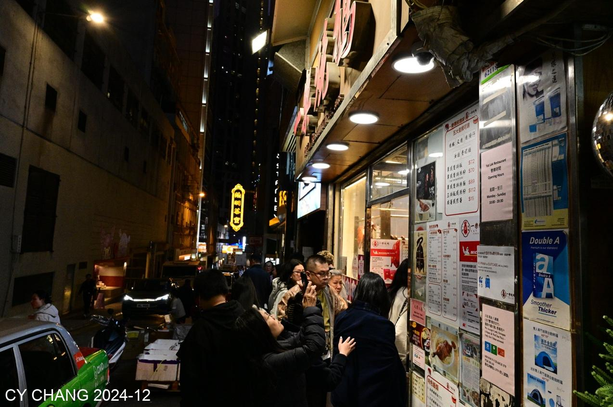

+++
author = "CY Chang"
title = "香港隨記"
date = "2024-12-25"
description = ""
tags = [

    "photography",

    "香港",

    "夜景",

    "膠卷",

]
categories = [

    "photography",

]
category_group = "photography"
series = ["香港"]
image = "image_9.jpeg"
+++
2024-12-25, 香港 

攝影/文案 CY Chang

# 香港隨記

離上次來香港也不知道多久了， 學了怎打地鐵， 轉車到酒店， 沒有計畫的行程， 聖誕節的遊客全來了香港， 入境的人潮像螞蟻綿延機場。  
感覺到濃濃的聖誕氣氛， 尖沙嘴的海邊學生們都準備好要表演， 畢竟英國人留下的傳統。 

富士的X100VI 充滿正片的色調， 彷彿又回到年輕時拍膠卷的時代。  
產品的成功是要靠用心的體貼使用者的。

渡輪滿滿的人， 看到Season’s Greeting， 是要加個dollar sign 的， 去蘭桂坊的路上， 已經沒有進酒吧的衝動了， 拍街景似乎更貼近現在的感覺。 

ㄧ家米其林的燒鵝店神奇的高傲服務態度， 我真懷疑下次還會來光顧。  
只是宣傳的太好了， 人排到馬路上了。 

## 太平山夜景
路邊的花店， 暖色的燈光照著， 雖然在夜裡， 看著心裡都繽紛。  
上太平山的長龍， 抬頭看到這LED 的景， 稍稍緩解那個無奈。 人是怎都擠在這裡啊。 

幾分鐘上山的纜車， 轉著轉著的人潮， 擠上山還得找到空隙， 自認網美的婦人， 姿勢擺足， 只是忘記了是來看維多利亞港的夜景的。 我想一定不是香港本地人。

星光大道， 都是些名人， 只是浮沉星海， 能夠流芳的畢竟不是全部。  
滿滿英式服務的茹斯葵， 貴得有道理， 中午只有一桌客人， 全部的服務都到我這邊了。 

下午， 吹著風， 海邊走著走著， 船來來往往， 絡繹不絕的遊客， 把路都堵了。  
看山上的太平山。 想今晚該是滿滿的人了。 

以為有煙火的聖誕夜， 在港邊看著看著， 來了燈光秀， 只是散場的人潮， 擠但有序的香港式管理， 彌敦道上塞滿了， 一步一步的走著， 不是散場電影， 逃難。

多種族的社會， 繞著小巷傳福音， 唱著歌， 跳著舞， 歡樂的一刻。  
可不是， 沒有紛擾的融合， 多好。 

路上不只有燒鵝， 看到這滿滿相機的店， 裡面看到地上， 桌上， 架上， 都是沒整理的相機跟鏡頭， 讓我想到吃燒鵝的感覺， 不像東京的相機店， 對機子的尊重， 讓人心裡踏實， 這裡沒有。

麻油地的名店， 一樣， 不敢恭維的服務， 擠滿滿店的餐廳， 只有一聲， 唉。

網紅點， 還是要來看下， 沒找到相機店， 倒是看到許多外籍勞工的聚會， 想著、我也是打工的， 只是我們這次的聚會在餐廳， 沒在天橋上。 

打工久了， 是不是該退休， 過自己想過愛過的日子！
