+++
author = "CY Chang"
title = "Revisit Turpan, Xinjiang"
date = "2023-07-03"
description = ""
tags = [

    "photography",

    "Xingjiang"

]
categories = [

    "photography",

]
category_group = "photography"
series = ["Xinjiang"]
image = "image_6.jpeg"
+++
2023-07-03, Turpan, Xinjiang

Photo/Writing CY Chang

# Kumtag Desert

It is a place that you only come to when it is the hottest. When Tang Sanzang passed by, he had no choice. It is called desert fog, and it is true.  
I like the dreamy light and shadow. The sun bursts out from the gaps in the clouds, and in the distance beyond the layers of sand dunes, it is a painting. 

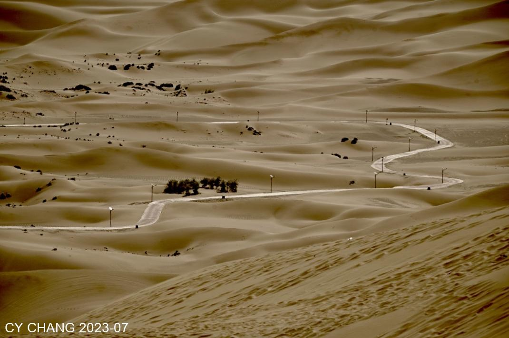

Passing by the vineyard, the Xinjiang people have to wait for another month for the grapes to mature. On the way to the Kumtag Desert on the edge of Shanshan County, I saw the scenery along the way and stopped the car because I liked it and took pictures again and again.  

> Note: Monk Shanshan is the master of Monkey Wukong. Later is more widely known as Son Goku, the main character in "Journey to the West"

This desert is closest to the city, so there are not many people and there is a lot of sunshine. When taking photos, you always have to endure the sun, wind and sand. The camera is afraid that it can't withstand the test, but the person is not afraid because he is old enough. I climbed up the sand dune slowly.  
My photography style is not as good as those internet influencer. I use the old-fashioned landscape photography techniques, I played with light and shadow.

Standing on the top of the sand dune, you can see the beauty of the mountain behind along the ridge. The layers of sand piles are somewhat intoxicating.
The blue sky with white clouds and the sand fog blown up by the wind on the ridge made people wonder why Wukong was so reluctant to follow this place.

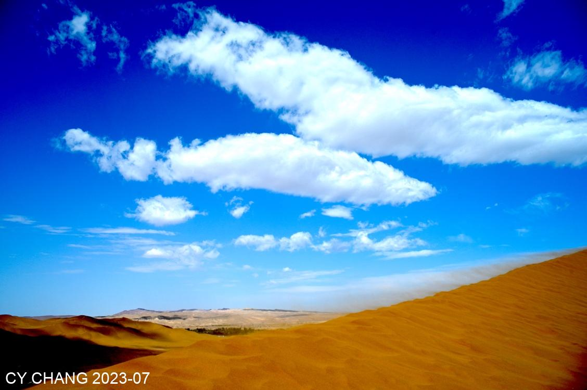

There is no camel traffic like in Dunhuang's Shaming Mountain, but it still looks like the one used to fight the Huns. I don't know who designed it, but it recreates the bustle of the Silk Road.

At the edge of the desert, the sand sculptures look artificial, but the emerald green that lives quietly on the sand looks more real.

# Flame Mountain

We always stop at the parking lot of Huoyan Mountain. There are more fences and larger parking spaces than a few years ago. The mountain isn't disappear, but there are more people.

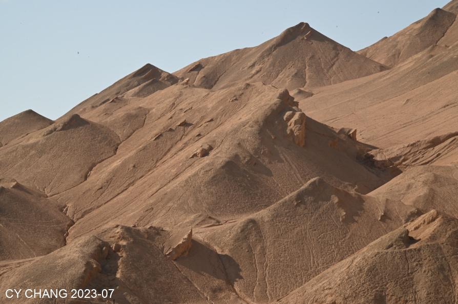

The sandstorm the day before did not cover everything.
The house where grapes are dried and the place where people make a living are waiting for next month's harvest.

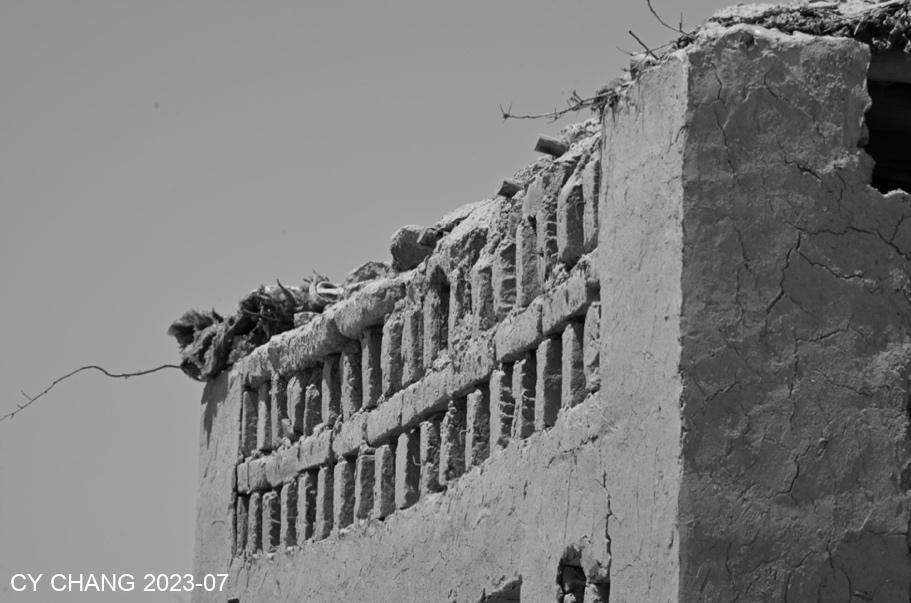

## Tuyugou

Passing by Tuyugou, there are Thousand Buddha Caves, where monks have been worshipped for more than 600 years AD. The caves were donated by wealthy businessmen who worshipped Buddha and supported the monks.

The cave is warm in winter and cool in summer with a dry climate. It has remained intact since 600 AD. It was only damaged by explorers from the Western world who took the precious cultural relics back with them. The remaining fragments require the tour guide to imagine what happened at that time and explain it slowly.

In midsummer, the parking lot is filled with tourists, and it is unclear whether they come here to see something that has passed away or the remaining stone walls.

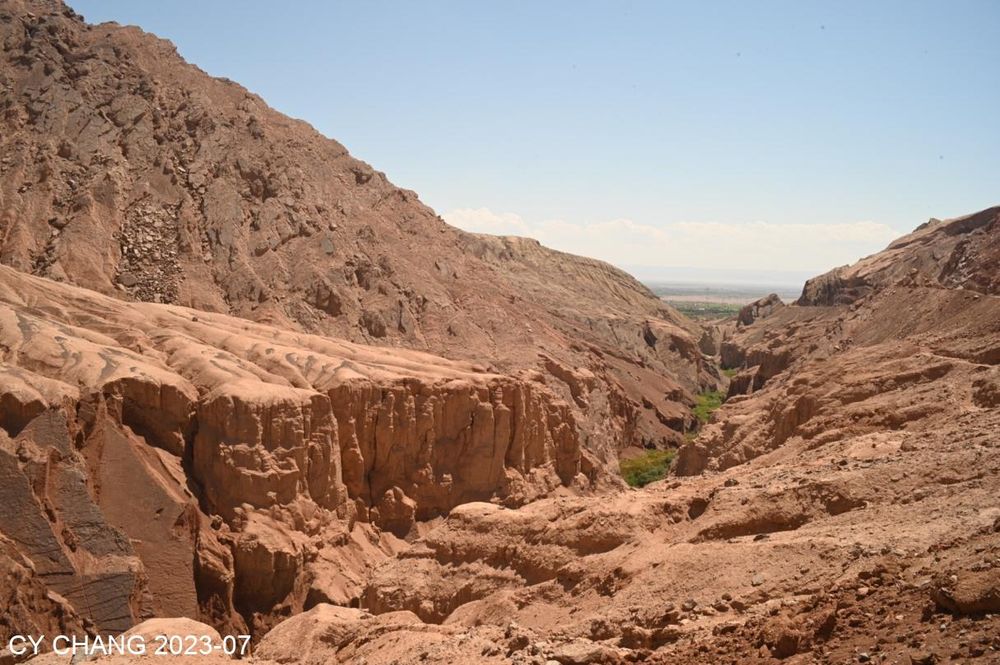

# Relics of the Ancient Kingdom of Gaochang

Going to the ruins of the ancient Gaochang Kingdom, it’s even more tedious.
Under the scorching sun at 43 degC, Hu and I needed to use an electric car to transport us. There was only one driver and one supervisor who accompanied us on a long tour of Gaochang Kingdom.

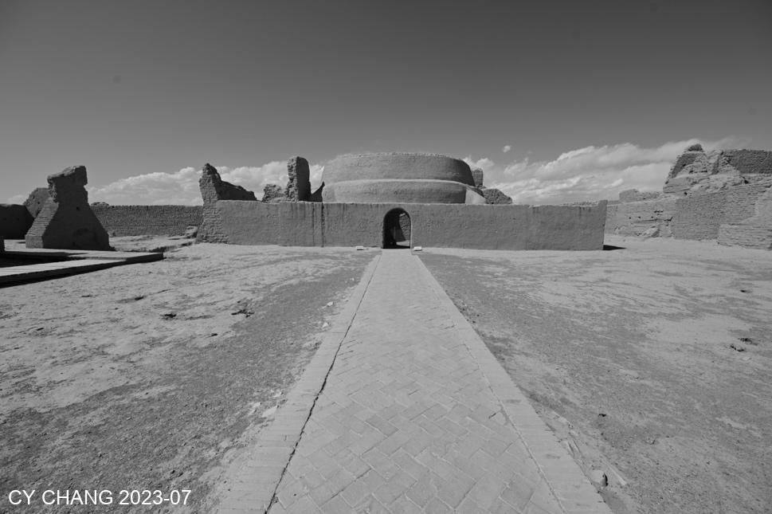 

The platform where Monk Sanzang gave lectures was gone, his sleeping place collapsed. Who would have thought that when the Monk passed by on his way back to Chang'an, Gaochang Kingdom was also destroyed. What mattered if Sanzang cried? But the situation had experienced many ups and downs in just over 20 years.
> Note: Chang'An was the capital of Tang Dynasty

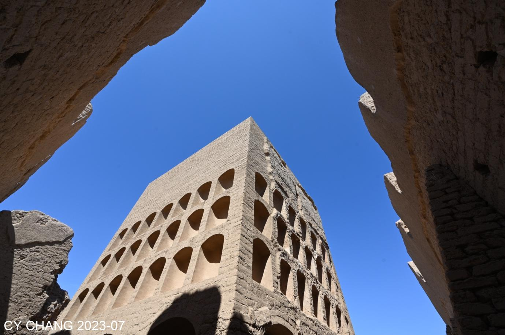

# Ayding Lake, the lowest point inland

There is no flat road on the road to Aiding Lake, so trucks carrying melons have to be careful when passing through the bad road. It was magical to see the sign of the lowest inland place in the world along the way.

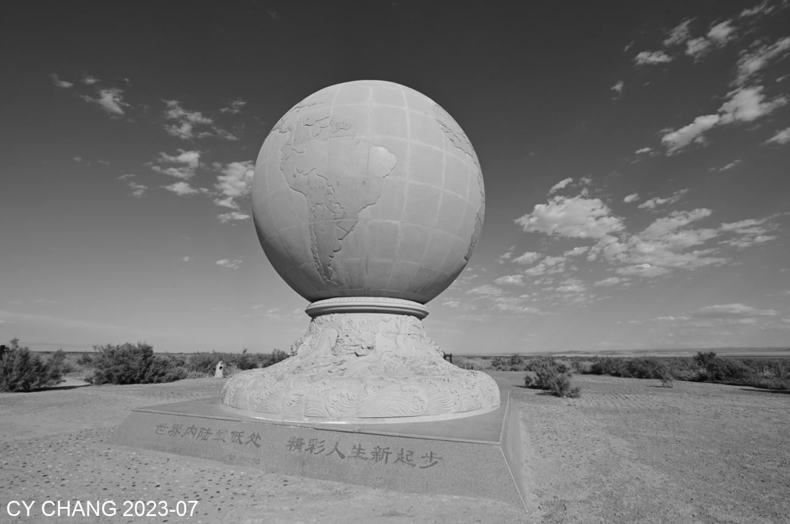

After passing the toll station, the road was straight and the dry lake looked lifeless. After walking for half an hour at the end, we actually arrived at the Turpan Depression, 154.3 meters below sea level. A group of Hui Muslim friends are outing here, looking free and easy.

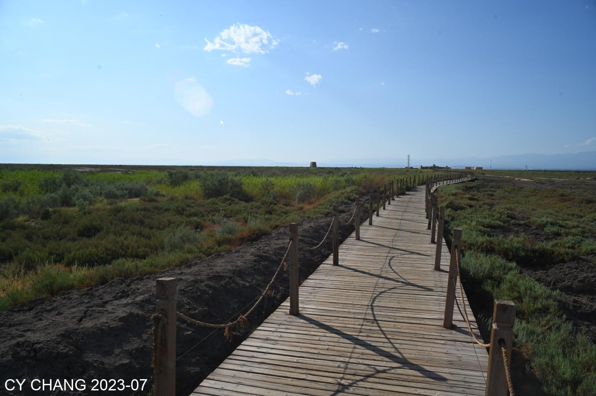

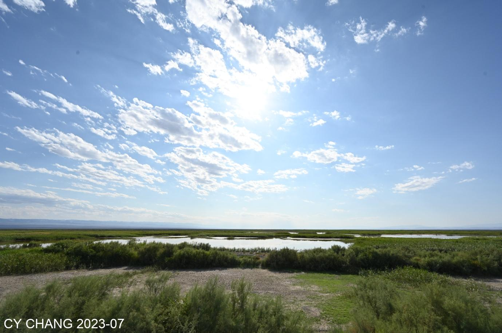

# The night in Turpan is very long

After dinner, it was already 11 PM. The streets were noisy and everyone was happy after a good dinner.
Roast lamb is a must-eat. Suddenly, I started drinking beer and indulging myself into that world of wine and meat.

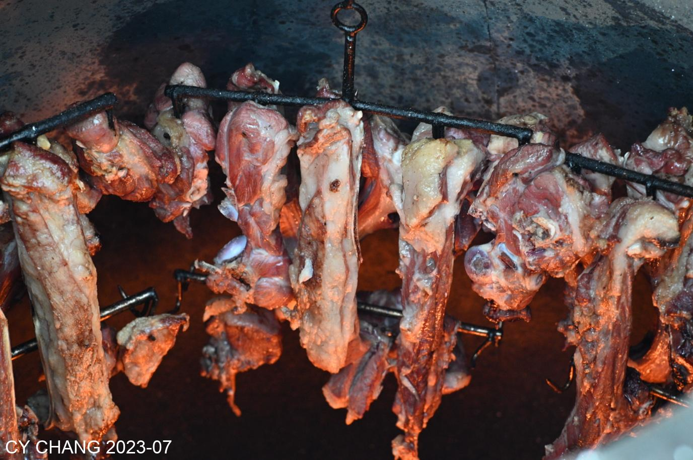

The sun has just risen in the morning, sits on the rooftop, complaining it's not 11 PM anymore.  
On the way home, I don’t need to ride a horse like the Monk, I just take iron bird back to Chongqing in one day.

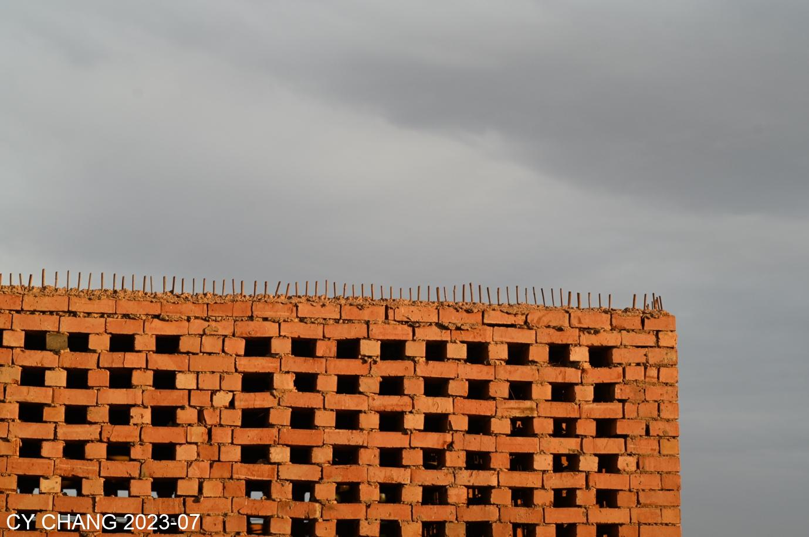
