+++
author = "CY Chang"
title = "再訪吐魯番沙漠, 新疆"
date = "2023-07-03"
description = ""
tags = [

    "photography",

    "新疆"

]
categories = [

    "photography",

]
category_group = "photography"
series = ["新疆"]
image = "image_6.jpeg"
+++
2023-07-03, 吐魯番 新疆 

攝影/文案 CY Chang

# 庫木塔格沙漠

最熱的時後才會來的地方，三藏經過時也該沒什選擇，說是沙漠迷霧，也是，喜歡那夢幻的那光影，陽光從雲隙中竄出，在沙丘層層的遠方，畫出的那幅景像。

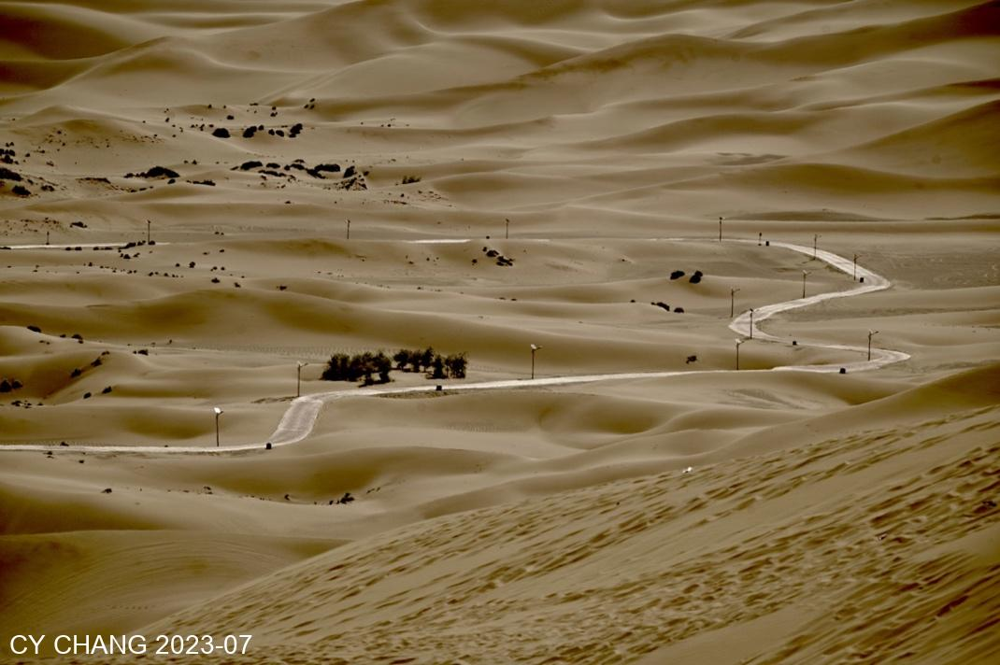

路過的葡萄園路，疆民等葡萄成熟，該要再ㄧ個月的了。  
往鄯善縣邊的庫木塔格沙漠，看到這路上得景緻，喜歡的停下車，拍了又拍。  
這沙漠離城最近，人不多，陽光多。  
照相總要忍著曬，忍著風沙。就相機怕經不起、人是不怕的，皮夠老。  
慢慢的爬上沙丘，比不上那些網紅的拍法，老手法的風景照，我玩光影。  

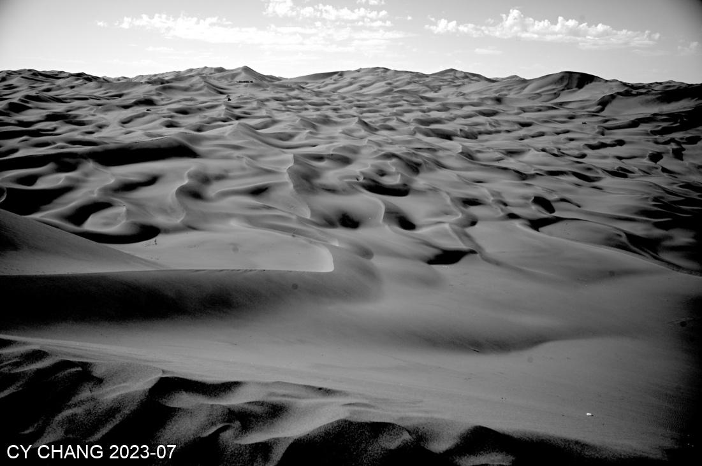

在沙丘的頂上，稜線邊看到後山的美，ㄧ層層的沙堆，有些醉人。  
藍天配白雲，稜線上風吹起的沙霧，想為什悟空一肚子不情願跟著過這地方。

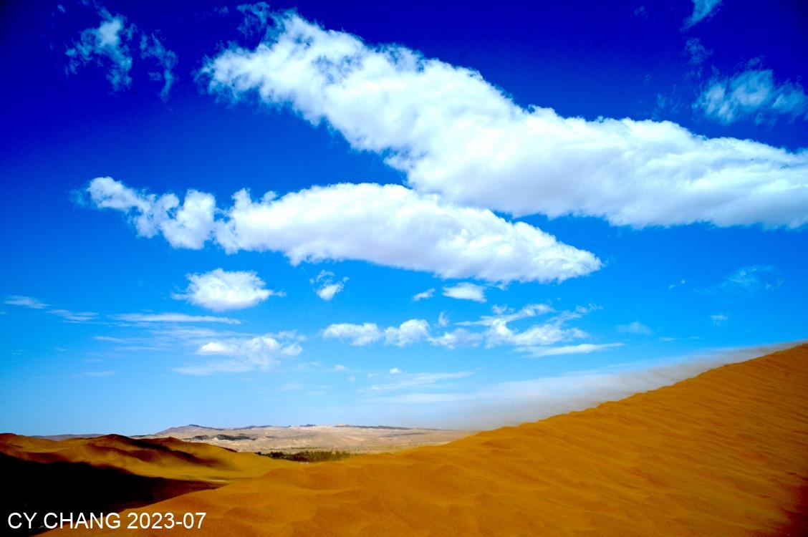

沒有敦煌沙鳴山的駱駝紅綠燈，但是一樣像打匈奴的樣，也不知到誰理出來的，重現絲路的繁忙。

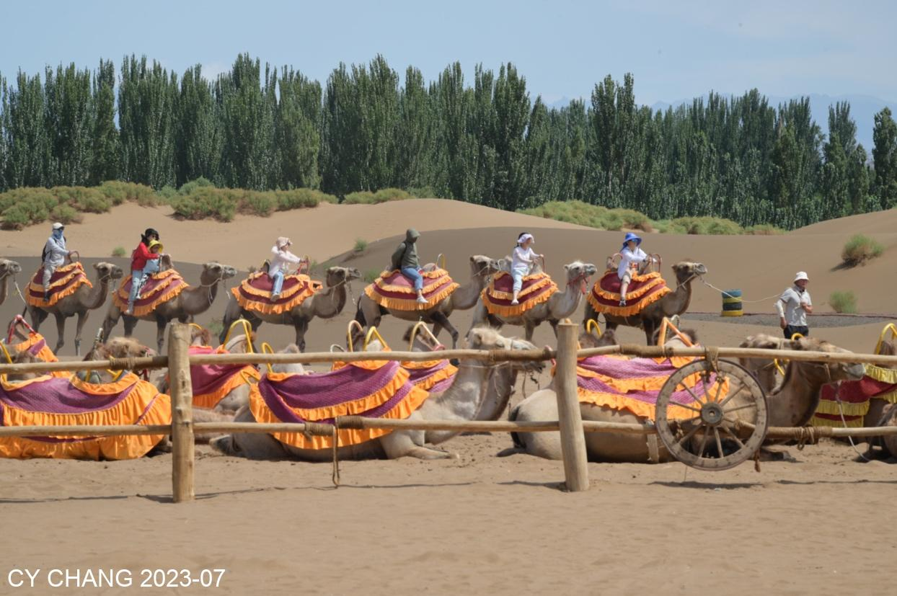

沙漠邊，沙雕雕的真人工，倒是默默在沙上過活的翠綠真實些。

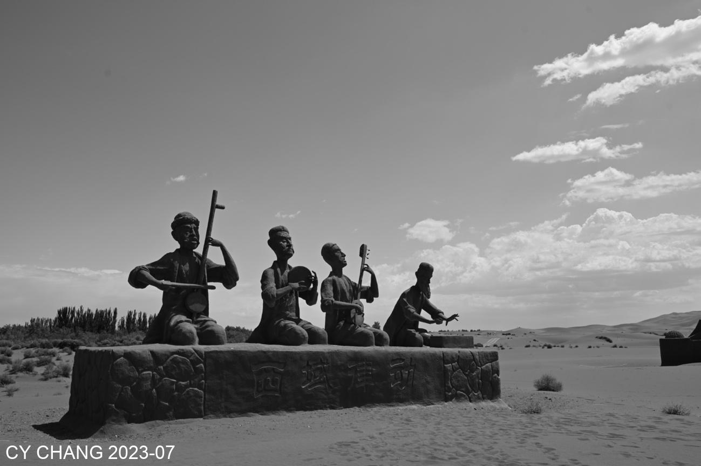

# 火焰山

還總是會在火焰山的停車場歇停點。比幾年前多了圍起的網跟更大的停車位，山沒少，人多了。

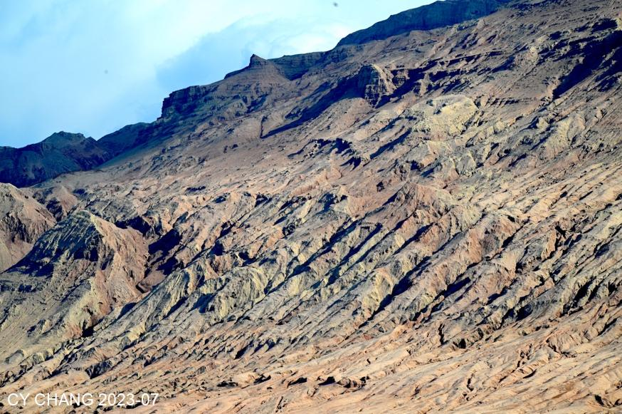

前一天的、沙塵爆，也沒淹沒一切。  
曬葡萄的房子，營生的地方，就等著下個月的收成。

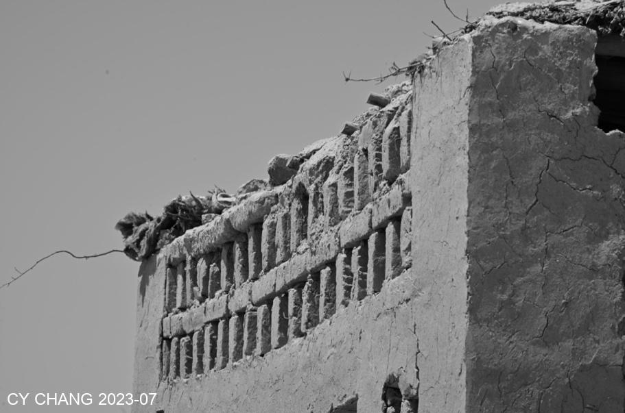

## 吐峪溝

路過吐峪溝，裡面有千佛洞，西元600多年有僧侶被供奉，有錢的商人捐獻的，敬佛又供養僧侶。  
山洞裡冬暖夏涼，氣候乾燥，西元600年至今都不壞，壞在西方來的探險家，把寶貴的文資全搬回去了。剩下的殘片，需要講解員想像著當時，慢慢解說。  
盛夏，遊客停滿車場，也不知來這看的是逝去的東西還是剩下的石壁。

# 高昌古國遺跡

轉到高昌古國遺跡，更絕了。  
在43度的艷陽下，我跟虎哥兩人，電瓶車接駁是必要的，只是一個司機，配一個監督，陪我們轉了一大圈的高昌國。

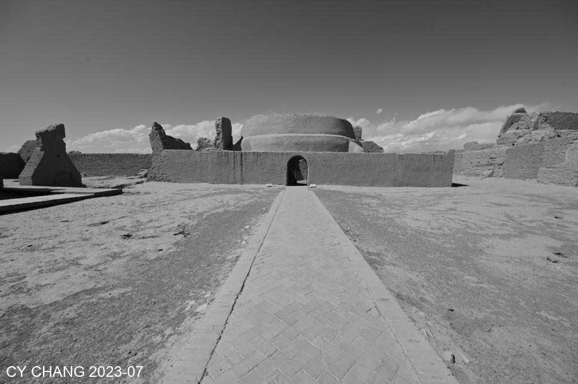 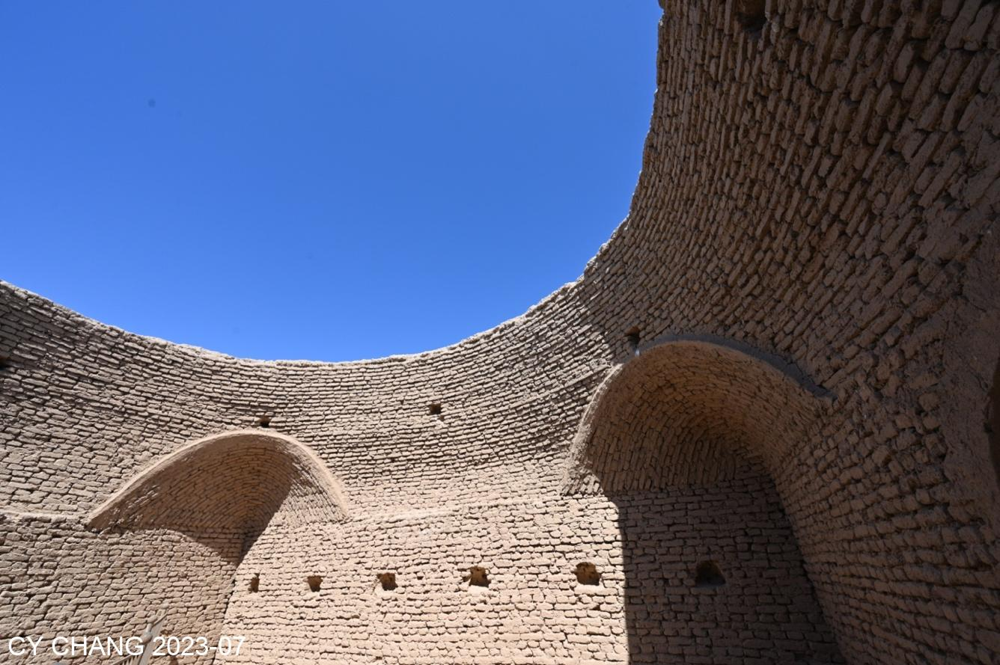

三藏講經的講壇沒了，睡的地方垮了，誰想得到唐僧想到回長安的路上經過，高昌國也被滅了，三藏大哭又如何，不過20幾年光景大起大落。

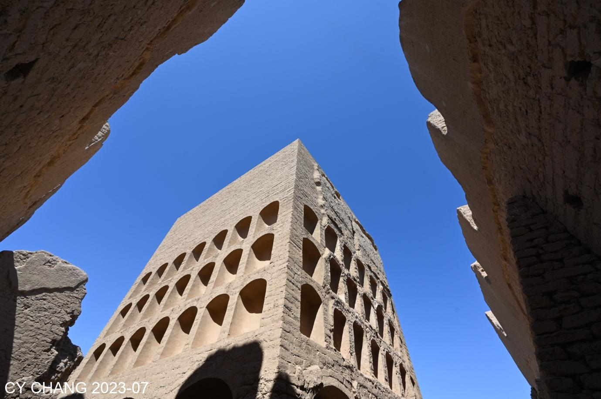

# 艾丁湖，內陸最低的地方

艾丁湖路上，沒平路，載瓜的卡車過爛路看也小心。一路看到世界內陸最低的地方的招牌，也神奇。  

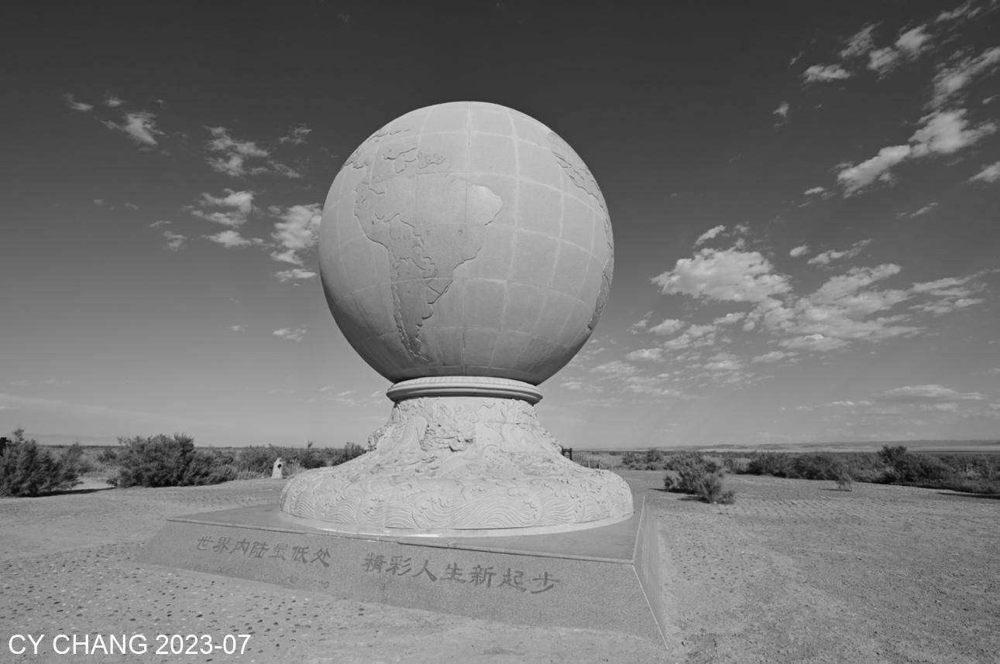

過收費站一路直線，乾枯的湖沒啥生機，在盡頭走了半小時，還真的來吐魯番凹地，海平面下154.3米。一群回族三五好友在這踏青，看他們自由自在的。  

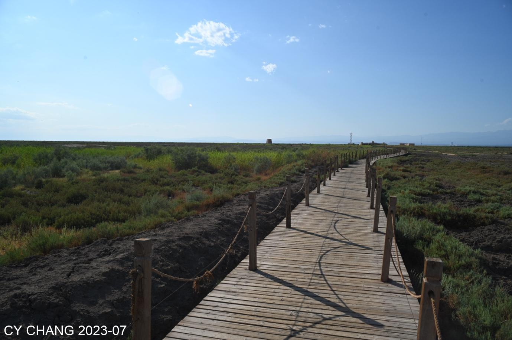

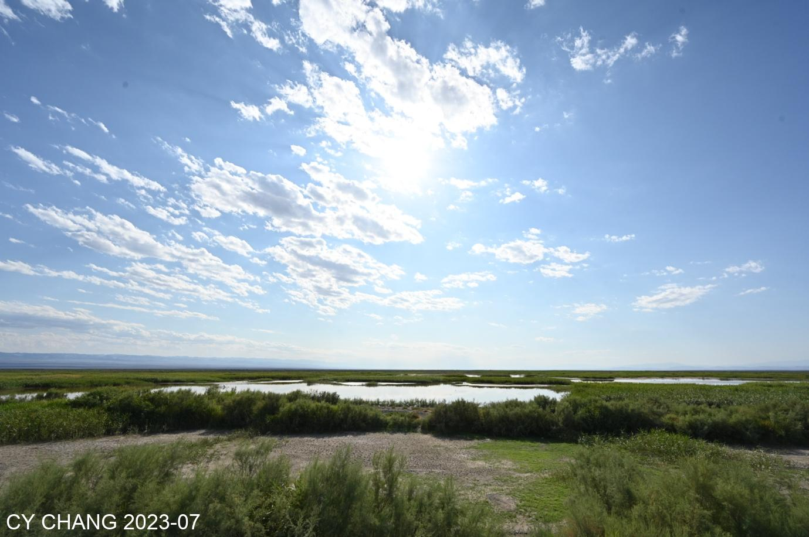

# 吐魯番的夜、很長

吃完晚餐，就是11點了，路上喧嘩，大家吃完好晚餐的快樂 。  
烤羊肉是必點的，突然我怎喝起啤酒，融入那酒肉世界。  
> Will's 註： ...

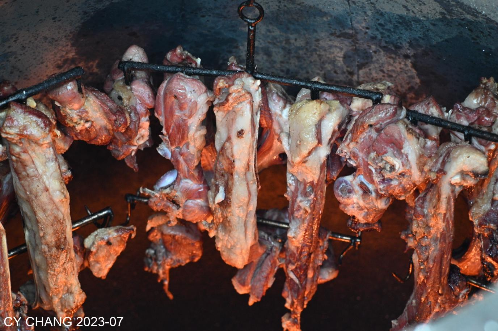

夕陽照著屋頂，說哪是晚上11:00。  
朝陽下太陽剛剛露頭，回家路上，不用騎馬、駕著鐵鳥，一日返渝。  

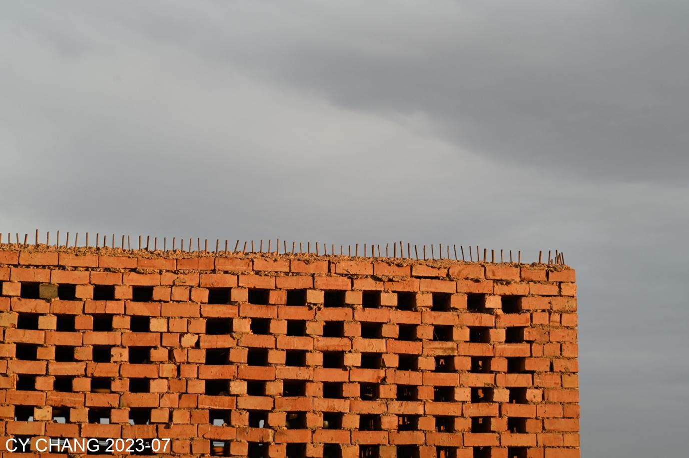
