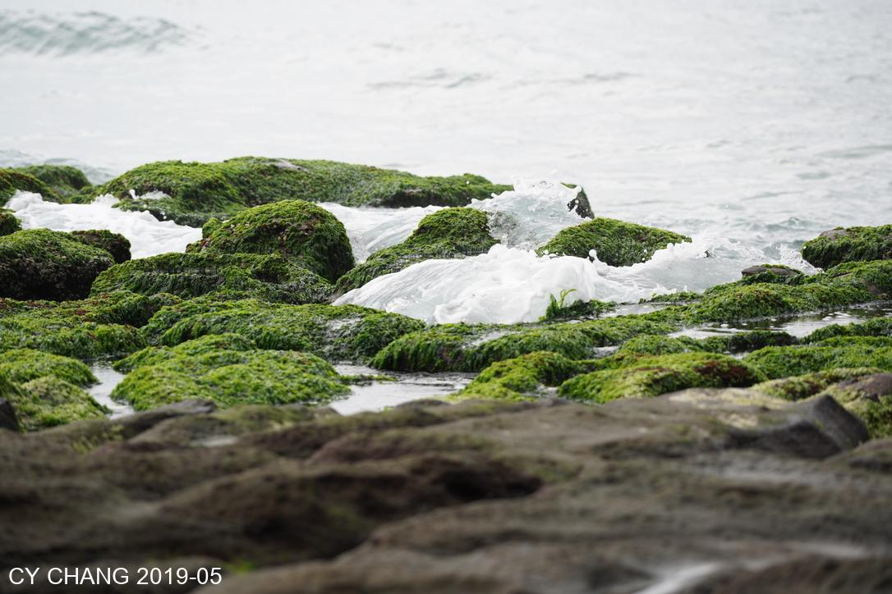
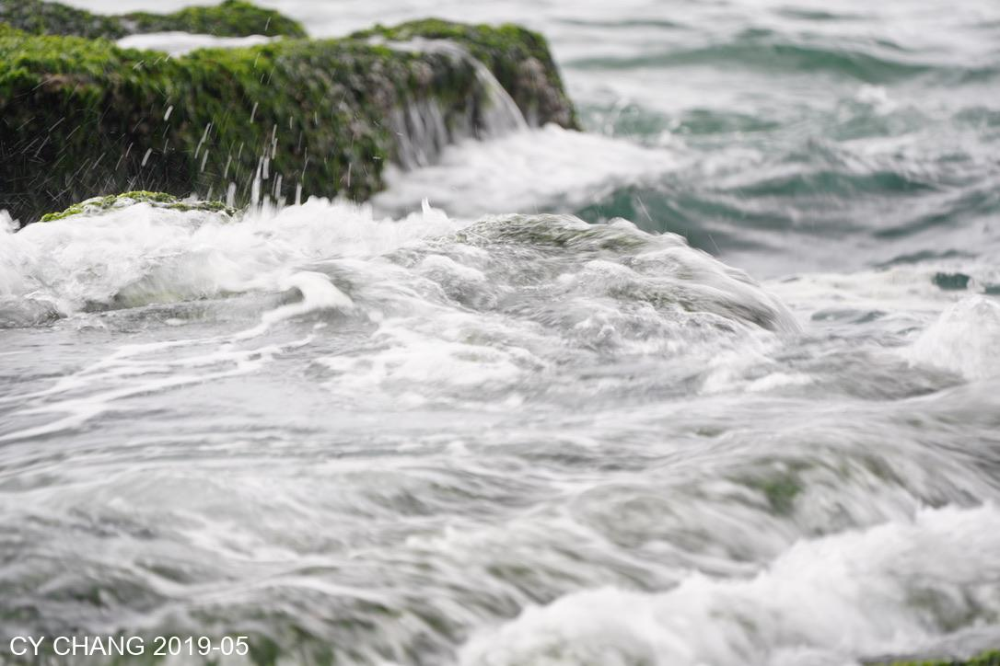
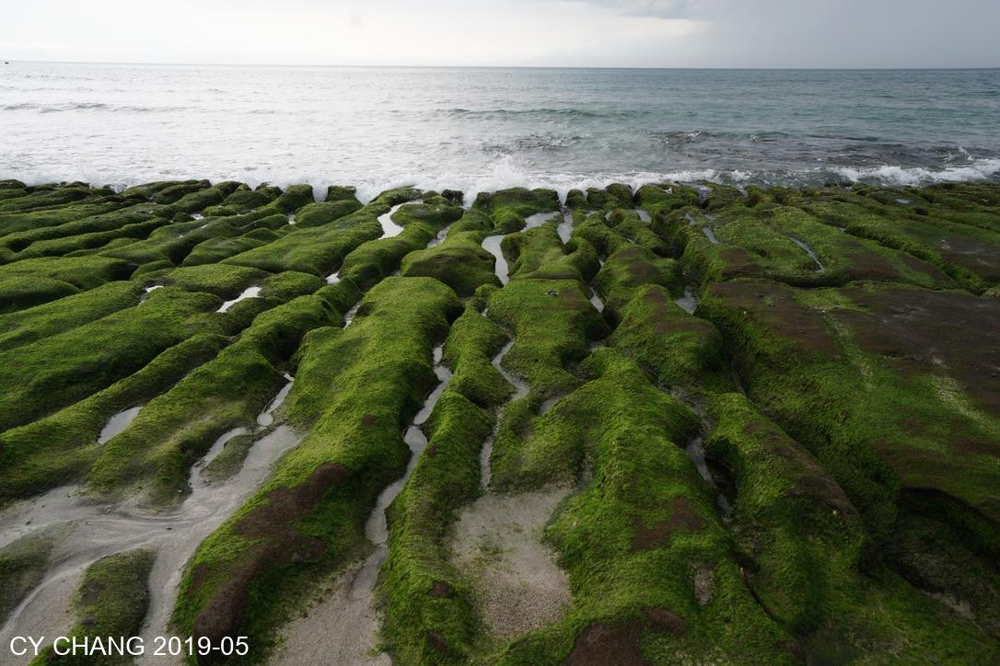
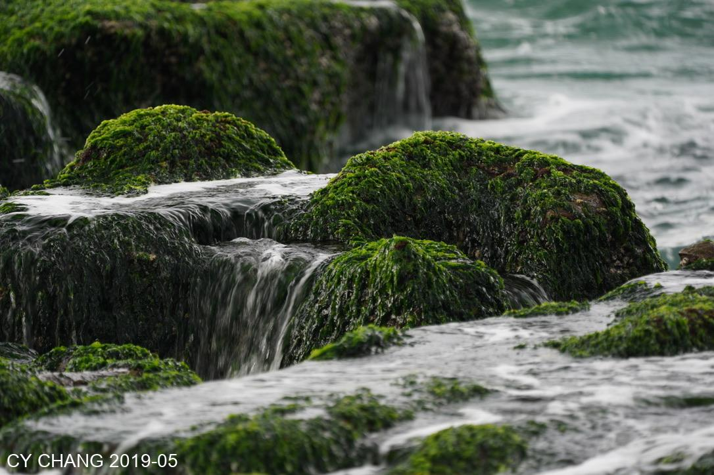

+++
author = "CY Chang"
title = "Laomei Green Reef - Shimen, Taiwan"
date = "2019-05-30"
description = "Northern Coast's Well Known Beauty"
tags = [

    "photography",

    "Taiwan",

    "Coast",

]
categories = [

    "photography",

]
category_group = "photography"
series = ["Taiwan"]
image = "image_3.jpeg"
+++
05-30-2019 Laomei Green Reef - Shimen, Taiwan 

Photo/Writing CY Chang

> Will's Note: Dad's spontaneous photos. Incredibly beautiful. NOT AI generated for sure!

[Google Map](https://www.google.com/maps/place/Laomei+Green+Reef/@25.2924447,121.5398484,17z/data=!3m1!4b1!4m6!3m5!1s0x3442b5d24b9341ed:0x28a58d2f492330b2!8m2!3d25.2924399!4d121.5447193!16s%2Fg%2F12hmcs3rs?entry=ttu&g_ep=EgoyMDI1MDEyMi4wIKXMDSoASAFQAw%3D%3D)

## Tides

The time-limited beauty every year, the change of tides creates the natural green elves of the earth. It is a living scene, the waves of the sea make dancing spirits move in and out of the waves.

## Coastal erosion

The coming and going of seasons for thousands of years has etched traces of volcanic ash. Green elves are attached to the surface. The dead scenery is everything lively.

 

When the waves hit, the white foam drove the rhythm of my heart. Life is too hurry. I sit there and watched carefully, but I couldn’t reach it. I was busy taking pictures. Were I missing anything?

 
