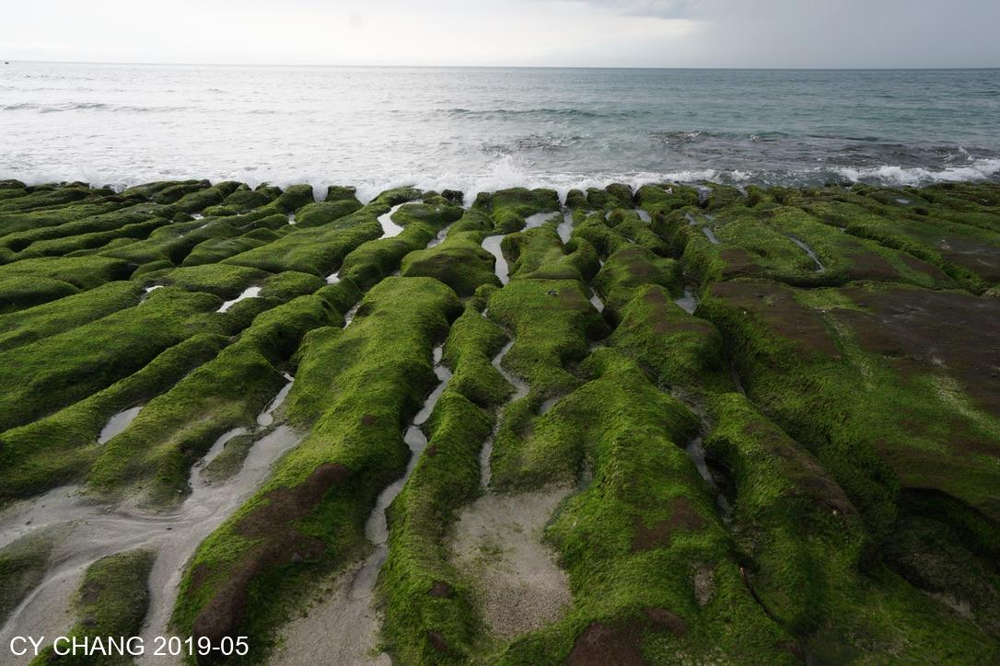

+++
author = "CY Chang"
title = "老梅綠石槽 石門 台灣"
date = "2019-05-30"
description = "北海岸"
tags = [

    "photography",

    "台灣",

    "海岸",

]
categories = [

    "photography",

]
category_group = "photography"
series = ["台灣"]
image = "image_3.jpeg"
+++
05-30-2019 綠石槽 台灣北海石門  

攝影/文案 CY Chang

> Will's 註：老爸隨手拍的，美到不像話，不說還以為是AI圖

[Google Map](https://www.google.com/maps/place/Laomei+Green+Reef/@25.2924447,121.5398484,17z/data=!3m1!4b1!4m6!3m5!1s0x3442b5d24b9341ed:0x28a58d2f492330b2!8m2!3d25.2924399!4d121.5447193!16s%2Fg%2F12hmcs3rs?entry=ttu&g_ep=EgoyMDI1MDEyMi4wIKXMDSoASAFQAw%3D%3D)

## 潮汐

每年的限定美景， 潮汐的變化造就了大地天然的綠精靈。是活的景色 海水的波動 讓跳動的精靈 在水波進出。

## 海蝕

千年的來回季節 刻蝕著火山灰的流痕 綠精靈附著表面 死的景色卻是活潑的ㄧ切。

 

當海浪拍打時 白色的浪花 帶動心裡的節拍 生活太急了，坐那細細的看著 卻不可得，忙著拍照 是不是少看到什了

