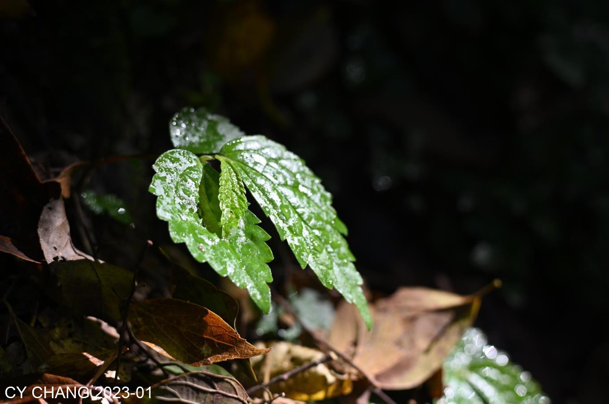
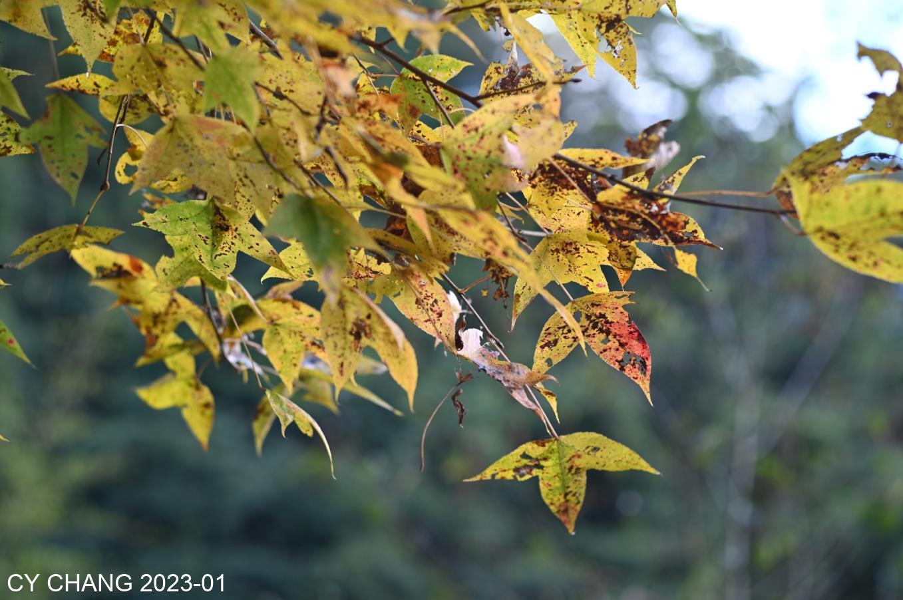
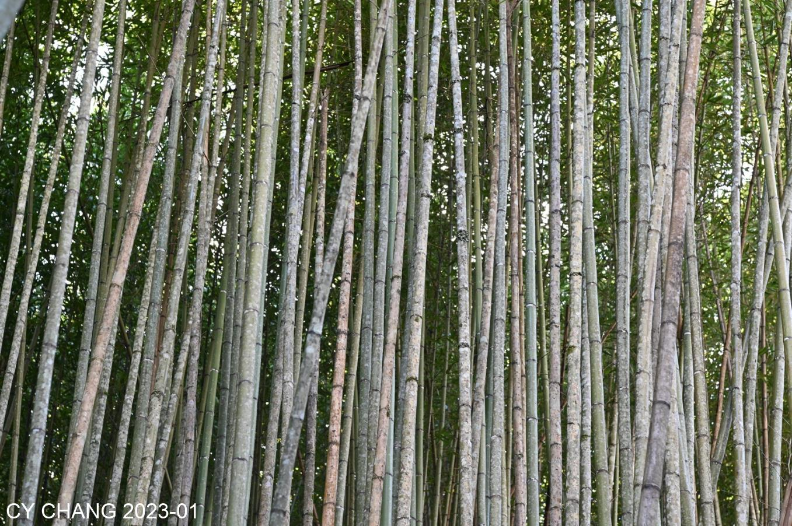
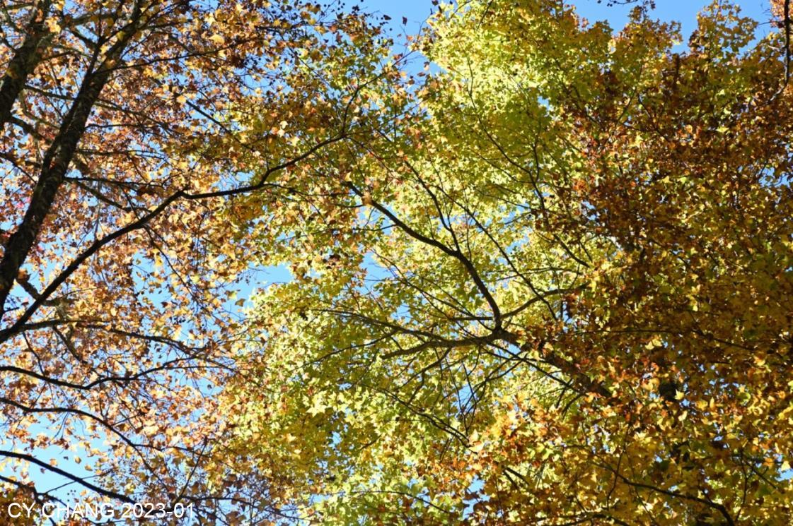
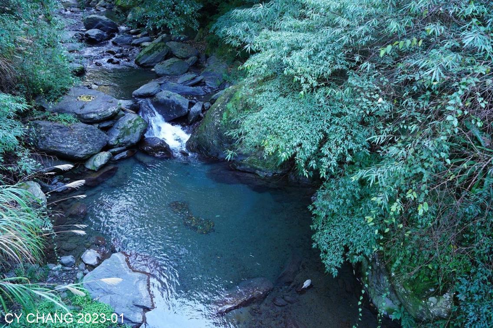
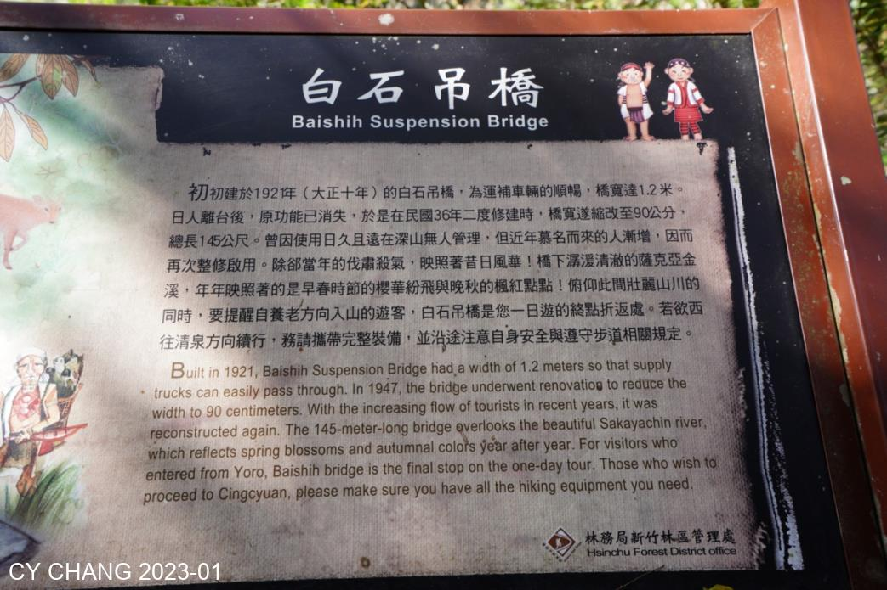
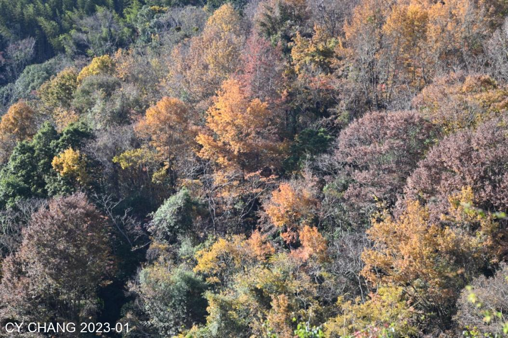
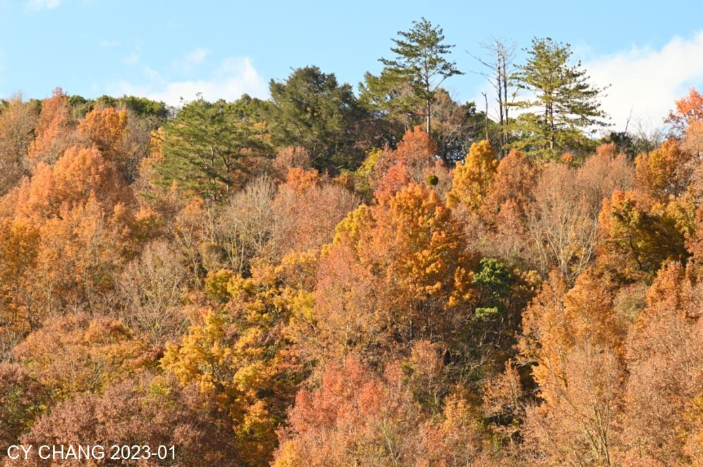

+++
author = "CY Chang"
title = "Syakaro Historic Trail, Taiwan"
date = "2023-01-07"
description = ""
tags = [

    "photography",

    "Mountain-Climbing"

]
categories = [

    "photography",

]
category_group = "photography"
series = ["Taiwan"]
image = "image_2.jpeg"
+++
2023-01-07, Syakaro Historic Trail, Taiwan

Photo/Writing CY Chang

# Originated from Maple Red

When the maple leaves turn red, everyone thinks of the Syakaro Historic Trail, a sad ancient trail that has become a popular route with limited entry.

The Japanese developed flat roads on the mountainside to transport guns, ammunition, and built several garrisons. The bottles of wine left behind were low-grade Japanese rice wine. The Japanese police who came to Taiwan must have come for a living.

> Note: Taiwan was under Japan regime between 1895 ~ 1945.

The internet influencer took beautiful aerial photos. I geared myself up with my heavy Leica and walked 20k mountain road. The mountain trail had clear sunlight, and you could see through the leaves. I haven't seen it for a long time.

I walked through the bamboo forest and saw the red maple leaves under the blue sky at the Ma'an Station, using a wide-angle Zeiss lens. Lying on the ground and looking at the sky, the blue sky through the leaves. Pure beauty.

# White Rock Suspension Bridge, aka Baishih Bridge

The green stream is under the suspension bridge. You will miss it if you don’t pay attention. It is preserved without being polluted, which is an ecological necessity.

10k to Baishih Suspension Bridge. Thinking about the 10k it will take to go back to Yanglao Village, I feel like the things on my back have become heavier. Climbing up and down the high and winding road. It's time to turn back at one o'clock in the afternoon.

# Sunset

The setting sun makes the maple leaves on the opposite mountain more colorful. The forest is where the Saddle Station is. Thinking that I am still on the opposite mountain, the 15 kilograms on my back feels even heavier.

The last time I saw a mountain full of red maple leaves was in Kyoto, Japan. It has been decades since then. In the mountains of Taiwan, I walked slowly, enjoying the scenery. After passing the forest, I found that the people who came before me were going to camp overnight in Baishi. Next time, I should camp overnight as well. It takes another two hours to drive home from the parking lot. I took a familiar route and walked slowly.

