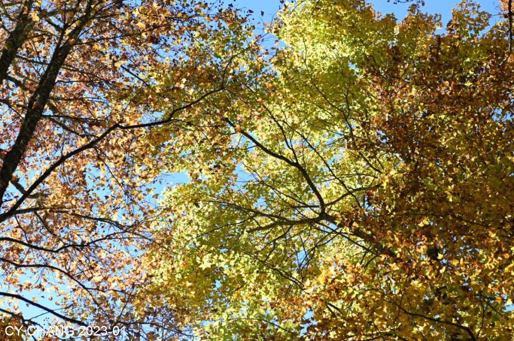
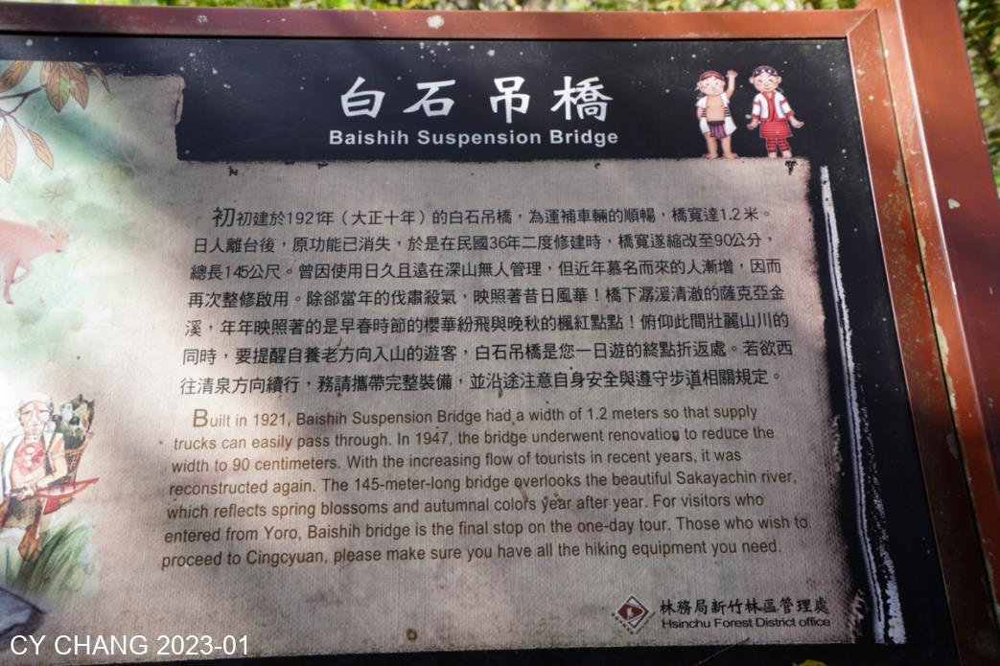

+++
author = "CY Chang"
title = "霞喀羅古道, 台灣"
date = "2023-01-07"
description = ""
tags = [

    "photography",

    "登山"

]
categories = [

    "photography",

]
category_group = "photography"
series = ["台灣"]
image = "image_2.jpeg"
+++
2023-01-07, 霞喀羅古道, 台灣 

攝影/文案 CY Chang

# 緣起楓紅

當楓紅時，大家想到霞喀羅古道，一個悲傷的古道，變成進入還要限流的熱門路線。  

日本人平番開了山道，在山腰上切開了平平的道路，運槍砲彈藥， 建了幾個駐在所， 留下的酒瓶是日本低階的米酒， 來台灣的日警該是來求口飯吃的吧。 

網紅拍了漂亮的空拍照， 我就重裝帶著重重的萊卡， 走著 20k 的山路， 山徑有著通透的陽光， 能看穿葉子， 好久沒能見到了。 

 
穿過竹林， 在馬鞍駐在所看到了藍天下的楓紅、廣角的蔡司鏡頭用上。 躺在地上看天空、透著葉子的藍天，美著。 

 

# 白石吊橋

綠綠的溪水，在吊橋下， 沒注意就錯過了。 能保留著不受污染， 這是生態的必須。  

10k 到白石吊橋， 想想回頭回到養老部落還要10k，覺得背上的東西變重了。 高繞的路上下爬著。 下午一點該是回頭的時候了。 

 

# 斜陽 

斜陽讓對山的楓葉更有色彩， 那林子就是馬鞍駐在所， 想想我還在對山， 背上的15 公斤更重了。 

上次看到滿山楓紅是在京都， 都幾十年了， 在台灣山裡， 品嚐著 慢慢走， 過了林子， 前面來的人都是要去白石過夜露宿的， 下次我也來個露宿白石。 到停車場還要兩小時車回家， 熟路回去， 慢慢行。 

