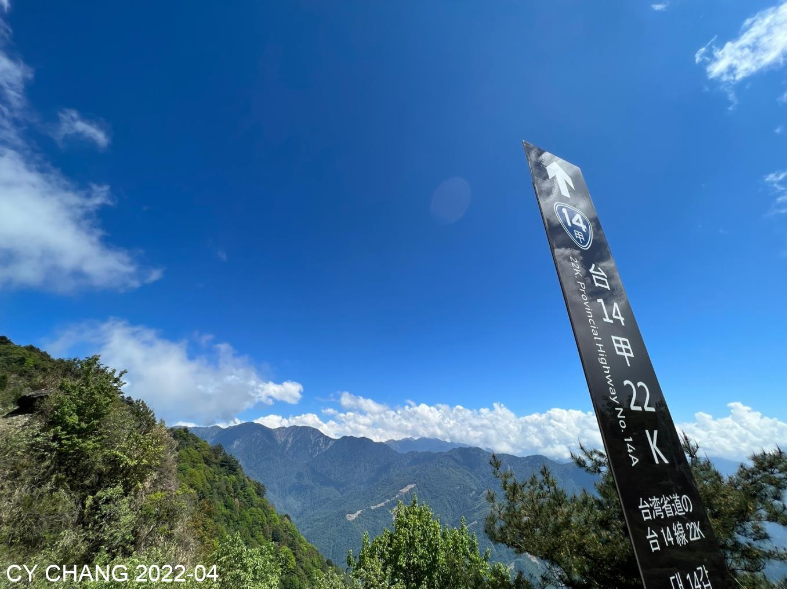
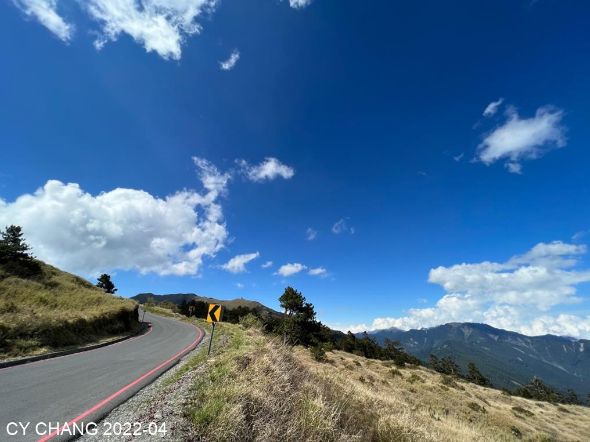
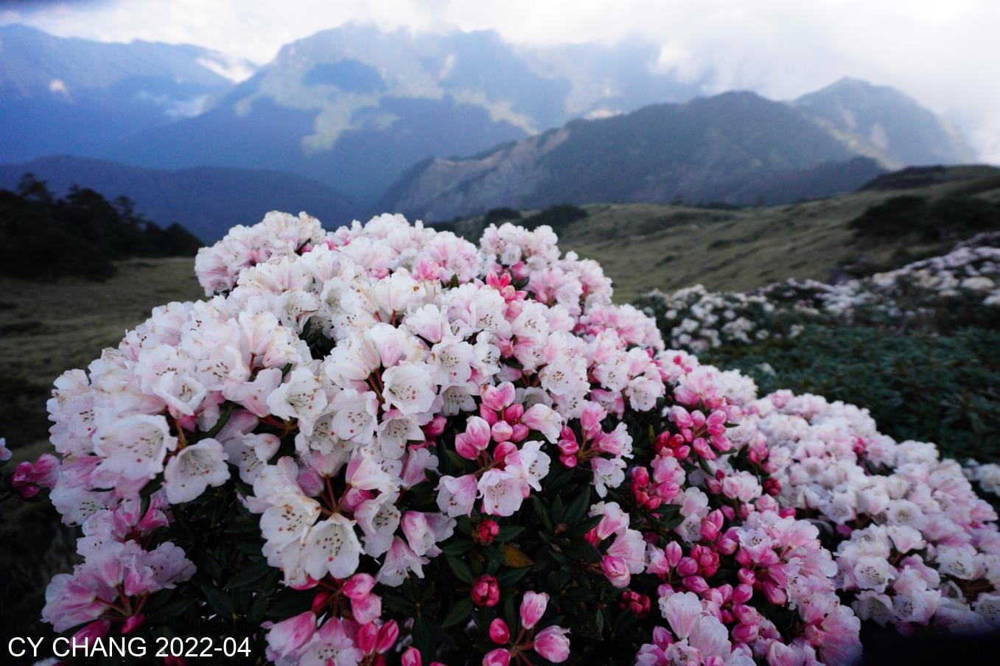
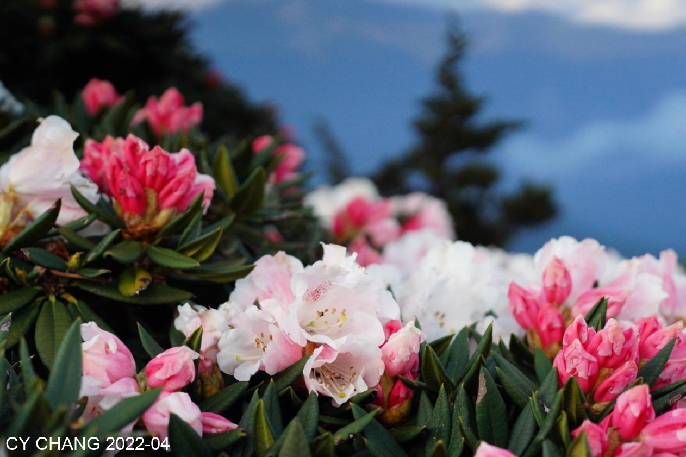
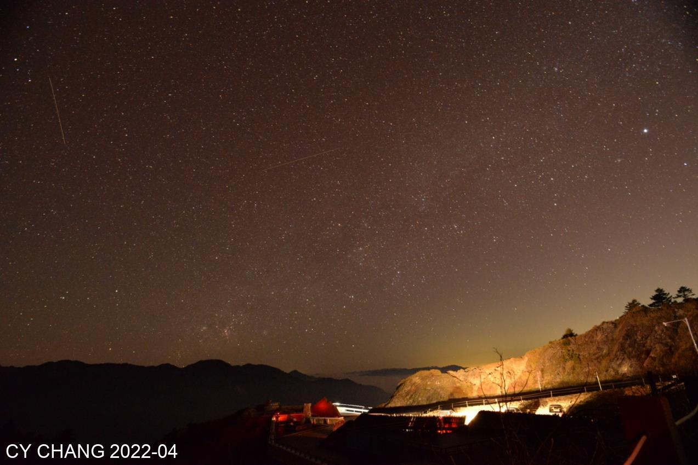

+++
author = "CY Chang"
title = "Hehuan Mountain East Peak, Taiwan"
date = "2022-04-28"
description = "Rhododendron, Milkyway"
tags = [

    "photography",
    "Taiwan",
    "mountain",
    "milky way",

]
categories = [

    "photography",

]
category_group = "photography"
series = ["Taiwan"]
image = "image_16.jpeg"
+++
CY Chang

## Hehuan Mountain East Peak

Had been there several times. Re-visit.

Compare riding my bicycle, driving was a lot easier.

  

Bright blue sky, finding shooting spot.

  

 

Night, still waiting for the Milkey Way.

Perseids meteor shower is few days away. Captured 10 or so shooting stars, time to go home.

