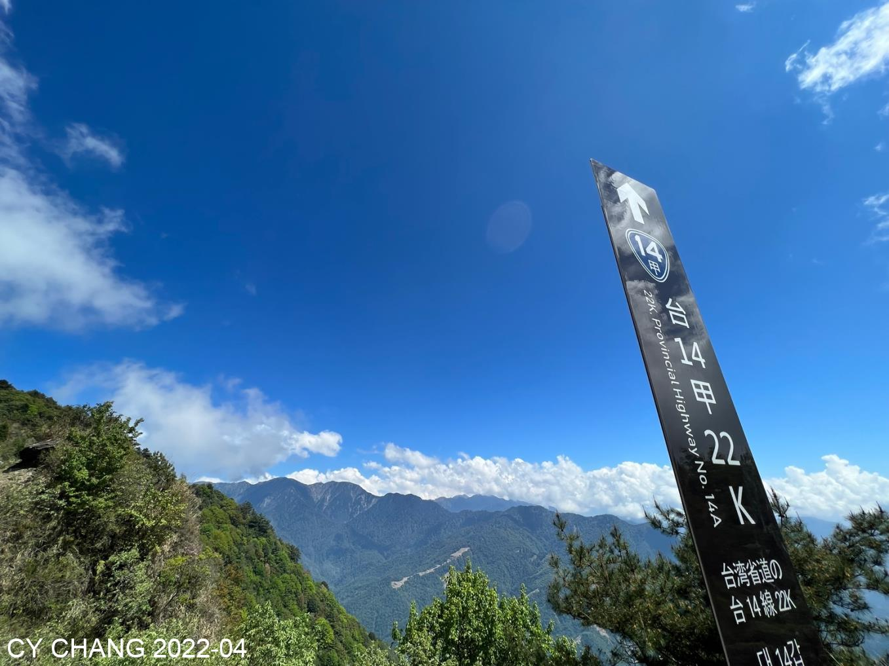
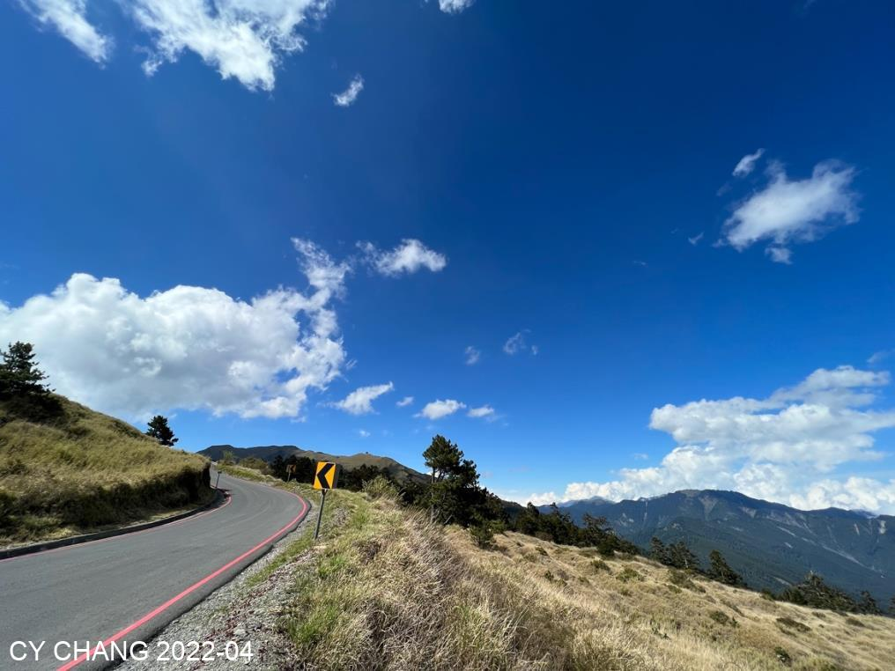

+++
author = "CY Chang"
title = "合歡山東峰"
date = "2022-04-28"
description = "合歡山，東峰上的杜鵑花"
tags = [

    "photography",
    "台灣",
    "群山",
    "夜景",

]
categories = [

    "photography",

]
category_group = "photography"
series = ["Taiwan"]
aliases = ["migrate-from-jekyl"]
image = "image_16.jpeg"
+++
CY Chang

## 合歡東峰

合歡東峰 去了幾次  再去 嗯  

這幾年都沒有機會拍合歡山上的杜鵑花，趁著這個空檔，希望沒車，熟悉的路，騎過自行車，開車輕鬆多了

疫情 大家還是往山上跑，反正傍晚人應該會少一點
 

  

藍的出汁的天空 開車快 在山頂上找停車的好位置

 
松雪楼旁边 直接攻东峰 沿路又咳又喘 快到三角点就停在这里拍了 今天应该没有夕陽 好好拍的沒 
有人入鏡的景  
 
  
 
 

晚上 等著銀河上山 北方有武嶺的燈光 東邊銀河升上山 該是能高山上 

嗯

仙英座的大流星雨還差幾天 先到的先拍。就幾十顆劃過夜空  滿足的開回關西 半夜了 
