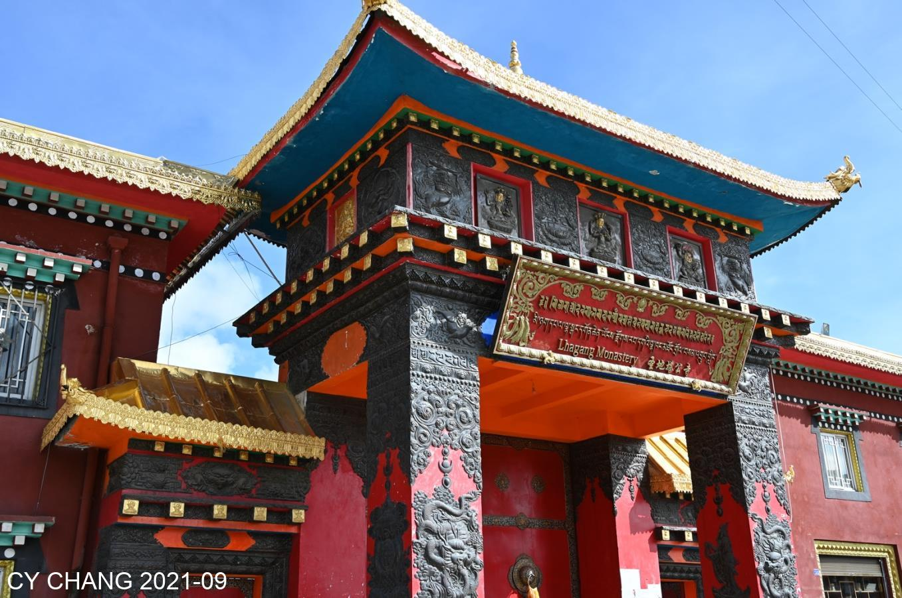
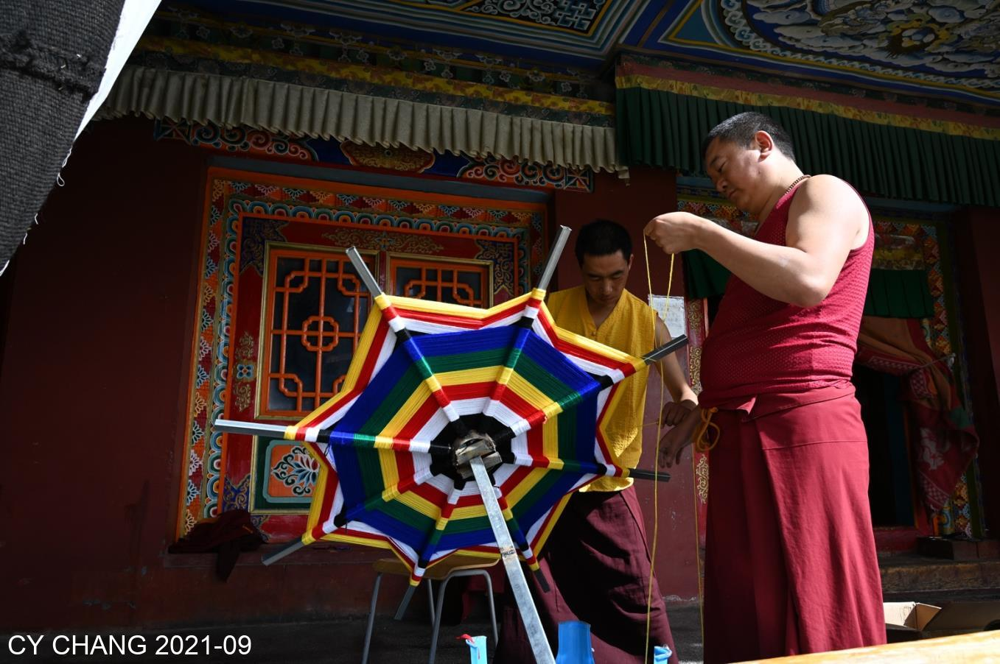
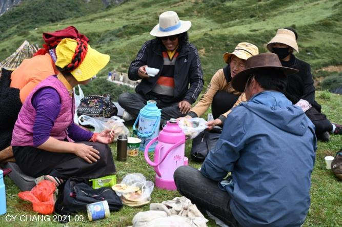
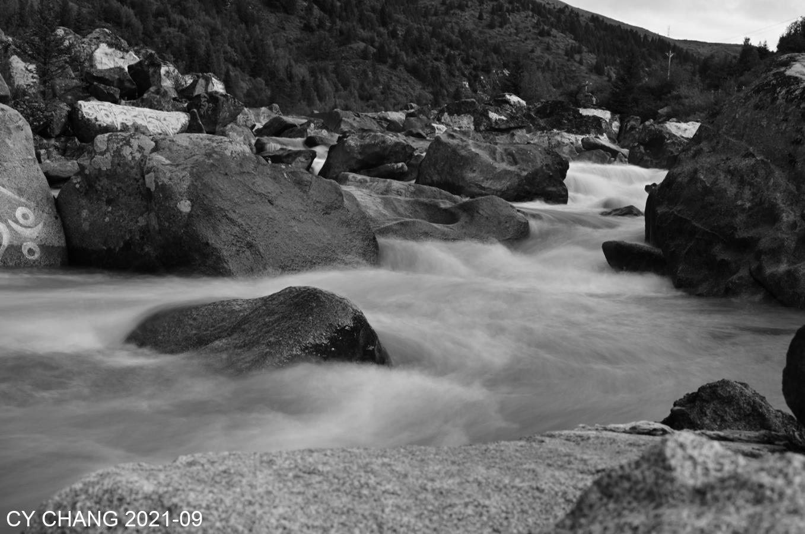
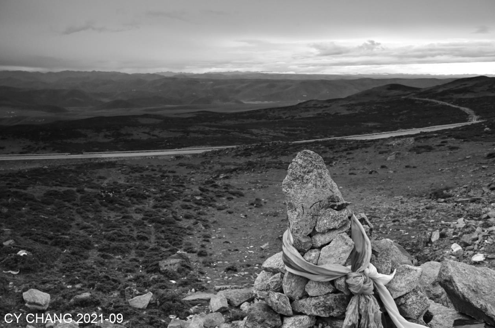
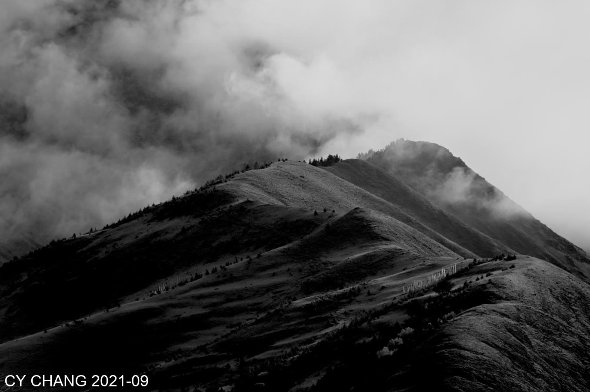

+++
author = "CY Chang"
title = "Xin Du Qiao, Sichuan"
date = "2021-09-28"
description = "September, round trip back to Xinduqiao"
tags = [

    "photography",
    "mountain",
    "Sichuan",

]
categories = [

    "photography",

]
category_group = "photography"
series = ["Sichuan"]
image = "image_1.jpeg"
+++
09-2021 川西 新都橋 CY Chang

## Temple

Back to Xinduqiao again, this time in September, the same blue sky, the days of lack of oxygen, one more day of break, I went to a few places, the blue sky plus the bright red color.
 

  

The bright red paintings are like the colorful flowers on the mountains. The flags flutter in the breeze. The tickets are expensive, but I think I'll just forget about it and treat it as incense money.

  

## Partners

Happy partners, in the wonder of black soil, they sit on the grass at noon, drinking Butter Tea. Looking at their smiles, they must love their work,

  

Horses on the plateau. There are not many tourists riding horses, but the local merchants aren't putting much pressure on tourist. This is the lovely place

They rely on horses like partners. Watching them walk happily and eat grass happily.
 
## Serenity

Meandering over one mountain after another. I saw a beautiful valley in this corner and stopped to take a few more pictures. The clouds, blue sky and green land in the distance. It is rare to have such a beautiful place. Peaceful.

   

The lonely pile of stones, tied with cloth strips, prayed for blessings. The lake it saw for thousands of years has grown bigger and the road has become better.
 
 

I wanted to take pictures of the river, but it had all been dug up, leaving only the day's worth of pebbles. Film the grass beside the bend and call it a day.
