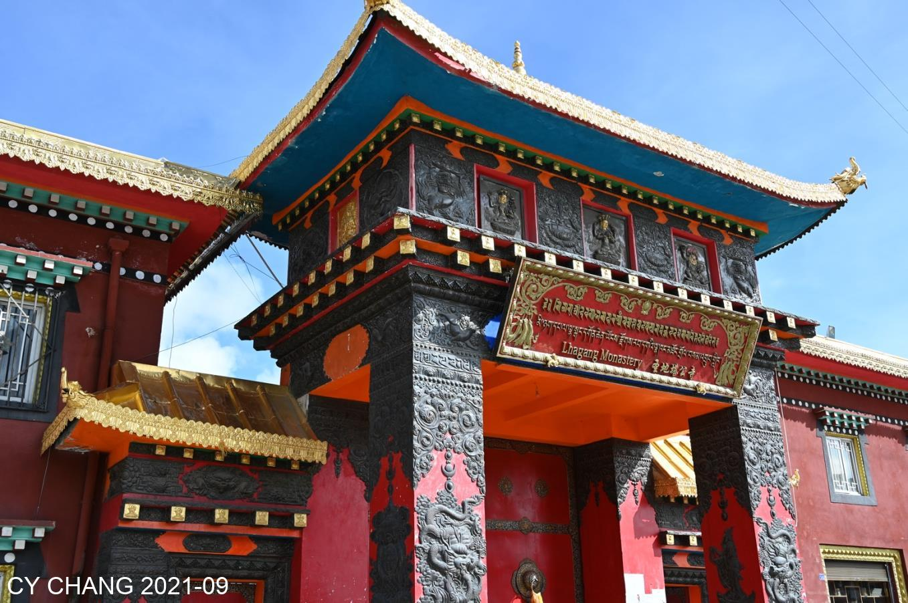
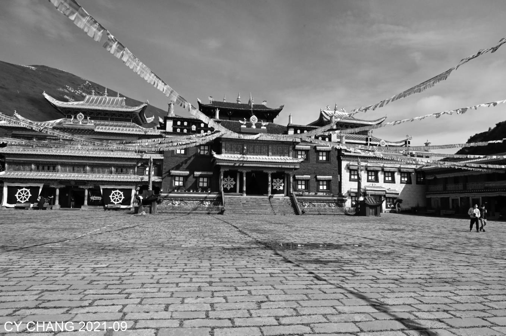
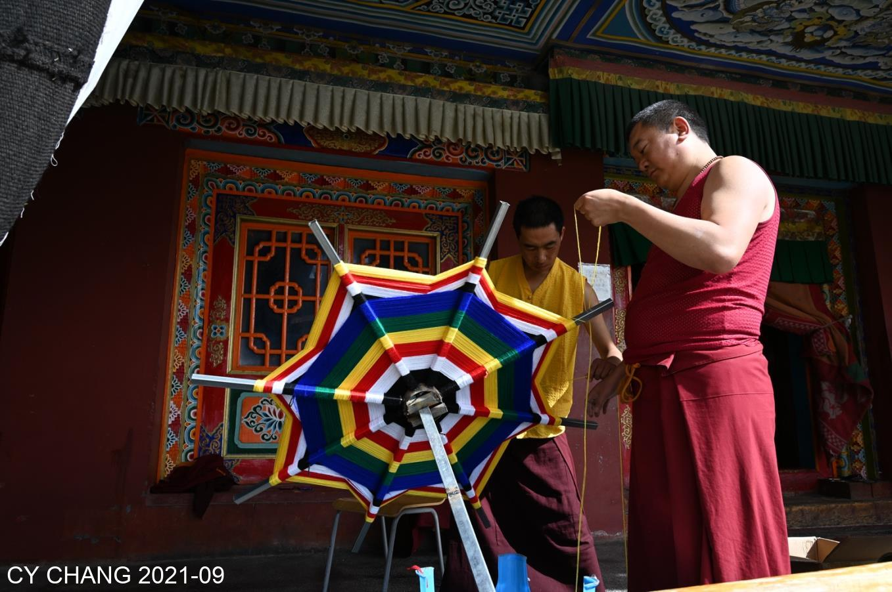
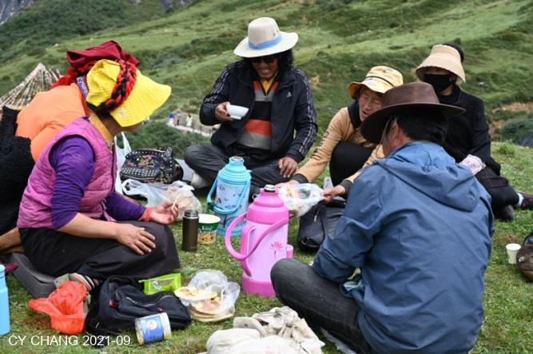
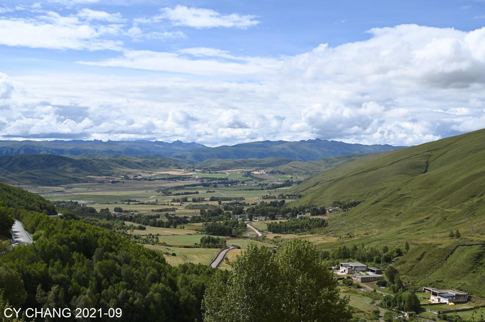
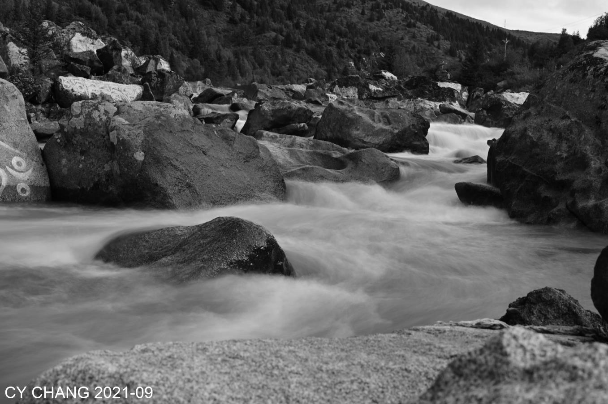
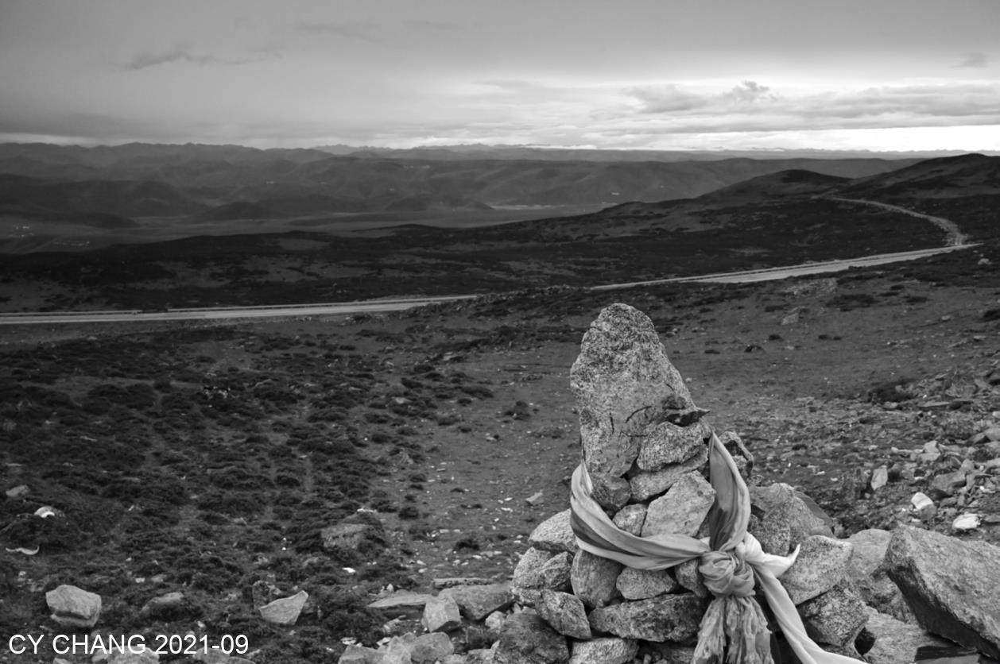
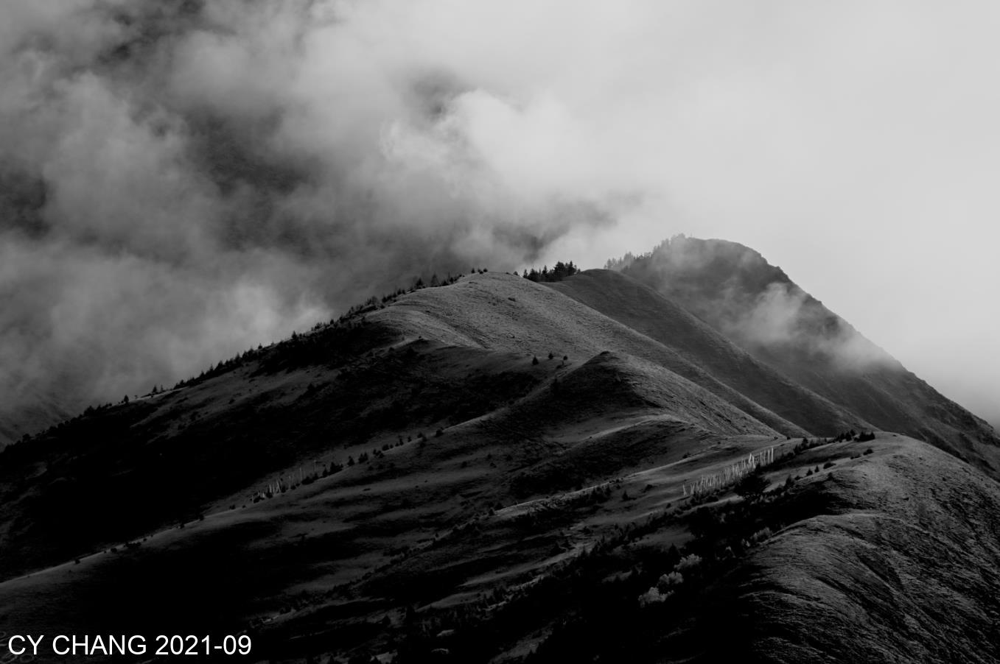

+++
author = "CY Chang"
title = "新都橋, 四川"
date = "2021-09-28"
description = "九月再訪新都橋"
tags = [

    "photography",

    "群山",
    "四川",

]
categories = [

    "photography",

]
category_group = "photography"
series = ["四川"]
image = "image_1.jpeg"
+++
09-2021 川西 新都橋 CY Chang

## 藏寺 

又回到新都桥， 这次是9月去， 一样的蓝蓝的天， 缺氧的日子， 多了一天空挡， 到几个地方去跑一趟， 蓝天加上鲜红的色彩  
 

  

鲜红的彩绘， 跟高山上， 色彩艳丽的花一样， 幡旗在微风中飘， 跟游客说的很贵的门票， 我想就算了吧， 当香火钱  

  

## 快樂的夥伴

快乐的伙伴，在黑土的奇景， 他们中午坐在草地上， 喝着酥油， 看那笑容， 该是喜欢他们的工作吧，

  

看马也很自由， 騎馬的游客不多， 但是也没有给你太多压力， 这就是可爱的地方  
 
他们吃饭的家伙， 都很保护著 看他们快乐的走路， 快乐的吃草 
 
## 寧靜

转过一山又一山．在这个角落去看到漂亮的山谷，停下来多拍了几张，远处的云、蓝天绿地，难得有这么漂亮的地方．宁静安详  

   

孤寂的石堆，綁著布條，祈福中，千年看到的湖长大了，路也变好了  
 
 

想到河边拍前面看到的景，却是全挖掉了，剩下一天的石子。拍拍和床旁边的小草．作为一个总结吧。 

