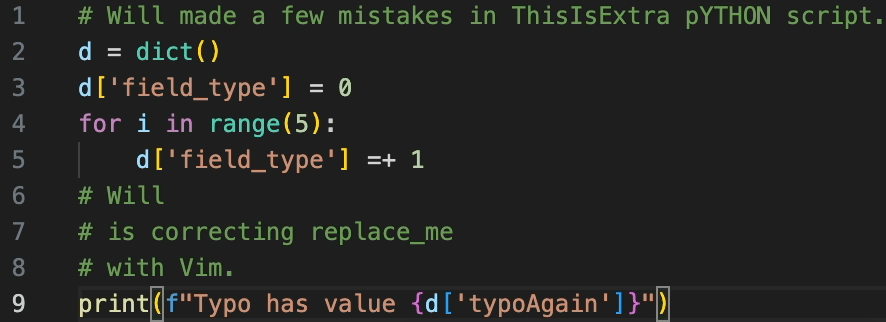

+++
author = "Meswsoul"
title = "Vim Learning Guide, for normal developers like me"
date = "2025-02-01"
description = "Vim remap & jump around"
tags = [

    "IDE",

]
categories = [

    "Tech-Notes",

]
series = ["Python"]
image = "cover.png"
+++
# TLDR

Conclusion first, whether you want to use pure vim, or IDE with vim,
I recommend starting here:

* [**Remap ESC**](#must-see-remap-esc)
* [**Learn to run before learning to walk**](#must-see-learn-to-run-before-learn-to-walk)

--------
If you are like me:
* Keep forgetting shortcuts when Switching between different IDEs
* Feel troublesome to write code between Windows and Mac at the same time
* Gave up on vim, but still want to master it

This article shares with you what vim learning paths I have tried as a normal developer, and how to overcome the vim learning curve.

> Simulate a workflow, think of it as editing in a hundred-lines script: 
Move to top line `gg` ——>
Move to `fT` ——>
Delete to space `df<space>` ——>
Change case ——>
Find `/ty` ——>
Continuously change the letters `R` name ——>
Repeat action `n.` ——>
Copy inside the single quotes `yi'` ——>
Find `/re` ——>
Select the word `viw` and paste `cmd+v` ——>
Move to bottom line `G` ——>
Find `fo` in line——>
Select the word `viw` and paste `cmd+v` ——>
Continue looking for `;` ——>
Select the word `viw` and paste `cmd+v`

## 2021, Missing Semester, from getting started to giving up in 2 hours

Around 2021, after watching
[MIT - The Missing Semester: Editors (vim)](https://missing.csail.mit.edu/2019/editors/)
, I just felt vim is so great, those experts are so amazing, could it be that I am also the chosen one, and can learn it in no time? So I immediately turned on the computer, and the result was as expected,  was completely defeated by ` hjkl`, and that was the next time until I opened vim is after two years.

## 2022 ~ 2024, IDE is awesome

I briefly tried neovim and lazyvim, but couldn't stick with them because modern IDEs are too powerful.
I mainly use Pycharm for work, memorizing the commonly used hot keys was enough.
Even if sometimes the server side needs working in terminal, it was acceptable by configure nano with the mouse setting(Note 1) so that it can scroll and click. If further use VSCode [ssh remote IDE](https://code.visualstudio.com/docs/remote/ssh), it's sleek.

> Note 1: .nanorc set mouse

## 2024, Sandwiched between Win & Mac

One day, my surface pro turned into a brick during an update, so I bought my first MacBook. It was my first time configuring the environment on Mac, and the experience was very smooth. I used the cmd key to copy, paste, etc., and I got used to it right away.

But a new problem arises. I use Windows for work and Mac for personal use. If I want to write code fluently on both sides, I have to be familiar with at least three environments: Mac VSCode + Win VSCode + Win Pycharm (for Dataframe work), and nano too.
Whenever I switch between Windows and Mac, I always have trouble with the keys, which is a headache, so I made up my mind and opened vim again.

> Note 2: Another way is to change the IDE settings, but pycharm default is too complete and there are too many conflicts

## Self-analysis, two major reasons for past failures

1. **My right hand is rusty**. Before switching, when I drew in AutoCAD, I typed cmd with my left hand and clicked the mouse with my right hand, and I often typed with one hand, so when my right hand returned to the keyboard, my ring finger and little finger were in a disabled state. Bad habits, such as pressing L with my middle finger, make my vim operation very awkward.
2. Lack of vim **jump concept**. In the past, I just wanted to do it brute force `hjkl`(X). In fact, I didn’t give up a few times and still tried to get used to moving by playing [vim snake](https://vimsnake.com/). I thought that as long as I practiced up, down, left and right, I would have the door to the new world. How naive!

## Ways to reduce vim's learning curve

 — What works for me may not work for you, be sure to find a way that works for you! —

### Method 1. **Remap ESC <---> Cap Lock**

#### Must-See-Remap-ESC
The reason is, vim often uses `esc`, so I have to 1. move my palm up > 2. find `esc` with pinky finger > 3. bring hand back > 4. bring my pinky finger back to A, which is very tiring and hands get sore after a day of use.
After remapping [Note 3], it is natural to press the cap with the little finger of the left hand, avoiding wastes.

Another reason is that if Vim misses a key in the middle of continuous operation, you need to press `u` several times to restore it to its original state.
I don’t feel safe enough when typing blindly, so I set up a dummy-proof mechanism for myself – increasing the frequency of pressing ESC. After remap, the little finger can easily press esc to reset the operation. Press `esc` more and `u` less, prevention is better than cure. To some extent, it's like pressing the shortcut key to find idle villagers in Age of Empires to ensure there are no redundants (OCD?)

### Method 2. **Unified IDE environment**

Enable both Pycharm and VSCode with vim simulation, force myself to use.

### Method 3. **Unify the keyboard feel**

Avoid using the company's ThinkPad laptop keyboard and use the same external keyboard instead to help my fingers get used to it faster.
I chose a 75% keyboard with the same layout as the MacBook Air, [Logitech MX Keys Mini Windows version](https://www.logitech.com/en-us/products/keyboards/mx-keys-mini), although I gave up the number pad is a pity, but in fact, compared to CAD, writing code does have fewer keys and long strings of numbers.

### Step 4. **Practice blind typing**
As my right hand is clumsy, I practice blind typing to improve [MonkeyType](https://monkeytype.com/). Choose the theme of Quote articles with uppercase and lowercase punctuation, or simulate Python 5k code (or the language you use).
By the way, a tip I found: before I start typing each word, I pause for a moment to think about how to move my fingers, and then start moving my fingers to force myself to finish typing in an instant. At first I pressed the wrong order like crazy, but the key is to modify the muscle memory.

> Originally 35 wpm, I was embarrassed to say I'm developer —> Improved to 60 wpm up (~90% acc)

### Method 5. **Learn to run first, then learn to walk**

#### Must-See-Learn-to-Run-Before-Learn-to-Walk

Many tutorials emphasize the importance of being familiar with hjkl at the beginning.
For example, in [Vim RPG](https://vim-adventures.com/), J down and K up are not intuitive, and most people fail here.

The most effective learning order for me is to avoid hjkl, learn to jump around first, and be able to quickly browse the code.
Then, while jumping around, I familiarize myself with the detailed movements of hjkl.

Vim jump, Some quick movement commands that are easy to remember and can make the cursor fly:

`/<ch>` Search down, then n/N to search continuously (<ch> represents letters)\
`?<ch>` Search back \
`f/F<ch>` find, move to the next/previous char in the same line, followed by `;` to find continuously\
`H`/ `M`/ `L` moves the cursor to the top/middle/bottom of the screen\
`I` / `A` insert at begin of line/ append at end of line \
After remap, you can use I-Esc / A-Esc to replace / move to the beginning of the sentence `^` / end of the sentence `$`\
`%` Jump brackets () [] {}\
`58gg` moves to line 58\
`b`/`w`/`e` back/word/end\
`zz` Center the cursor line

**Vim selection**
It can be seen as [verb d c x s y v] + [motion] + [target]\
del / cut / xut / substitute / yank / view

`vi{` select inside `{}` \
`ci(` delete () and enter the editing mode\
`yiw` >..move-cursor..> `viW` `p` Copy the word where the cursor is > move > overwrite the word where the cursor is\
`C` Delete all after words and enter edit mode\
`de` cut to the end of the word\
`df=` delete from cursor to =\
`dd` cut / `yy` paste a line\
`.`(period) repeat action

At first glance, there are a lot of shortcut keys to remember! But it is fixed between IDEs, just like learning a set of **universal** shortcut keys between AutoCad, SolidWorks, Catia, which makes your life much easier!\

The first week I was very stuck, but in the second week I felt like I had figured it out, and by the third week the resistance was gone, nice!

> Note 3 Remap tool:
> * Karabiner for Mac
> * Using PowerToys on Windows, I also mapped the win key to Ctrl, so that Ctrl+c can copy/v paste/s save. This win keystroke is consistent with the mac keystroke.
>
> Note 4: Those who have typed Zhuyin know that by using its buffer, `ㄉㄟㄨ ˋ ` which is a wrong order, can also type out "對".
> Thanks to this, when typing Chinese, I press several keys at the same time, and then type blindly with one or both hands, but this habit conflicts with typing in English. \
> 
>
> Note 5: During the process, I discovered the design of [hhkb keyboard](https://happyhackingkb.com/jp/), which is also worth a look (~~getting one~~).

## Conclusion, Benefits

For me, besides being able to easily switch IDEs, there are two main advantages:
1. Editing efficiency is improved, **editing long markdown articles** is particularly obvious
2. Relax eyes

What does it have to do with the eyes?
When using the mouse or arrow keys to select or move, you must keep your eyes on the cursor to make sure it moves to the desired location.
Vim is essentially a program. When you press `/X`, as long as X exists, it will 100% move to the next X, without error.
So your eyes have more chances to be free and you just need to think about what action to take after the cursor moves to the next position.

Nowadays, no matter whether you are using IDE or AI to generate code, the Tab completion is getting stronger and stronger. Maybe one day we will only need to write code with mouth and don’t have to worry about keyboard hotkeys. Btw, I don’t think developers must learn vim. First think about whether your "needs" must use vim. Usually IDE is enough.

In any case, I am very happy to find a balance between Windows and Mac, and to commemorate the milestone of passing the learning curve of Vim.