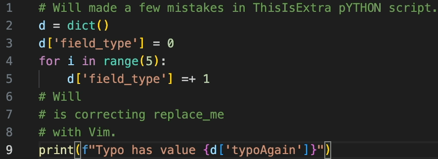

+++
author = "Meswsoul"
title = "給普通Developer的Vim學習路線"
date = "2025-02-01"
description = "Vim的remap，跳轉"
tags = [

    "IDE",

]
categories = [

    "Tech-Notes",

]
series = ["Python"]
image = "cover.png"
+++

# TLDR

先說結論，不論你想用純vim，或是IDE配vim，
我都推薦從這開始:

* [**Remap ESC**](#must-see-remap-esc)
* [**先學會跑 再學會走**](#must-see-先學會跑-再學會走)

--------
如果你跟我一樣：
* 在不同IDE之間切換，總記不住快捷鍵
* 對於同時在 windows/mac 之間寫code很困擾
* 曾放棄過vim，但仍想駕馭它

那這篇分享給你，我一個轉碼的普通developer，嘗試過哪些vim學習途徑，以及如何克服vim學習曲線。

> 模擬一個工作流，把它想成是在幾百行的script中操作： 
去首行 `gg` ——>
移至 `fT` ——>
刪至空白處 `df<space>` ——>
更換大小寫 ——>
找 `/ty` ——>
連續覆蓋字母 `R` n a m e ——>
重複動作 `n.` ——>
複製'單引號'內 `yi'` ——>
找 `/re` ——>
選取字 `viw` 貼上 `cmd+v` ——>
去底行 `G` ——>
同行裡找 `fo` ——>
選取字 `viw` 貼上 `cmd+v` ——>
繼續找 `；` ——>
選取字 `viw` 貼上 `cmd+v`

## 2021，Missing Semester 從入門到放棄 2小時

2021前後，正在努力轉碼的我，在看完
[MIT - The Missing Semester: Editors (vim)](https://missing.csail.mit.edu/2019/editors/)
，只感覺心頭一熱，vim好高大上阿，大牛們真厲害，該不會我也是天生神力、秋森萬、一學就會吧?  於是我立馬打開電腦，結果不出意料，什麼`hjkl`直接心態崩了，也是我當年最後一次開啟vim。再次開啟已是上岸後。

## 2022 ~ 2024，IDE好棒棒

上岸後，我短暫試過neovim、lazyvim，沒能堅持住，原因是現代IDE太強大了。
工作主力用Pycharm，常用快捷鍵記熟也就夠了。
就算Server端要terminal，將nano配置了滑鼠(註1)，能滾動能點擊也湊合著用，若再配上 VSCode [ssh remote IDE](https://code.visualstudio.com/docs/remote/ssh)，簡直香噴噴。

> 註1：.nanorc 設定滑鼠 set mouse

## 2024，夾在Win & Mac之間

某天，我的surface pro在更新中變成磚，入手人生第一台macbook。第一次在mac中配置環境，體驗非常絲滑，改用cmd鍵複製、貼上等等，一下就適應了。

但新問題來了，工作是windows，私人是Mac，想在兩邊都流暢地寫代碼，我至少得熟悉三套環境，Mac VSCode + Win VSCode + Win Pycharm(工作Dataframe)，還有nano。
每當切換windows/mac總是按不順，很頭痛，於是狠下心，再次打開vim。

> 註2：另一條路是硬改IDE設置，但pycharm default太齊全，太多衝突

## 自我分析，過去失敗的兩大原因

1. **右手手殘**。轉碼之前，我畫AutoCAD是左手打cmd、右手點滑鼠，而且常常單手打字，以至於右手回到鍵盤時，我的無名指與小指處於殘廢狀態。壞習慣例如用中指按Ｌ，讓我vim操作十分彆扭。
2. 缺少 vim**跳轉觀念**。過去只想靠上下左右蠻幹 (X)。其實中間我幾次不死心，仍企圖通過玩[vim貪吃蛇](https://vimsnake.com/) 習慣移動，以為只要練熟了上下左右，就掌握了通往新世界大門，天真！

## 降低vim學習曲線的方法

 — 適合我的，不一定適合你，務必找到適合自己的方式 ! —

### 作法1. **Remap ESC <---> Cap Lock**

#### Must-See-Remap-ESC
理由是，vim常用到`esc`，我必須1. 手掌往上移> 2. 小指找到`esc` > 3. 手回來 > 4. 小指回到A，十分耗神，一天累積下來也手酸。
而remap後[註3]，用左手小指按cap很自然，避免把自己玩到精神耗弱。

另一個原因，若Vim連續操作中間miss一個鍵，要多按幾次 `u` 才能恢復原狀，
我盲打安全感還不夠，所以給自己設防呆機制 –— 提高按esc頻率。Remap後，小指能常常按esc將操作歸零，多按一點 `esc` 少按一點 `u` ，預防勝於治療。某整程度上，像世紀帝國一直按尋找閒置村民的快捷鍵，確保沒有冗員一樣（強迫症？）

### 作法2. **統一IDE環境**

Pycharm 跟 VSCode 都開啟 vim 模試，車同軌，逼自己用。

### 作法3. **統一鍵盤手感**

避免使用公司ThinkPad筆電鍵盤，改用同一個外接鍵盤，讓手指更快習慣。
我選跟macbook air 一樣layout 的75%鍵盤，[logitech MX Keys Mini windows版](https://www.logitech.com/en-us/products/keyboards/mx-keys-mini) ，雖然捨棄數字pad很可惜，但其實比起繪圖，寫code確實很少key長串數字。

### 作法4. **練習盲打**
針對右手手殘，我靠練習盲打改善[MonkeyType](https://monkeytype.com/)，主題選 Quote文章包含大小標點寫的，或是模擬python 5k code(或你的語言)。
順便提一個心得，我刻意在開始打每個詞前，停頓一下，想好手指頭怎麼動，再啟動手指頭逼自己一瞬間按完。一開始我瘋狂按錯順序，但重點在修改肌肉記憶。

> 原本 35 wpm ，都不好意思說自己在寫code —> 進步到 60 wpm up(~90%acc) 

### 作法5. **先學會跑，再學會走**

#### Must-See-先學會跑-再學會走

不少教程強調要在初學就熟悉hjkl，
像是[Vim RPG](https://vim-adventures.com/)，偏偏 J 下、 K 上，很不直覺，多數人栽在這。

對我最有效的學習順序，是避開hjkl移動光標，先學會到處跳轉，能快速瀏覽code，
然後在跳來跳去的過程中，順便熟悉 hjkl 細部移動即可。

vim的跳轉，一些好記，又能讓光標飛起來的快速移動指令:

`/<ch>` 	往下找，接 n/N 連續找	（< ch >代表字母）\
`?<ch>` 	往回找 \
`f/F<ch>`	find，同行找移動到後一個/前一個char之上，接 `；` 連續找\
`H`/ `M`/ `L`	移動光標到屏幕首/ 中/ 底部\
`I` / `A`	insert at begin of line/ append at end of line \
Remap後可以用 I-Esc / A-Esc  代替/  移動到句首`^`/句尾`$`\
`%` 	跳轉括號 () [] {}\
`58gg` 移動到58行\
`b`/`w`/`e`  back/word/end\
`zz` 將光標所在行置中

**Vim選取**
可以看成  [ 動詞 d c x s y v ] + [ motion ] + [ target ]\
del / cut/ xut/ substitute/ yank/ view

`vi{`  選取`{}`之內\
`ci(`  刪除()內後進入編輯模試\
`yiw` >..move-cursor..> `viW` `p`  複製光標所在的字>移動>覆蓋光標所在的字\
`C`	刪掉游標後全部，進入編輯模試\
`de`	剪到字尾\
`df=` 	刪掉光標開始到=\
`dd` 剪下/ `yy` 貼上一行\
`.`(period) 重複action

乍看之下，要記一堆快捷鍵阿！但它在IDE之間是固定的，就像在AutoCad, SolidWorks, Catia等繪圖軟件之間，學會一套**通用**的快捷鍵，腦袋輕鬆多了!\

就這樣限制自己只用vim打字，
第一週很卡，第二週有抓到訣竅的感覺，第三週抗拒感消失，Nice！

> 註3 Remap工具：
> * Mac 用 Karabiner
> * Windows 用PowerToys，我順便把win鍵map成Ctrl，讓Ctrl c複製/v貼上/s存檔 的這win按法與mac一致
>
> 註4：打過注音的朋友知道，利用它的buffer， `ㄉㄟㄨ ˋ ` 一樣能打出 “對”，
> 得益於此，打中文我都同時按下好幾鍵，然後單手/雙手盲打，但這習慣與英打衝突。\
> 
>
> 註5：過程中發現[hhkb鍵盤](https://happyhackingkb.com/jp/)的設計，也值得一看(~~入坑~~)。

## 結語，好處

對我來說，除了能輕鬆切換IDE之外，還有兩大優點：
1. 編輯效率增加，**編輯長篇markdown文章**由其明顯
2. 眼睛放輕鬆

跟眼睛什麼關係呢？
當用滑鼠或方向鍵去選取、移動，視線必須盯著游標，確定光標有跑到想要的位置。
而Vim本質上是程式，當你按 `/X`，只要X存在，他100%會移到下一個X上，不會錯，
所以眼睛有更多機會放空，只要想著，光標移到下個位置之後，要做什麼動作即可。

現在不論IDE 或 AI生code，Tab一鍵補全的全功能越來越強，也許哪天剩下用嘴寫code，也不用管什麼鍵盤熱鍵了。我也不認為developer一定要學vim，先想想自己的”需求”是否非vim不可，通常IDE很夠。

無論如何，很開心能在windows 與 Mac之間找到平衡，紀念一下自己跨過Vim門檻的里程碑。